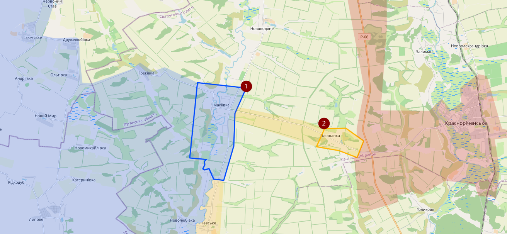
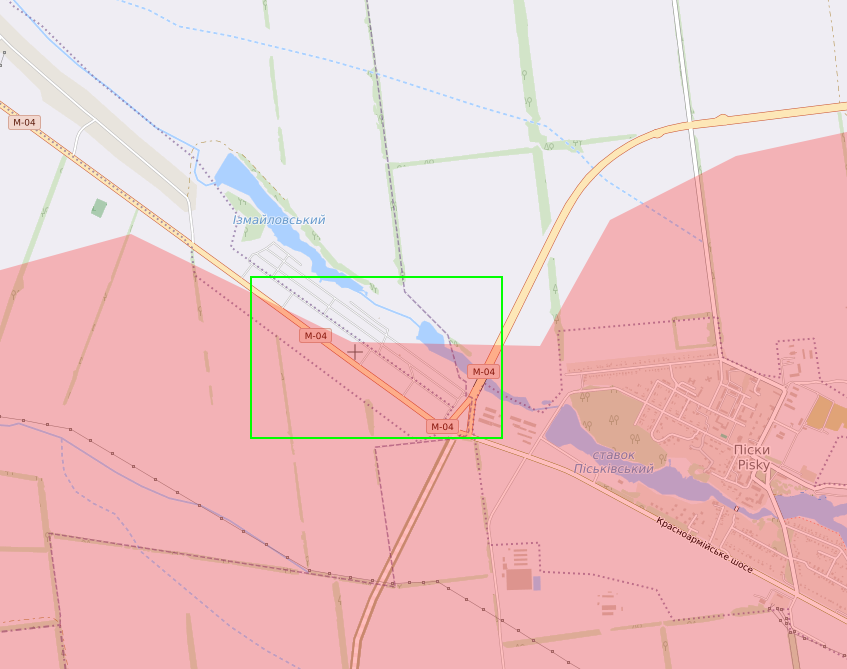
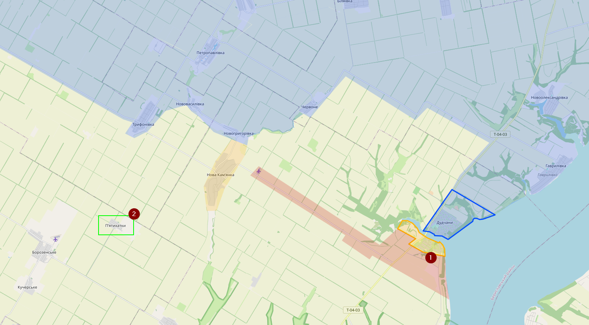

# August 2022

## Update 21-08-2022

Weinig nieuws vandaag. In het noorden bij Izium waren er meer offensieven van de Russen dan gisteren. Vermoedelijk is dat gebied eens stuk meer contested geraakt.

Richting Siversk was het dan weer kalmer.

Voor de rest redelijk dezelfde offensieven als de afgelopen dagen in het Oosten, maar Rusland heeft (na lange tijd) nog eens een offensief ondernomen in de buurt van Marinka bij Donetsk.

Bij Kherson heeft Oekraïne nieuwe offensieven uitgevoerd en is er weer meer gebied contested (<https://discord.com/channels/701168115349979147/946311403017498674/1010664316795621467>)

## Update 22-08-2022

Redelijk hetzelfde als gisteren op eerste zicht. Maar vermoedelijk is Rusland er wel in geslaagd wat terrein te winnen ten zuiden van Izium en richting Mykolaiv (Kherson).

Foto’s van de mogelijke dader van de aanslag op de Doegins dat de ronde doet is zwaar gefotoshopt, maar ik snap de focus van het westen niet zo op die aanslag. Volgens mij gaan we nooit de waarheid weten en eigenlijk idk.

In other news… 😉
<https://twitter.com/DefenceU/status/1561775821257379840>

## Update 23-08-2022

<https://discord.com/channels/701168115349979147/946311403017498674/1011720985361260574>
Niet alleen Independence Day of Ukraine, maar ook zes maand invasie. Geen idee of het ooit bewust is gekozen door Rusland, gezien ze oorspronkelijk 14 dagen oorlog hadden gepland. Maar er is ook goed nieuws, kind of… Veel westerse landen hebben hun steun aan Oekraïne nog maar eens bevestig. Erdogan heeft in een speech laten weten dat het Krim van Oekraïne is. Macron heeft laten weten dat ze Oekraïne gaan blijven steunen zich te verdedigen tegen Rusland, ook op de lange termijn. De VS zou morgen weer 3 miljard militaire steun aankondigen, dat zou het totaal van de afgelopen drie weken op 4.7 miljard brengen. Het einde van de oorlog is (jammer genoeg) nog niet in zicht.
Frontnieuws: op het eerste zicht was het vandaag een stuk kalmer dan de afgelopen dagen, vermoedelijk sparen ze hun krachten voor de 24e. Enkel in het oosten en het zuiden zijn er aanvallen geweest.

Een hoop Pro-Russische accounts kregen gisteren spontaan een orgasme nadat liveuamap een aanpassing had gedaan aan hun kaart. Maar in realiteit heeft Rusland geen tegenoffensief van 25km gemaakt, maar hebben ze enkel het dorp Blahodatne deels kunnen heroveren. In veel pro-Oekraïense en Pro-Russische kaarten was dat gebied gekleurd onder Russische controle. Het Kherson gebied is sowieso redelijk onduidelijk door gebrek aan informatie uit beide kampen.

Hetzelfde gaat trouwens op voor Izium. Daar heeft Oekraïne vermoedelijk meer gebied in handen

Maar ik snap het wel. Liveuamap is niet de beste kaart dat er is en ik zou werk moeten maken van mijn eigen kaart.

En dat is het ongeveer.

## Update 25/0/2022

Gisteren was er een Russische raket aanval op een station. Volgens Oekraïne zijn er zeker 15 burgers omgekomen. Rusland beweert dat er 200 soldaten zijn omgekomen. Ik zet mijn geld in op Oekraïne, wat eigenlijk ook niet echt leuk nieuws is.

Nuja, gerelateerd hieraan: <https://discord.com/channels/701168115349979147/946311403017498674/1012230631146672138>

<https://twitter.com/DefenceU/status/1562509545116540931>

Geen idee hoe legit het bericht is, maar Taiwan zou 860 kamikaze drones hebben overgedragen. Volgens de logica van China zijn dat dus Chinese wapens?

Frontline news: In de buurt van Kharkiv zijn er weinig of geen offensieven, maar de russen blijven de stad bombarderen. Je weet wel, zodat ze de bewoners niet meer moeten evacueren. (dat laatste was sarcasme voor alle duidelijkheid)

Uit Izium kwamen de afgelopen dagen weer beelden van iets van een offensief, maar weinig is geweten, de beelden kunnen ook redelijk oud zijn. Maar ook daar was het de afgelopen dagen een stuk kalmer van Russische kant.

In de buurt van Sloviansk melde Oekraïne dat er een Russisch offensief was richting Staryi Karavan en dat zou kunnen betekenen dat het gebied daar contested is. Kind of make sense dat ze vooral veilig uit de range van Oekraïense artillerie blijven en daar dus niet permanent zijn. Maar dat zorgt dus ook dat ze niet snel een offensief van daaruit kunnen starten.

In Soledar is de situatie redelijk onduidelijk. Er zou gevochten worden rond de mijn, maar er zijn ook bronnen die beweren dat de russen niet langer in de knauf fabriek verblijven. In elke geval is het contested gebied een km opgeschoven. Op 10/08 beweerde veel Russische accounts dat die stad was gevallen -_-

Nog zo een dorp dat al honderd keer is veroverd. Pisky… Ik denk dat dat de posities van Oekraïne sinds 15/08 niet meer zijn veranderd. De Russen hebben we wat meer terrein herwonnen (vooral buiten de stad) <https://discord.com/channels/701168115349979147/946311403017498674/1008820990026973304>

Rond Avdiivka zou er wel redelijk zwaar gevochten zijn

In het zuiden zijn er twee offensieven geweest zonder echt succes.

In Kherson zou Oekraïne nog steeds controle hebben over het gebied bij Davydiv Brid

Het valt mij op dat na enkele dagen wat intensievere offensieven (met marginaal succes) dat het nu weer een stuk rustiger is. Ik kan mij in elk geval maar moeilijk inbeelden dat Rusland weer bezig is met een rotatie.

## Update 27/08/2022

Er is eigenlijk weinig te melden aan het front en het is al enkele dagen status quo.

Enkel ten zuiden van Pisky hebben de Russen de afgelopen dagen wat landbouw terrein gewonnen en hebben ze een aanval gedaan op Nevelske, zonder succes voorlopig.

In Kherson blijft de Russische media de overwinning van Blahodatne uitmelken. Dat doet mij vermoeden dat er weinig (goed) nieuws te melden is, maar ook dat dit misschien een onverwachts succes is geweest?

Iets meer zuidelijker zijn er beelden opgedoken van een Oekraïense artillerie aanval op de Russen (groene regio). Het is echter niet duidelijk hoe oud die beelden zijn en het gebied is daar redelijk contested. Deze week was er wel nog melding dat Pravdyne (1) in Oekraïense handen zou zijn, maar er zijn er andere (pro-Oekraïense accounts) die dat betwijfelen. Hetzelfde gaat op voor Oleksandrivka (2).

## Update 28/08/2022

Korte update. Helemaal in het noorden zou Rusland in de buurt van de grens het dorp Udy hebben kunnen veroveren. Merk op dat dit gebied in maart als “goodwill” was teruggegeven aan Oekraïne.

In de buurt van Bakhmut zou Rusland (Wagner) het dorpje Kodema hebben kunnen bemachtigen.

## Update 29/08/2022

TL;DR:

Oké dat bovenste is wel een beetje (heel veel) overdreven, maar ik vond het een leuke meme. We mogen niet vergeten dat elke dag oorlog er eentje te veel is. En ik blijf er na dag 187 ervan overtuigd dat dit een compleet nutteloze oorlog is.

Soit, vandaag begon het allemaal met berichten uit Kherson dat de Oekraïne door de frontlinies waren gebroken. Er was ook een Russische soldaat die verslag uitbracht van aan het front en mededing maakte van het offensief, maar dit filmpje is vermoedelijk fake en op dit moment kan ik het zelfs niet meer terugvinden.
Er is vandaag dan ook redelijk wat activiteit geweest op sociale media en het is niet makkelijk om de bomen door het bos te zien. Ik ga het vandaag dan ook houden bij Kherson en ga redelijk conservatief zijn.

Oekraïne melde deze avond dat ze begonnen zijn met een groter offensief in de regio, maar noemt het geen tegenoffensief. Ook het Pentagon maakt melding van meer activiteit, maar ziet het ook niet als een counteroffensive. Het kan zijn dat het de komende dagen weer een pak rustiger zal worden. De Russische logistiek in de regio was al redelijk verstoord en de laatste dagen is dat nog meer verstoord geraakt.

Ook de Wagner groep melde in een bericht dat dit al enkele dagen aan de gang is en dat ze op dit moment niet anders kunnen doen dan een defensieve positie aannemen.

Over gebied lopen de meldingen redelijk uiteen. Sommige spreken van één offensief, andere van drie en nog andere hebben het over vijf. Oekraïne zelf geeft geen commentaar over locaties

Zeker is de regio rond Davydiv Brid. Sukhyi Stavok (1) wordt vaak gemeld als bevrijd. Maar zolang ik geen visuele confirmatie zie, ga ik ervan uit dat de russen daar weggetrokken zijn en dat het gebied contested is. Blahodativka (2), vermoedelijk ook, maar volgens mij was dat al langer contested.

Voor de rest zijn er geen bevestigde veranderingen in die regio, ondanks vermoedelijke offensieven.

CNN maakt wel melding van vier andere steden: Tomyna Balka, Pravdyne, Nova Dmytrivka en Arkhanhel's'ke, maar CNN is geen echt betrouwbare bron. Tomyna Balka ligt trouwens redelijk diep achter het front. Ik ga die locaties de komende dagen wat meer in het oog houden.

Sowieso, mijn definitie van een bevrijding is geen Russen in het dorp, maar wel Oekraïense soldaten.

## Update 30/08/2022

Update 30/08/2022: Zoals verwacht heeft het militair nieuws uit Kherson vandaag plaats geruimd voor 100% onversneden bullsh*t, voornamelijk afkomstig van Russische (bot)accounts. Gisteren beweerde de Russische accounts dat er geen offensief was, deze ochtend was de toon dat het offensief volledig was afgeslagen en dat er 500 Oekraïense doden waren gevallen, wat later werden dat er 1000, daarna 1200 en er waren enkele die zelfs beweerde dat het er 1600 waren.

Zijn er doden gevallen aan Oekraïense kant? Zeker, net als aan Russische kant.
Hoeveel? Geen idee, maar zeker minder dan 500
Hoe ik dat weet? Omdat zelfs de f*cking Wagner Group zegt dat de bewering van 500 Oekraïense slachtoffers er over zijn, zonder in detail te treden hoeveel er slachtoffers er zijn gevallen. Het is al ver gekomen als de Wagner Group logischer begint te klinken. (Bericht vertaald door @wartranslated)

Battlefront news… eigenlijk niet veel te zeggen In de buurt van Izium zijn er wat onduidelijkheden, vermoedelijk is het terrein wat meer contested in het zuiden. Persoonlijk denk ik dat Dovhenke op zijn minst contested is. Als was het maar omdat Oekraïne daar geen rechtstreekse aanvoerlijnen heeft die onder hun controle staan.

Rond Siversk is het al een tijde geleden dat ze nog een offensief hebben uitgevoerd. Enkel de dagelijkse artilleriebeschietingen.

Gezien dat de Russen nog steeds Kodema aan het bombarderen zijn, vermoed ik dat ze nog geen volledige controle hebben.

Een andere locatie is Pisky, gisteren beweerde Russische accounts voor de vierde of vijfde keer dat de Oekraïners daar weggetrokken waren, maar deze keer zou het wel eens waar kunnen zijn. Er zijn o.a. beelden opgedoken van gevechten rond de brug in het zuiden. Als Oekraïne nog ergens controle heeft, dan is het vermoedelijk in het noorden. Niet dat er nog veel overblijft van Pisky, de kans dat die ooit zullen worden herbouwd is redelijk nihil.

In de Zaporizhzhia Oblast zijn er volgens mij ook geen succesvolle offensieven geweest van de Russen (of Oekraïners), als er nieuws uit die regio komt dan gaat het over de kerncentrale.

Kherson… over offensieven heb ik weinig informatie. Het enige dat ik weet is dat Oekraïne melde dat de Russen een offensief hebben uitgevoerd in het noorden, zonder succes. De Antonovsky brug zou vandaag vier keer gebombardeerd zijn geweest. Vermoedelijk is daarbij ook de pontonbrug geraakt die voor de helft klaar was.

## Update 31/08/2022

Op eerste zicht zijn er geen (grote) verandering in het oosten van Oekraïne, buitens de dagelijkse pogingen van de russen dat dan wordt afgeslagen. De situatie in Pisky blijft onduidelijk, gezien Oekraïne beweert dat er nog steeds wordt gevochten.

Als we naar Kherson kijken, dan is de situatie zeer onduidelijk in sommige gebieden, maar het staat in elk geval vast dat er wel degelijk een offensief aan de gang is. We gaan moeten kijken of Oekraïne dit kan blijven volhouden, want sowieso mogen we niet vergeten dat erbij zo een offensief veel doden vallen.

Redelijk zeker is het noorden van Kherson, daar zijn beelden opgedoken van Oekraïne troepen die vanuit Ivanivka richting Arkhanelske trokken. Ook vanuit Arkhanelske zelf zijn er vermoedelijke beelden opgedoken van Oekraïense gevechten. De stad is zeker contested.

Ter hoogte van Davydiv Brid verspreide de Pro-Russische telegram account Rybar deze namiddag volgende kaart:

De betrouwbaarheid van Rybar is…

In het verleden beweerde die ook dat de russen aan het vechten waren in Siversk. De russen zijn zelfs nog nooit in de buurt van die stad gekomen. Dusja…

Ik zou durven gokken dat de situatie daar ongeveer zo is (Blauw Oekraïne, Geel contested, Rood Rusland):

Iets meer naar het zuiden, beweerde Rybar ook dat er een offensief was in het noorden van Kyselivka (1), maar dat de russen de Oekraïners hebben kunnen terugdrijven richting Ternovi Pody (2). Ik heb persoonlijk hier enorm mijn twijfels over. Misschien dat Ternovi Pody onder Oekraïense controle staat en dat ze vandaaruit wel een offensief hebben gestart, maar ik denk niet dat die aanval tot aan Kyselivka is geweest.

Verder zijn de bruggen over Dnieper weer gebombardeerd geweest. Ik heb geen weet over de exacte conditie, gezien het redelijk ongezond is om in de buurt van die bruggen te komen en niemand dat dus doet. Er zou een ferry bij één van die aanvallen geraakt zijn.

Dit zouden de defensies zijn van de Russen volgens @J_JHelin in de Kherson regio.

## 07/10/2022

Update 07/10/2022: Some good news, some bad news.

Kharkiv: Na de geruchten zijn er vandaag visuele bewijzen dat Makiivka (1) onder Oekraïense controle staat. Er waren vandaag ook weer berichten dat de P-66 contested was, deze keer ter hoogte van Krasnorichenske. Klinkt logisch, ik markeer Ploshchanka (2) als contested, net als de weg die kant op.

Rond Bakhmut zijn er vandaag beelden verschenen van Oekraïense artillerie dat de russen aanvallen in Zaitseve. Hoewel ik niet denk dat de Russen daar al volledige controle hebben, markeer ik het wel als Russisch.

Bij Pisky hebben de russen ook kunnen doorbreken voorbij de zwaar versterkte brug dat nog in aanbouw was op het moment dat het conflict uitbrak. Ook bekend als Republica Mist.

In Kherson was het rustiger. Russische accounts melde een aanval op Dudchany (1). Het zuidelijke deel van dat dorp is (of was?) nog in Russische handen, ik markeer het als contested.
Ook was er het gerucht dat Oekraïne een offensief zou hebben uitgevoerd op Piatykhatky (2), maar mij klinkt het weinig waarschijnlijk.

## Sources

- <https://liveuamap.com/>
- <https://t.me/s/UkraineNow/>
- @wartranslated
- @J_JHelin
