# October 2022

## 02/10/2022

Er is veel gebeurd, maar ben te lui om het allemaal in detail op kaarten te verwerken, die zal ik morgen bijwerken.

Weet dat het Oekraïens leger verder aan het oprukken is en dat Torske (1) onder Oekraïense controle staat. Hier en daar ook meldingen gezien van Yampolivka (2), maar nog niet kunnen verifiëren. Oekraïne is in elk geval verder richting het oosten getrokken.

Meer ten noorden van Lyman bij Kupiansk-Vuzlovyi, zijn er beelden van Oekraïense soldaten in Kivsharivka (1) en vermoedelijk ook Novoosynove (2). Ook zou er meer gebied contested zijn ten oosten van Kupiansk-Vuzlovyi.
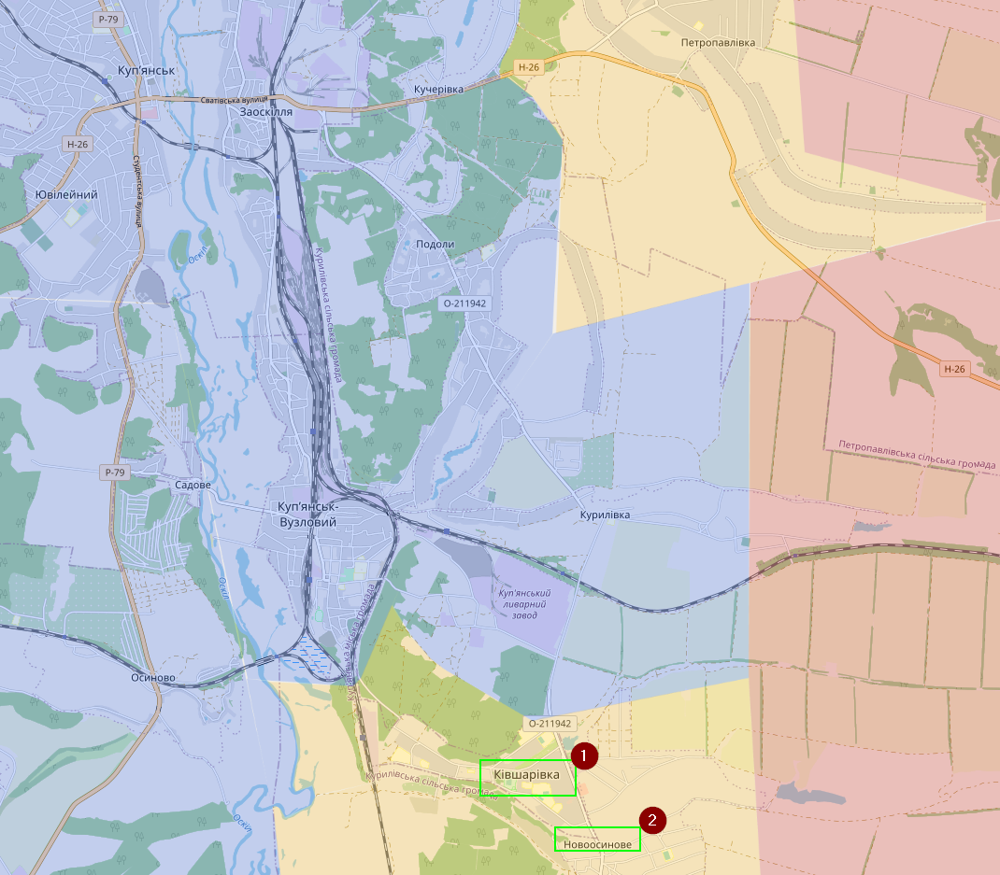

De weg verder naar het zuiden gaat naar Borova en dat is een stad waar Oekraïense soldaten zich al in het oosten en zuiden bevinden.
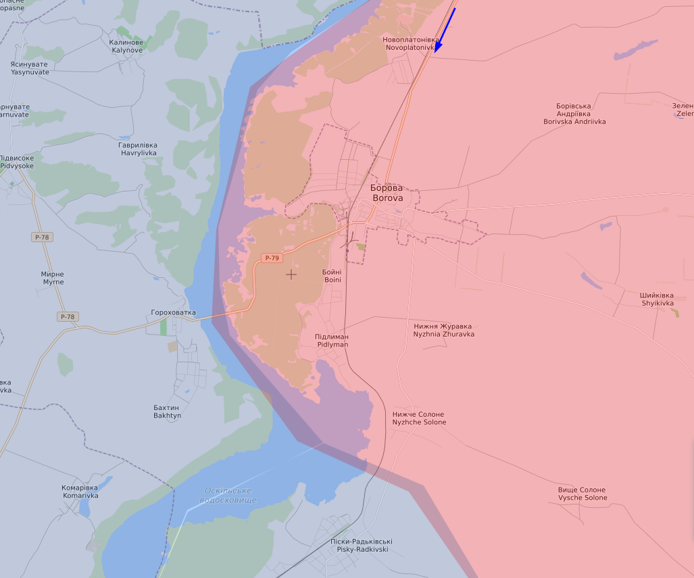

Verder in het oosten zijn er enkel Russische offensieven geweest richting Bakhmut, maar op eerste zicht zonder succes.

In het noorden van Kherson heeft Oekraïne een nieuw (klein) offensief geopend, waarbij Oekraïne de dorpen Zolota Balka (1) en Khreschenivka (2) hebben kunnen innemen. To be fair, ik dacht dat Zolota Balka eigenlijk onder Oekraïense controle stond.
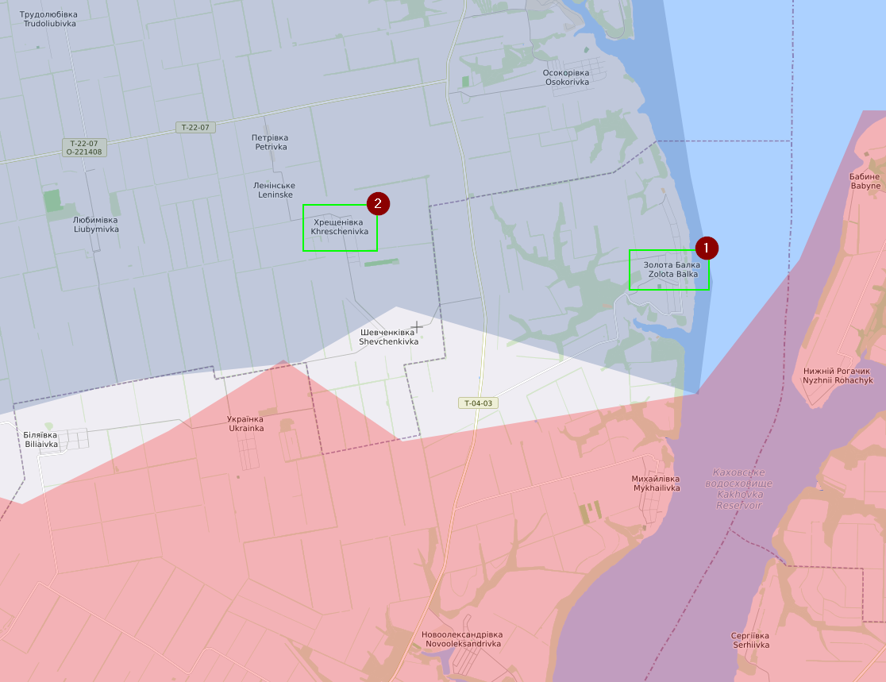

Op dit moment is het redelijk duidelijk dat Oekraïne de bovenhand heeft. Rusland kan zeker in bepaalde regio’s de druk op Oekraïne houden, maar ook niet meer dan dat. Ik ben benieuwd hoe het de komende dagen/weken zal evolueren.

## 03/10/2022

Het gaat zo hard dat ik enorm veel moeite heb om alles te mappen, ergens vind ik dat niet erg. Zaterdag namiddag heb ik normaal een half dagje om een hoop kaarten bij te werken, hopelijk laat Oekraïne nog iets over tegen dan.

Over het noordelijke gedeelte had ik deze ochtend al gemeld dat Borova (1) onder Oekraïense controle was gekomen. Later kwamen daar ook nog Shyikivka (2) en Druzhelyubivka (3) erbij. Ik heb alles ten zuiden daarvan ook opgevuld, gezien er vandaar geen toegangswegen zijn naar Russisch gebied. Iets meer ten noorden langs de Oskil heb ik ook alles contested aangeduid. De wegen zijn daar redelijk beperkt en op dit moment is het daar redelijk nat, dus ik kan mij maar moeilijk inbeelden dat de Russen daar nog zitten. Ik heb al hier en daar al het gerucht opgevangen van (artillerie) aanvallen op Svatove (4) door Oekraïense troepen.
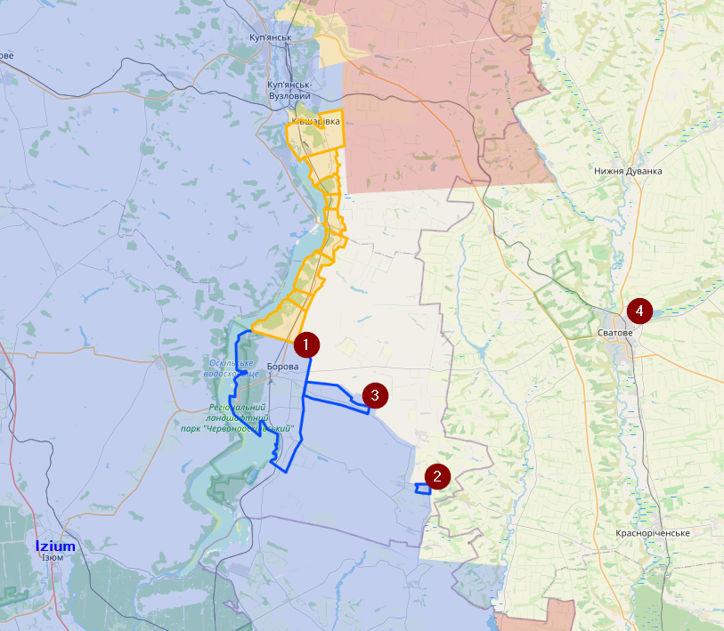

Bij Bakhmut beweerde Rybar dat Oekraïne ook een offensief zou hebben uitgevoerd, maar andere spreken dat tegen. Vermoedelijk staat het daar stil.

In Kherson zie je links de situatie op 30 september en rechts de situatie op 3 oktober. De visuele bevestigingen gaan tot bij Havrylivka (1) en er zijn ook geruchten dat Rusland uit Dudchany (2) zou zijn verdreven. Nu goed, het is nog zeker 50km tot aan de cruciale dam.
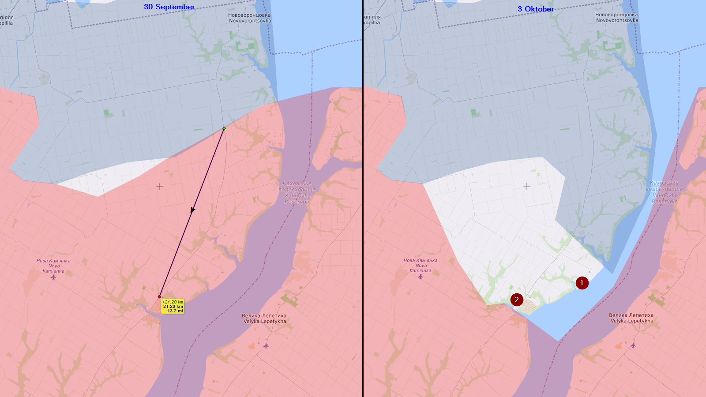

## 04/10/2022

Vandaag ga ik enkel hebben over het noordelijk front van Kherson. Het blauwe is het gebied dat Oekraïne heeft veroverd de afgelopen dagen (behalve het zuidelijke deel van Davydiv Brid). Er is een enorm stuk contested en dat komt omdat er verschillende pro-Russische accounts beweren dat Rusland zich heeft teruggetrokken uit dat gebied. Of dat klopt, zullen we de komende dagen wel merken, maar heel onlogisch is dat niet. Er zijn daar maar weinig wegen en het is herfst, dus ook nat, dus heb je verharde wegen nodig om je te verplaatsen. Belangrijk om te weten is dat er voor Davydiv Brid (1) en Dudchany (2) visuele bevestigingen zijn.
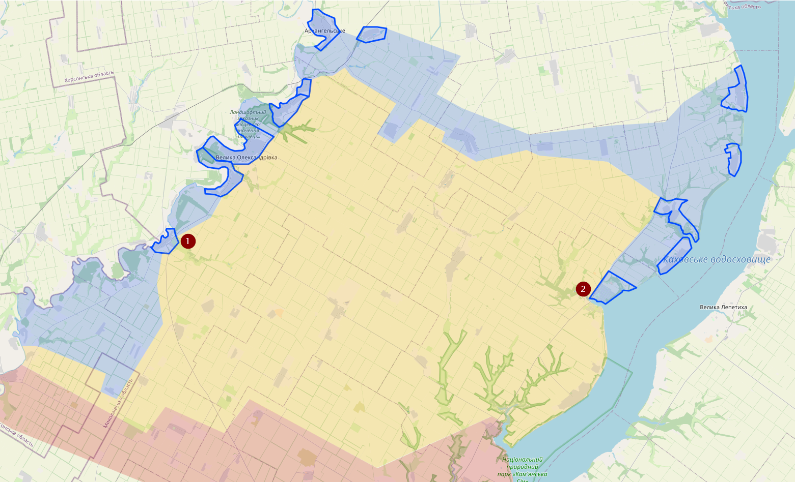

Om dat in lijstjes vorm te hebben:
02/10/2022
Zolota Balka
03/10/2022
Havrylivka
Novooleksandrivka
Mykhailivka
04/10/2022
Dudchany
Davydiv Brid
Mala Oleksandrivka
Velyka Oleksandrivka
Novodmytrivka
Starosillia
Arkhanhelske
Novopetrivka
Blakytne
Ik zal er nog een hoop vergeten, maar dat zijn de grootste en zijn ook gemarkeerd op de kaart

## 05/10/2022

Kharkiv front heb ik mijn kaart redelijk wat kunnen uitbreiden. Ik heb alles Oekraïens gekleurd vanaf Zarichne tot Terny (1), van dat laatste is er visuele bevestiging. Van Hrekivka (2) is er ook visuele bevestiging dat het onder Oekraïense controle staat. Oekraïense troepen zouden Makiivka (3) hebben aangevallen, maar vermoedelijk heeft Oekraïne nog geen volledige controle, maar zeker contested. Ook Neveske (4) is vermoedelijk contested. Met die informatie ben ik redelijk zeker dat Ploshchanka (5) onder Russische controle staat. Er zijn beelden opgedoken van een Rus in Svatove dat beweert dat de P-66 (6) richting het zuiden zou contested zijn. Ik vermoed dat het hier gaat over artillerie. Als laatste gaat er ook nog een gerucht de ronde onder Russische accounts dat Oekraïne zich aan het klaarmaken is in Pershotravneve (7) voor een nieuw offensief, vermoedelijk richting Svatove. Ik heb geen visuele bevestiging gevonden dat Pershotravneve onder Oekraïense controle staat.
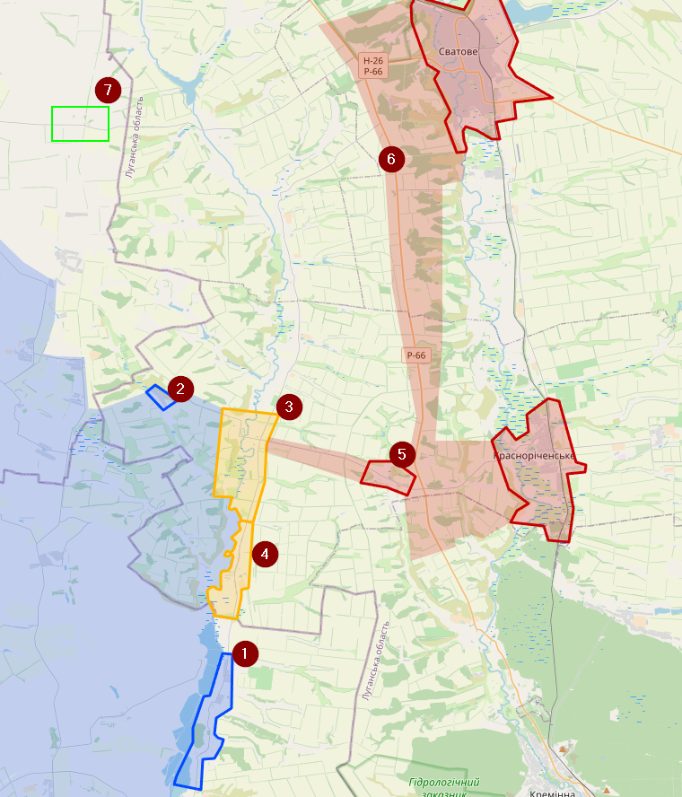

Er waren geruchten over een Oekraïense aanval op Lysyhansk, maar ik kan niets concreets vinden en ik geloof ook niet dat Oekraïne op dit moment die stad kan aanvallen.

Verder in Bakhmut de gewoonlijke offensieven van de Russen zonder succes afaik.

In Kherson melde Zelensky deze avond dat Novovoskresenske (1) en Petropavlivka (2) onder Oekraïense controle staat, maar ik ga morgen pas mijn kaart aanpassen.
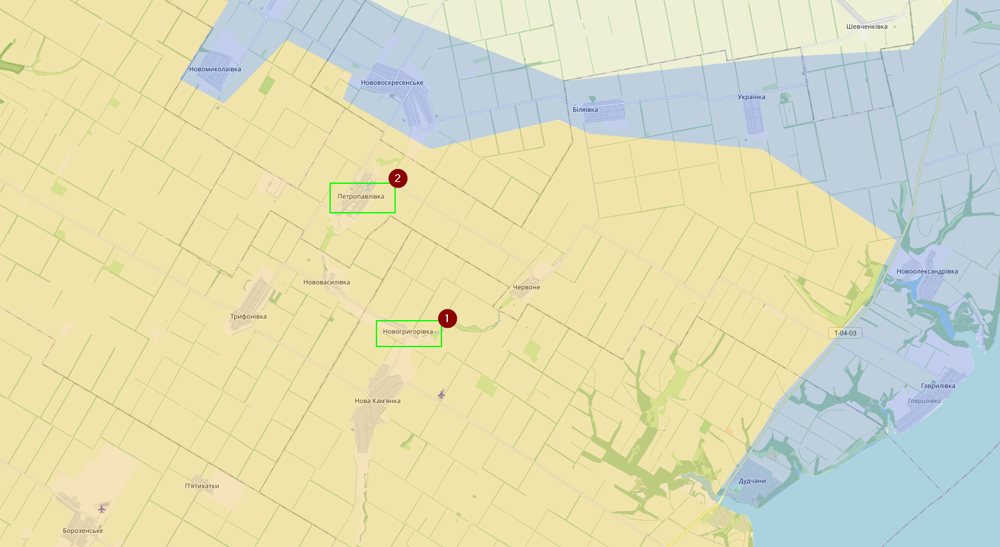

## 06/10/2022
Noord-Kharkiv: Vandaag is er visuele bevestiging verschenen dat Hlushkivka (1) onder Oekraïense controle staat. Op basis van die data heb ik Novoosynove (2) en Kivsharivka (3) als Oekraïens gemarkeerd. Er was al enkele dagen de geruchten dat die laatste twee onder Oekraïense controle stonden. Het Russisch gebied ten oosten van die steden is een stuk meer contested.
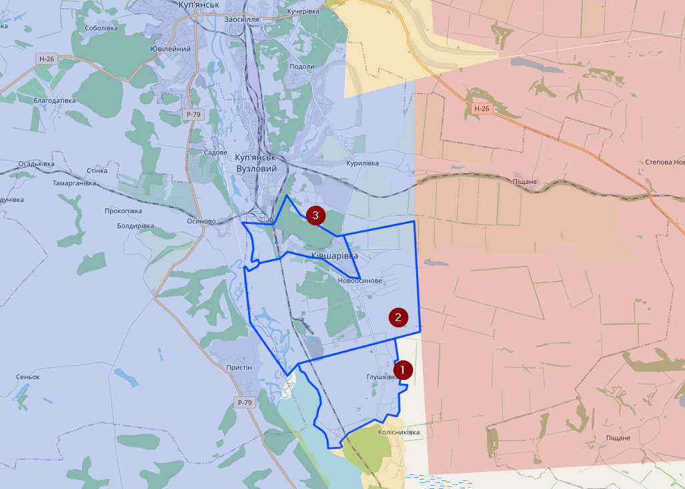

Kherson regio: Gisteren was het al bekend dat Novovoskresenske (1) onder Oekraïense controle stond. Vandaag is er visuele bevestig dat dit ook het geval is voor Tryfonivka (2). Op basis van die informatie heb ik ook Maiske (3), Chervone (4) en Novovasylivka (5) als Oekraïens gemarkeerd. En op basis van de wegen heb ik het Oekraïens gebied ook naar het zuiden verplaatst. De situatie in Nova Kamianka (6) is vermoedelijk contested. Oekraïne kan van twee kanten aanvallen. Rusland heeft vermoedelijk de controle over één verharde toegangsweg (rode pijl).
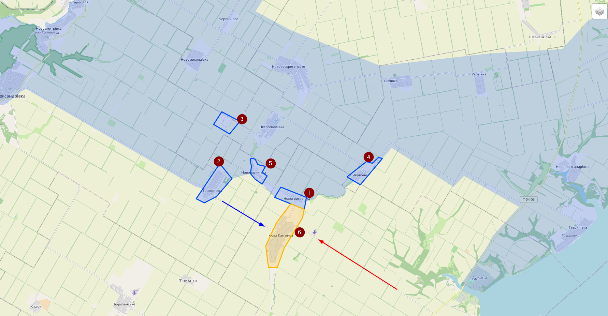

## 08/10/2022

Update 08/10/2022: héél kort. Enkel informatie uit Kharkiv dat Kruhliakivka(1) en Zahryzove (2) onder Oekraïense controle zijn gekomen, niet dat daar nog veel russen aanwezig waren. Oekraïense is daar de rivier overgestoken.
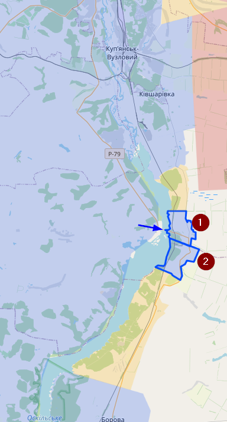

Het goede nieuws daardoor is dat ik goed ben opgeschoten met mijn map in Kherson.
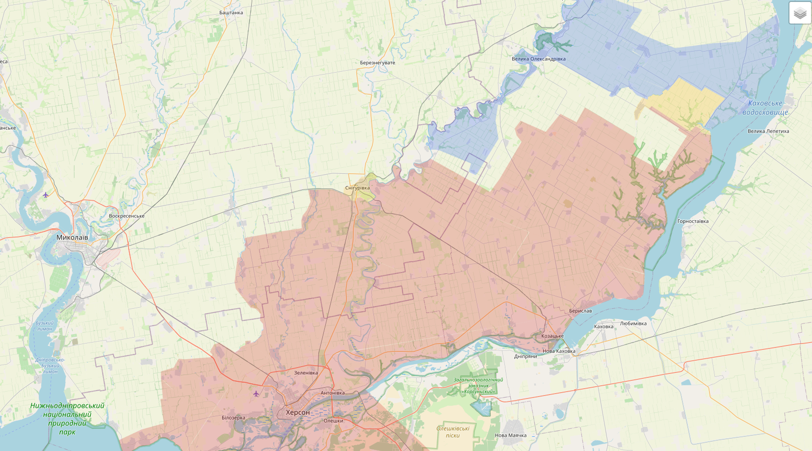

## 09/10/2022

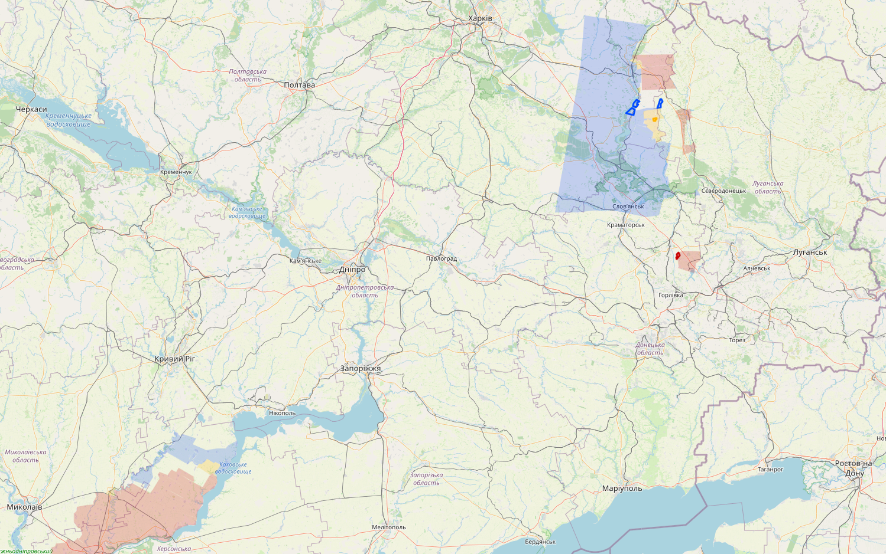

Gisterenavond zag ik nog een visuele bevestiging van Oekraïense troepen in Stelmahivka (1), alleen snapte ik niet hoe die daar geraakte, gezien er enkel contested gebied naar daar ging. Vandaag ben ik erachter gekomen dat Novoplatonivka (2), Bohuslavka (4) en Borivska Andriivka (3) op 5 oktober door Oekraïne was heroverd. Ook in de regio beweert Oekraïene dat Pershotravneve (5) zou worden gebombardeerd, er zijn ook enkele recente geruchten die beweren dat deze stad onder Oekraïense controle zou staan. Ik markeer het als contested. Net als Kopanky en het gebied in het noorden. Twee dagen terug werd er in elk geval nog gevochten in Zelenyi Hai (6)
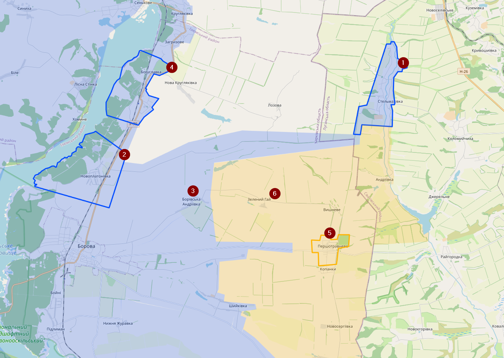

In de regio van Bakhmut zou Vesela Dolyna (1) zijn bemachtigd door de Russen. Dat gebied staat daar enorm onder druk. Als er ergens een locatie is waar de Russen nog vooruitgang kunnen boeken, dan is het rond Bakhmut.
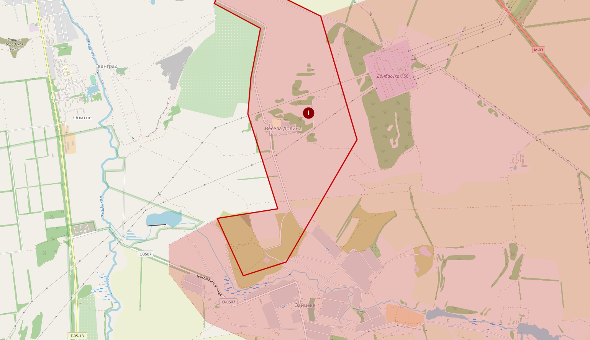

In Kherson is Nova Kamianka (1) onder Oekraïense controle gekomen, de enige weg ernaartoe heb ik als contested gemarkeerd.
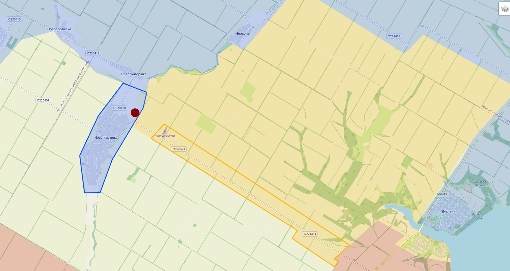

Rusland heeft ook gezegd dat de aanval geen reden is voor het inzetten van kernwapens, wat ergens toch goed nieuws is? Then again, Rusland zei ook dat ze nooit Oekraïne zouden binnenvallen. <https://twitter.com/maxseddon/status/1579177394774355969>
