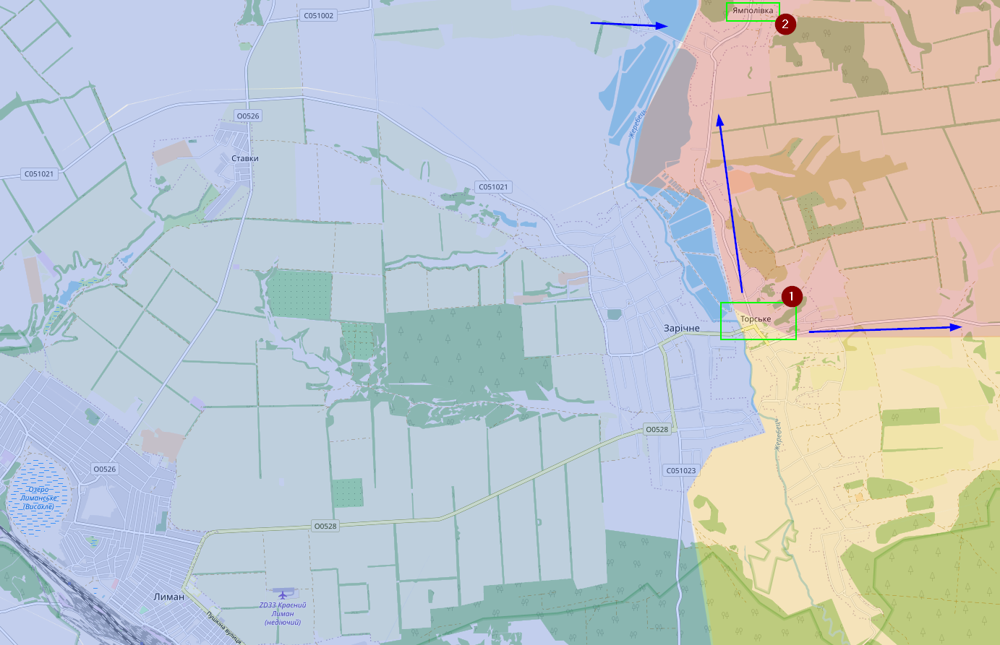

# October 2022

## 02/10/2022

Er is veel gebeurd, maar ben te lui om het allemaal in detail op kaarten te verwerken, die zal ik morgen bijwerken.

Weet dat het Oekraïens leger verder aan het oprukken is en dat Torske (1) onder Oekraïense controle staat. Hier en daar ook meldingen gezien van Yampolivka (2), maar nog niet kunnen verifiëren. Oekraïne is in elk geval verder richting het oosten getrokken.

Meer ten noorden van Lyman bij Kupiansk-Vuzlovyi, zijn er beelden van Oekraïense soldaten in Kivsharivka (1) en vermoedelijk ook Novoosynove (2). Ook zou er meer gebied contested zijn ten oosten van Kupiansk-Vuzlovyi.

De weg verder naar het zuiden gaat naar Borova en dat is een stad waar Oekraïense soldaten zich al in het oosten en zuiden bevinden.

Verder in het oosten zijn er enkel Russische offensieven geweest richting Bakhmut, maar op eerste zicht zonder succes.

In het noorden van Kherson heeft Oekraïne een nieuw (klein) offensief geopend, waarbij Oekraïne de dorpen Zolota Balka (1) en Khreschenivka (2) hebben kunnen innemen. To be fair, ik dacht dat Zolota Balka eigenlijk onder Oekraïense controle stond.

Op dit moment is het redelijk duidelijk dat Oekraïne de bovenhand heeft. Rusland kan zeker in bepaalde regio’s de druk op Oekraïne houden, maar ook niet meer dan dat. Ik ben benieuwd hoe het de komende dagen/weken zal evolueren.

## a

Zaitseve

Savatove or Svatove
Troitske
Yarova
Krymky
Kreminna

Oleksandrivka
belogorivka
Yatskivka (Kharkiv, Donetsk)
Novohrednieve (Kherson)
Bilohorivka (Lysychansk)
