# November 2022

## 01/11/2022

Na een kleine pauze terug van weggeweest, hoewel er na al die dagen ook niet zoveel nieuws te melden is. Je merkt wel dat Rusland een stuk actiever is geworden, vermoedelijk als gevolg van de mobilisatie.

In het noorden van Kharkiv heb ik Kyslivka gemarkeerd als contested (voorheen Russisch), vanwege visuele confirmatie van Oekraïense troepen ten noorden van het dorp.
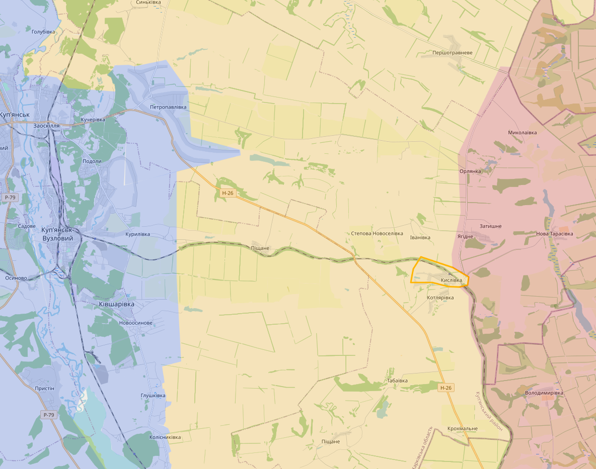

Iets meer naar het zuiden is er redelijk wat contested terrein rond Svatove. Vooral bij Kolomyichykha (1) zou er stevig worden gevochten en de H-26 zou regelmatig worden bestookt door Oekraïne.
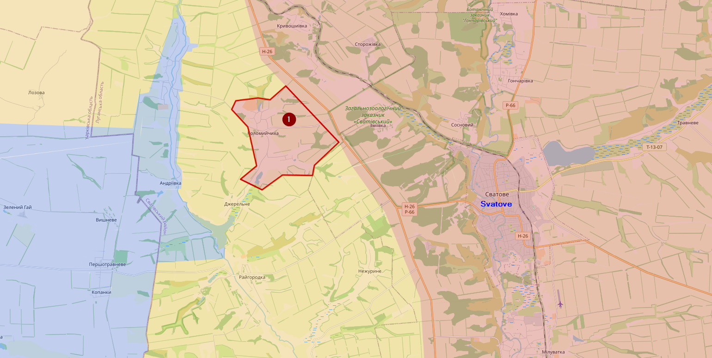

Bij Bakhmut zou de situatie niet veel veranderd zijn.

Ten zuiden van Bakhmut bij Pisky, beweren de Russen dat ze Vodiane (1) hebben kunnen veroveren, maar daar is weinig visueel bewijs van. Enkel in het oosten van dat dorp zijn er beelden van Russische troepen die gebombardeerd worden door Oekraïense troepen. Toch denk ik dat ze daar wat succes hebben en deels controle hebben over de M-30.
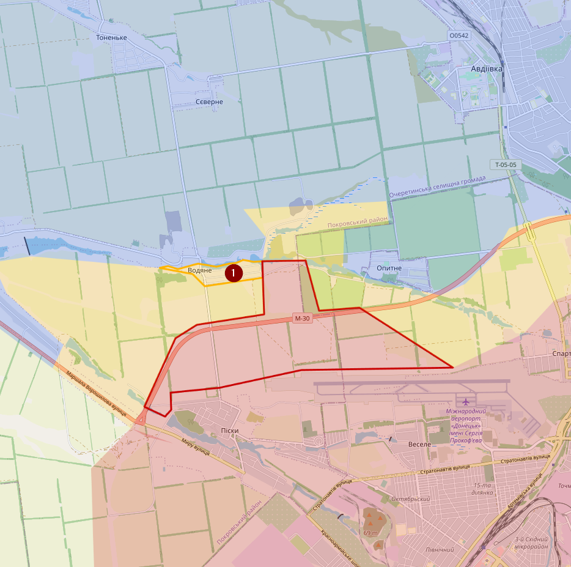

Aan het zuidelijk front zijn de russen ook een stuk actiever geworden. De Russen beweren dat ze het zuiden van Pavlivka (1) hebben kunnen heroveren, maar weer geen visuele confirmatie. Sowieso is de situatie daar niet 100% duidelijk. Veel kaarten markeren een groot deel van de steden op de T-05-09 onder Russisch controle, maar ik kan daar eigenlijk weinig bevestiging van vinden.
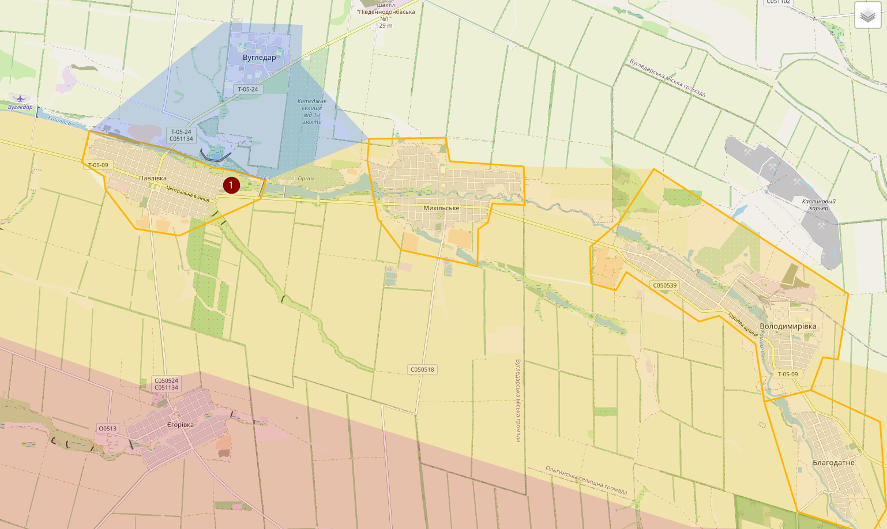

De volledige kaart zoals ik die nu heb
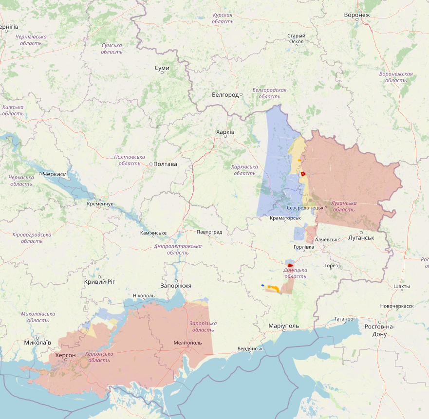

## 02/11/2022

Enkel nieuws uit Kharkiv, daar heeft Rusland een aanval uitgevoerd op Novovodiane (1) en Makiivka (2). Verschillende bronnen spreken elkaar tegen wat de uitkomst is, maar ik vermoed dat de aanval is afgeslagen. Het contested gebied is daar redelijk groot.
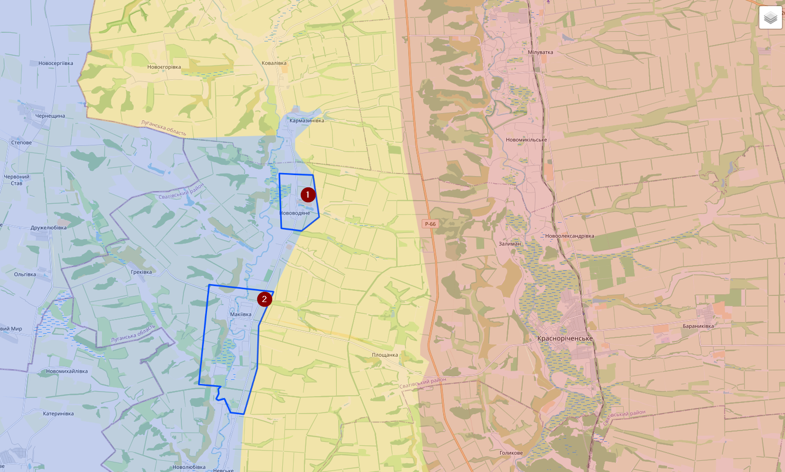

Grote kaart
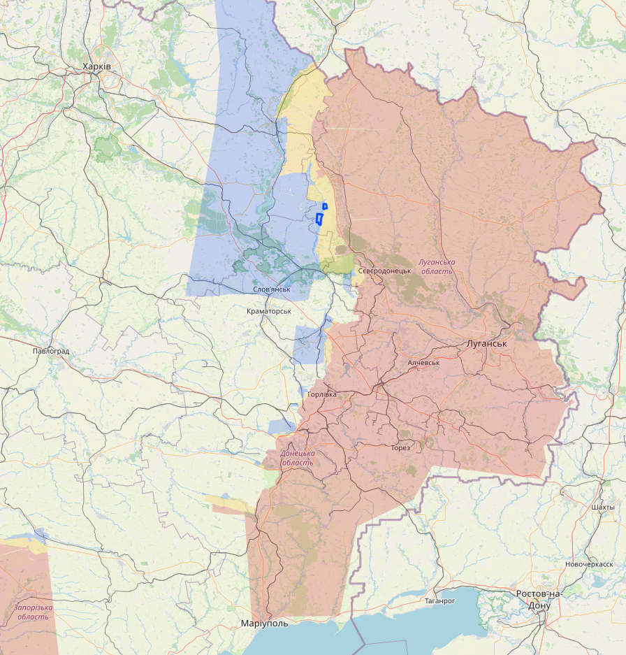

## 03/11/2022

In Kharkiv is er ondertussen bevestiging dat de aanval van gisteren was afgeslagen. Sommige Russische bronnen beweren dat Oekraïne zelfs een tegenoffensief heeft uitgevoerd richting P-66. Maar daar heb ik geen bevestiging van.

Bij Bakhmut Is het redelijk rustig.

In het zuiden bij Pavlivka beweren Russische accounts dat Oekraïne een succesvol tegenoffensief heeft uitgevoerd, maar vermoedelijk zijn ze nooit tot in Pavlivka geraakt.
Het grootste nieuws komt uit Kherson, daar zijn er al enkele weken geruchten dat Rusland zou vertrekken, maar die geruchten worden soms tegengesproken door bevindingen op het terrein. Desondanks was er vandaag de uitspraak van Kirill Stremousov (die aan het hoofd van dat gebied staat), wat best huge is. Vandaag zijn er ook verschillende beweringen/beelden dat de Russen verschillende checkpoints zouden hebben verlaten in Kherson stad. En de Russische vlag is ook verdwenen van het administratief gebouw. Veel Oekraïense bronnen blijven echter redelijk sceptisch.

Desondanks heeft Oekraïne bij Davydiv Brid het dorpje Mala Seidemynukha kunnen heroveren.
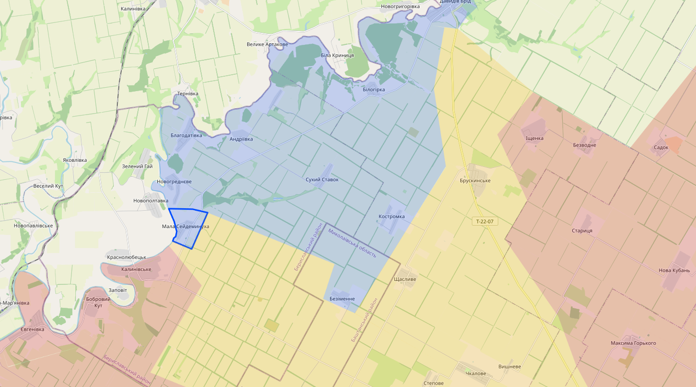
Grotere map:
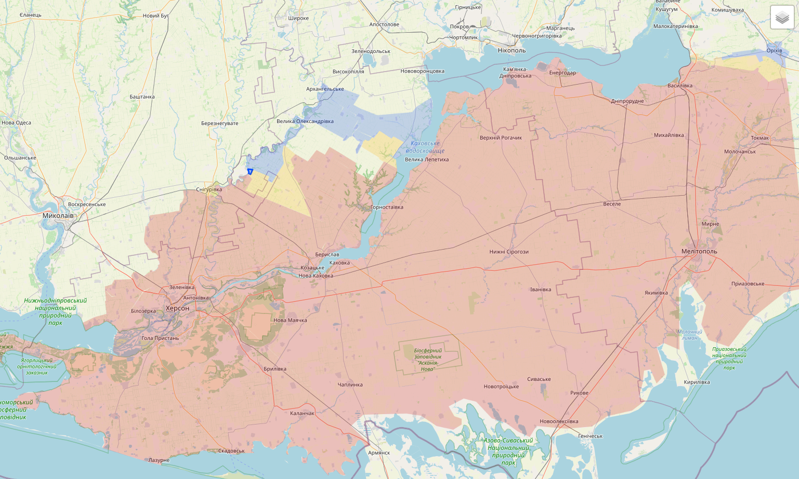

In other news, vandaag heeft de VS bevestigd dat er een klein team aanwezig is in Oekraïne die controles doet op de wapenleveringen. Die zouden wel wegblijven van het front.

## 06/11/2022

De laatste dagen was er weinig duidelijke berichtgeving, ik heb het gevoel dat de herfst het offensief van beide kampen redelijk bemoeilijkt.

In de Kharkiv regio zijn er beelden van een Oekraïense tank die ten noorden van Yahidne is aangevallen, daarom heb ik dat dorpje gemarkeerd als contested.
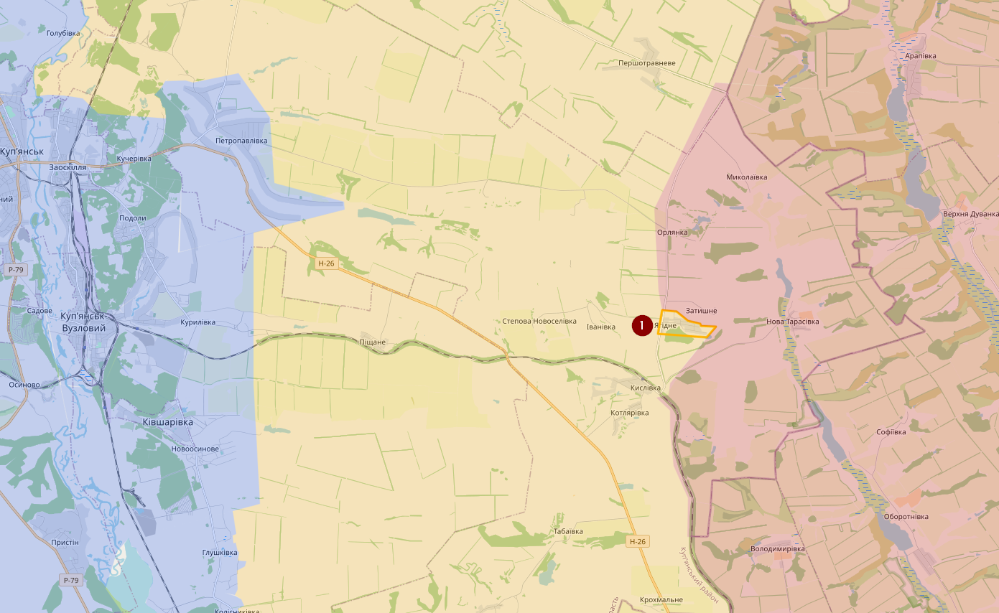

Ten zuiden van Marinka (1) zijn er dan weer beelden van Oekraïens artillerie, dus heb ik dat gebied ook als contested gemarkeerd. De Russen blijven Pavlivka (2) voortdurend aanvallen, hoewel ik ook signalen opvang dat de stad terug onder volledige Oekraïense controle staat. Volgens enkele russische accounts zou de Russische 155 Naval Infantry Brigade daar redelijk zware verliezen hebben geleden. Voorlopig hou ik het gemarkeerd als contested.

Verder weinig spectaculairs te melden. Kherson blijft een zwarte doos en ik verwacht niet dat Oekraïne daar snel een (frontale) aanval gaat uitvoeren.

Grote kaart
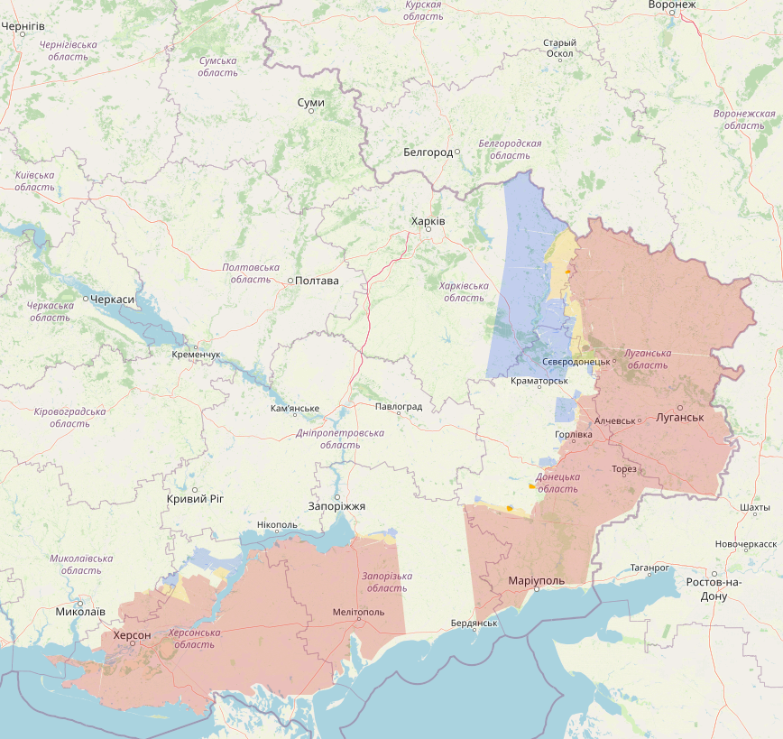

## 08/11/2022

Update 08/11/2022: Volgens Russische accounts zou Oekraïne zich aan het ingraven zijn (blauwe lijn) in de Kharkiv regio. Heel onlogisch zou dat niet zijn, want Winter is Coming

Kherson: Oekraïne heeft daar een konvooi kunnen aanvallen bij Snihurivka (1). In het verleden had ik deze als contested gemarkeerd, maar dat heb ik veranderd naar Russisch. Volgens Gonzo was er ook een aanval op Pravdyne (2), wat redelijk vreemd is gezien dat niet eens in Russische handen is.

## 09/11/2022

Kharkiv/Svatove regio. Niets concreets te melden

Bij Sivers’k zijn er beelden opgedoken van Wagner in het mijndorpje Bilohorivka (1).

Bij Bakhmut de gewoonlijke pogingen van de Russen zonder succes

Net als in het zuiden…

En dan Kherson… Het begon deze ochtend met verschillende visuele bevestigingen van bruggen die waren opgeblazen, dus het was redelijk snel duidelijk dat er iets aan het gebeuren was.

Gisteren zag het er zo uit…

Vandaag is dit de situatie:

Ik markeer het grootste deel als contested en niet als Oekraïens, omdat het gebied nog niet in handen is van Oekraïne en er vermoedelijk nog russen in het gebied zitten. Bovendien is Oekraïne (en de NAVO) redelijk argwanend.

Desondanks was er vandaag visuele bevestiging van Oekraïense troepen in Kalynivske (1).

Gisterenavond was er ook al spraken van een Oekraïnse aanval op Snihurivka (2), waarbij zowel terreinwinst zou zijn geboekt in het westen en het noorden. Echter zijn daar nog geen visuele bevestigingen van. Wel was er een foto van een Oekraïense vlag in de buurt van de spoorweg, maar die is vermoedelijk door een partizaan opgehangen.

Bij valavond zijn Oekraïne troepen de brug bij Dudchany (3) overgestoken.

En deze avond zijn er ook beelden opgedoken van Oekraïense troepen die Pravdyne (4) binnen zijn getrokken zonder gevechten.

Er zijn ook veel geruchten van het noorden in Kherson, o.a. bij Mylove, maar geen enkele (visuele) bevestiging. De komende dagen verwacht ik meer duidelijkheid, o.a. de situatie bij de dam zou wel nog interessant kunnen worden.

Zoals eerder gemeld is Kirill Stremousov omgekomen in een auto-ongeluk. Dit zouden beelden zijn van na het ongeluk. Volgens Russische media zou hij de controle verloren hebben en tegen een vrachtwagen zijn gebotst.
 

Er is ook een foto opgedoken van de truckchauffeur:

Goe hé, niet eens zelf bedacht.

## Update 10/11/2022

Ik ga mij alleen focussen op Kherson. Op andere locaties is de situatie niet veranderd. We zien wel een agressiever Rusland dat ook overwinningen probeert te faken met Russische vlaggen in contested gebied. Alles om het de aandacht weg te halen van Kherson I guess.

Het goede nieuws is dat de terugtrekking uit Kherson zonder geweld zou gebeuren, wat verschillende Russische accounts dan weer verdacht vinden. Blijkbaar snappen ze nog steeds niet dat Rusland de agressor is en dat Oekraïne niet liever heeft dat Rusland het gewoon afbolt zonder geweld.

Dus… volgende steden en dorpen zijn ondertussen bevestigd, hoewel ik niet alle beelden heb kunnen verifiëren:

1. Snihurivka
2. Pavlivka
3. Bobrovyi Kut
4. Yevhenivka
5. Tamaryne
6. Chkalove
7. Ischenka
8. Starytsia
9. Bruskynske
10. Kucherske
11. Borozenske
12. Kachkarivka
13. Mylove
14. Kyselivka
15. Stanislav
16. Pyatykhatky
17. Myroliubivka
18. Blahodatne

## 11/11/2022

Update 11/11/2022: Weer een dagje met veel Russische propaganda met fantoom overwinningen.

Uit het noorden heb ik weinig informatie.

Bij Bakhmut heb ik het contested gebied uitgebreid richting Klischiivka.

Ten zuiden daarvan beweren de russen dat ze Maiorsk (1) hebben ingenomen. Ze beweerde dat ook in september en oktober. Ik markeer het wel als contested, maar geloof niet dat ze het hebben ingenomen.

Bij het Avdiivka front beweren de russen dat ze Opytne (1) hebben kunnen bemachtigen, ondanks beelden van enkele soldaten in het zuiden van dat dorpje, denk ik niet dat ze al controle hebben. Ik heb het wel gemarkeerd als contested.

Kherson…

Twee dagen terug kwam ik dit tegen tussen mijn feed van Kherson. Aged like milk! Helaas bestaat het account en bericht niet meer, dus ga je het moeten doen met een screenshot.

Kherson beschouw ik nu zo goed als onder Oekraïense controle. Mochten er nog ergens Russen zitten dan geraken ze daar niet meer weg. Enkel het gedeelte bij de dam (1) is onduidelijk, maar daar zou de weg over de dam ook vernietigd zijn, dus ik vermoed dat dit gebied de komende dagen ook Oekraïens zal worden gemarkeerd

Zoals eerder hier al gemeld, is de Antonovsky bridge deze nacht vermoedelijk vernietigd door de Russen. Dit is trouwens al geüpdatet op Openstreetmap en drie maand terug had iemand daar ook een ferry route toegevoegd. Ik vind dat best knap dat zelfs in oorlogstijd dat soort informatie redelijk up-to-date is. (in tegenstelling tot de kaarten die de russen gebruikte aan het begin van de invasie)
  

## 13/11/2022

Het offensief in het noorden bij Svatove (1) van gisteren is nooit bevestigd geweest en vermoedelijk beperkt tot artillerie. Oekraïne melde wel dat ze weer volledige controle hebben over Makiivka (2). Om eerlijk te zijn, ik wist niet dat Oekraïne de controle was verloren.

Bij Lysychansk heb ik het dorp Bilohrivka veranderd naar contested. Vermoedelijk hebben de Oekraïense troepen geen (volledige) controle meer over dat dorp, maar dat gaat ook op voor de Russische troepen.

Situatie bij Yakovlivka (1) (In de buurt van Berestove) zou ook redelijk moeilijk zijn. Het oostelijk gedeelte is vermoedelijk contested

Verder weinig veranderingen in het oosten/zuiden. Russen beweren met visuele beelden dat ze verschillende dorpen hebben heroverd, maar dat gaat dan vaak over oude beelden die niet eens van daar zijn of een vlag midden in een contested gebied. Blijkbaar is de druk hoog om vooruitgang te boeken. Ik vraag mij af of Poetin die beelden ook gelooft?

Dan over Dnieper, de situatie is redelijk onduidelijk, maar Oekraïense troepen zouden actief zijn in Kinburn. Waar exact is redelijk onduidelijk en de geruchten gaan alle kanten op. Ik heb enkel het uiterste puntje gemarkeerd als contested, maar eigenlijk is dat een schot in de duisternis. Dat Oekraïne daar de oversteek heeft gemaakt, komt doordat ze complete controle hebben over het noorden en van daar heel makkelijk de Russische posities kunnen bombarderen met artillerie.

Verder zien we ook wat activiteit meer stroomopwaarts waarbij Oekraïne de Russische posities bestookt met artillerie.

Dit weekend ben ik nog eens langs geweest bij mijn vrienden die familie hebben in Mykolaiv. Die zijn uiteraard dolgelukkig dat de Russen vertrokken zijn uit Kherson, want de situatie is daar moeilijk. Er is daar maar enkele uren elektriciteit en geen stromend water.

## 14/11/2022

Update 14/11/2022: In het noorden klagen de Russen dat Oekraïene redelijk wat druk zet richting Svatove (1) en dat ze ook de stad Kreminna (2) bestoken met aanvallen vanuit de bossen in het zuiden.

Ten zuiden van Bakhmut is Mayorske (1) veroverd door de Russen. :(

In het zuiden beweren de russen voor de tigste keer dat ze Pavlivka (1) hebben veroverd -_-

De Russische propagandafilmpjes zijn trouwens redelijk doorzichtig. Hier zie je een stilstaand beeld van “Oekraïense” gevangen. Alleen geen enkel Oekraïense identificatie en bovendien duidelijk waardeloze kogelwerende vesten die je enkel ziet bij… de Russen
 

Verder richting Kherson blijven er maar geruchten komen van Oekraïners die de Dnieper zijn overgestoken, maar geen enkele visuele bevestiging. De paar beelden zijn allemaal aan de rechteroever. Desondanks ook weinig ontkenning aan Russische kant. Er gaat geruchten over Oleshky (1) en Hola Prystan (2) contested, zelfs van Oekraïense bronnen, maar vermoedelijk is dat psy ops. Deze nacht waren er wel artillerie aanvallen op Oleshky.

Andere geruchten komen dan weer uit Kinburn, er zijn er die beweren dat de russen teruggetrokken zijn tot aan de blauwe lijn waar ze verdedigingen hebben gebouwd. Ik twijfel of er iets van waar is.

## 15/11/2022

Weinig veranderingen aan het front, ondanks pogingen. Ik heb Kinburn weer als Russisch ingekleurd omdat ik nu zeker ben dat de Oekraïense (en Russische) beweringen van Oekraïense troepen fake waren. Er zijn zelfs beelden opgedoken van Russische soldaten in dat gebied, ondanks dat het niet duidelijk is wanneer die beelden genomen zijn.
