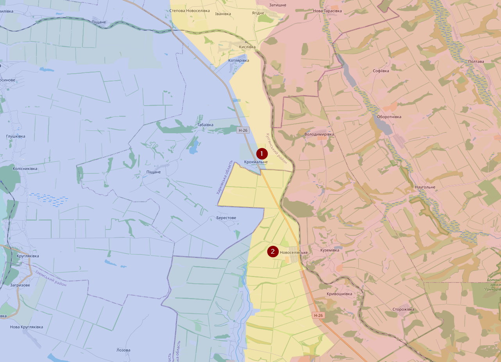
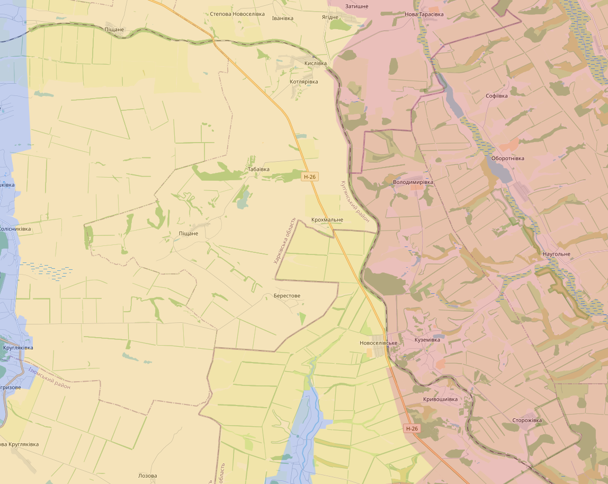
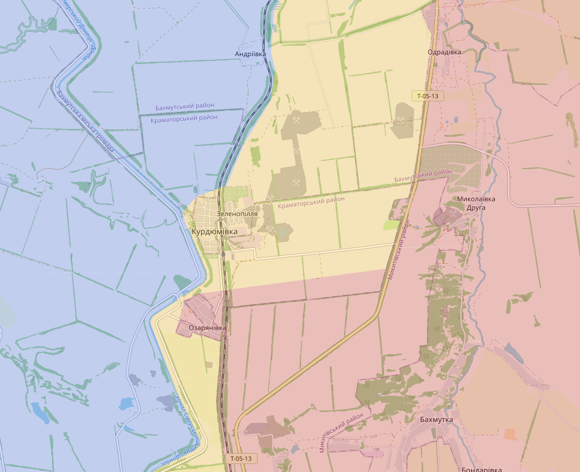
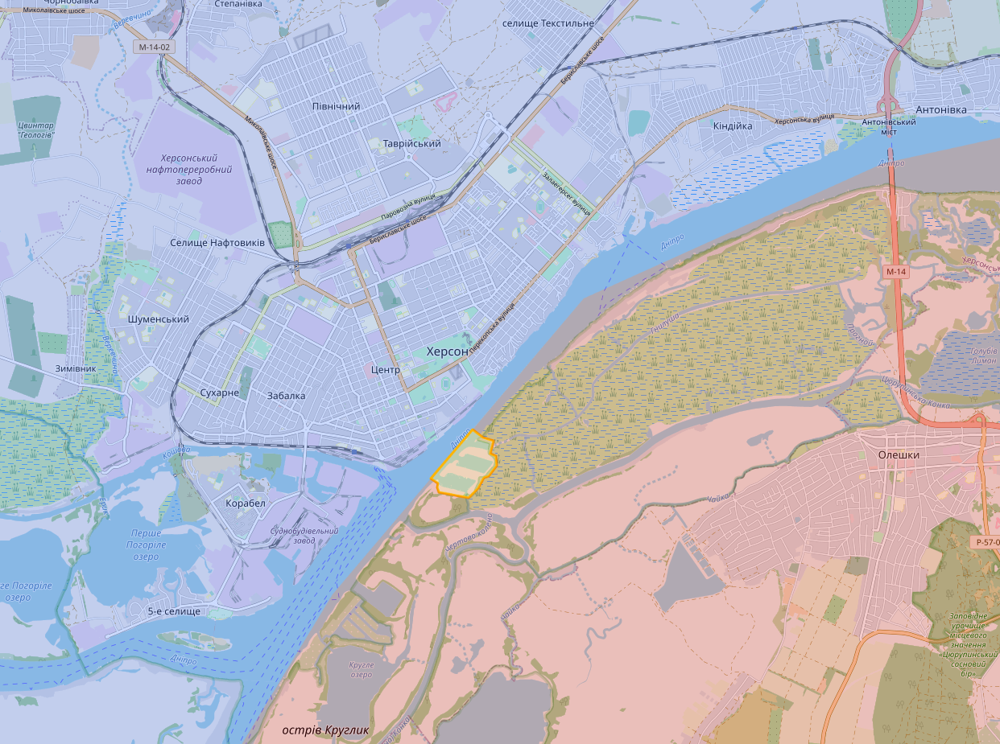
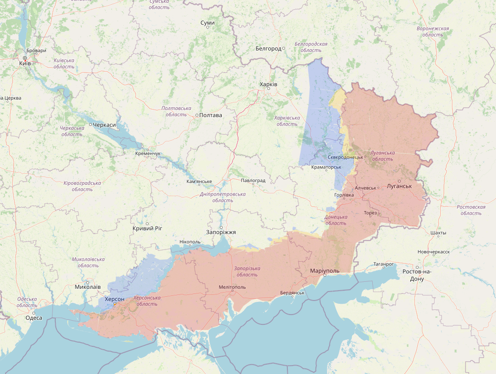
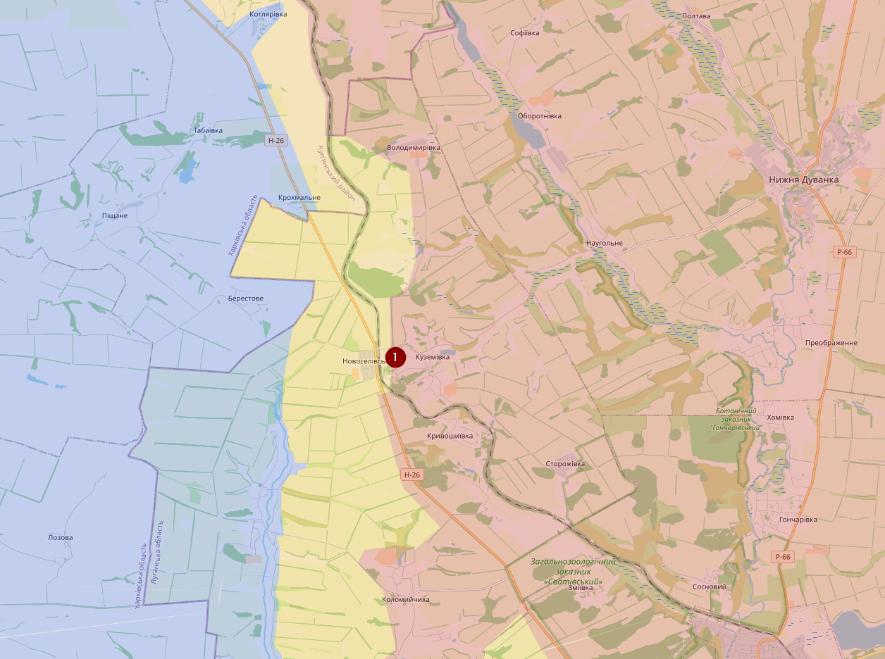
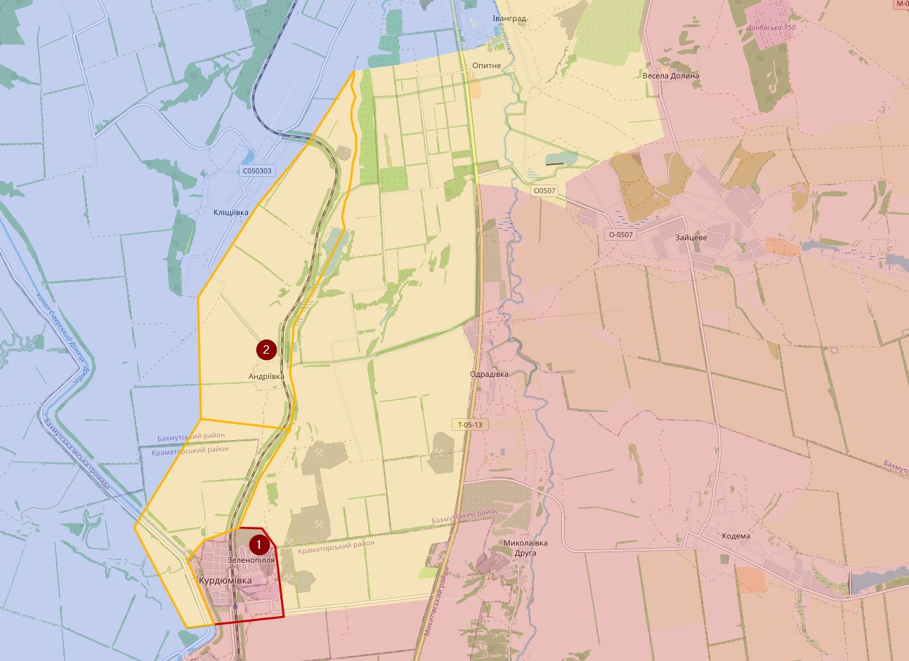
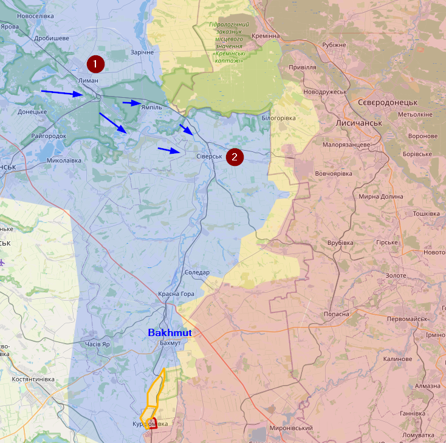
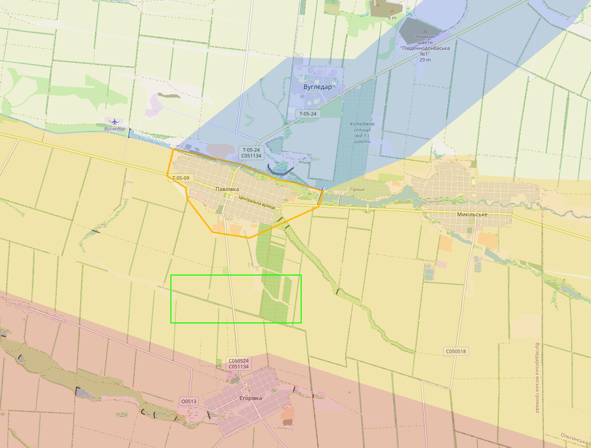
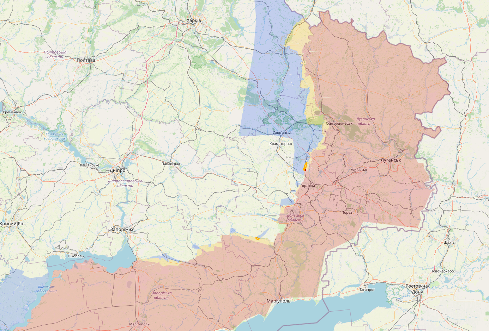

# December 2022

## 06/12/2022

Update 06/12/2022: Over de aanvallen op de luchtmachtbasissen, vermoedelijk gaat het over de Tupolev Tu-141 zoals de meeste media melden. Oekraïne beweert dat tegen februari een die tegen een hoog tempo te kunnen fabriceren.

Verder is zien we weinig veranderingen op het slagveld. Beide kampen slagen er niet in om nieuwe terrein vast te houden.

Kharkiv regio. Ten noorden van Svatove heb ik redelijk wat gebied aangepast in het voordeel van Oekraïne. Dat gebied was vermoedelijk al een lange tijd onder Oekraïense controle maar nooit visueel bevestigd. Krokhmalne (1) is zeker onder Oekraïense controle en vermoedelijk is een groot deel ten oosten van de spoorweg contested. Novoselivske (2) is al enkele keren van kamp veranderd, volgens de laatste visuele berichten is het nu onder Oekraïense controle, niet dat daar nog iets rechtstaat in dat dorp.

Zo zag de kaart ervoor uit. Meer ten noorden (bij de grens) moet ik ook nog een hoop gebied van contested naar Russisch veranderen, dat is voor een andere keer

Oekraïne zou (volgens Russische accounts) enkele dagen terug erin geslaagd zijn om de P-66 te bereiken ten noorden van Kreminna (1), maar ondertussen zou Oekraïne teruggedrongen zijn (volgens diezelfde Russische accounts), ik heb twijfels of dit effectief heeft plaatsgevonden. Oekraïne zou wel regelmatig kleine aanvallen uitvoeren op Kreminna vanuit het bos ten zuiden van de stad.

Bakhmut regio. Rusland beweerd hier grote progressie te maken, maar in de realiteit zien we het gebied voorduren van kant wisselen. Ozaryanivka (1) heeft Rusland vermoedelijk onder controle, maar bij Kurdiumivka (2) zien we ondertussen weer aanvallen ten oosten van het dorp, ondanks dat ze vorige week met visuele beelden beweerde de controle te hebben over dit dorp.

Ten noorden van Bakhmut bij Soledar beweert Rusland ook vooruitgang te boeken. Deze zomer beweerde Rusland dat ze dat gebied bijna hellemaal onder controle hadden, maar in realiteit zien ze zelfs vandaag nog steeds gevechten in contested gebied in de buurt van de knauf fabriek.

In het zuiden is het dan weer wat rustiger geworden. De Russen hebben weken gevochten om in het zuiden van Pavlivka een vlag te hangen en sindsdien blijven ze daar weg.

Oekraïne is technisch gezien de Dnieper overgestoken, ze hebben daar een vlag gehesen bij enkele kranen, maar verwacht niet dat ze van daar een actief offensief gaan uitvoeren (daarom contested).

De volledige kaart

## 11/12/2022

Svatove, weinig verandering. Op dit moment zou geen enkel kamp de controle hebben over Novoselivske (1). Ik heb het contested gebied hier wat uitgebreid ten oosten van de spoorweg.

Bakhmut, de Russen hebben daar wat successen gekend in het zuiden, Kurdiumivka (1) is nu wel onder Russische controle en het gebied in de buurt van de spoorweg heb ik ook als contested ingekleurd op basis van visuele bevestigingen (lees: Russische lijken in de buurt van de spoorweg). Maar we zien ook nog Oekraïense (artillerie/drone) aanvallen richting T-05-13. De situatie in Andriivka (2) is dan weer onduidelijk.

In een artikel van Vrt NWS wordt er beweert dat Bakhmut cruciaal is voor de bevoorrading, maar dat klopt niet (meer). Sinds de herovering van Lyman (1) in de Kharkiv regio hebben de Oekraïners weer voldoende bevoorradingsroutes richting Siversk (2). Enkele maanden terug is er enorm gevochten voor Lyman. <https://www.vrt.be/vrtnws/nl/2022/12/10/oekraiense-stad-odessa-zonder-elektriciteit-na-russische-aanval/>

In het zuiden zijn er enkele kleine offensieven geweest van Oekraïne, maar niets grootst. In Pavlivka bevinden zich geen Russen meer. Die zitten meer zuidelijk.

De volledige map

