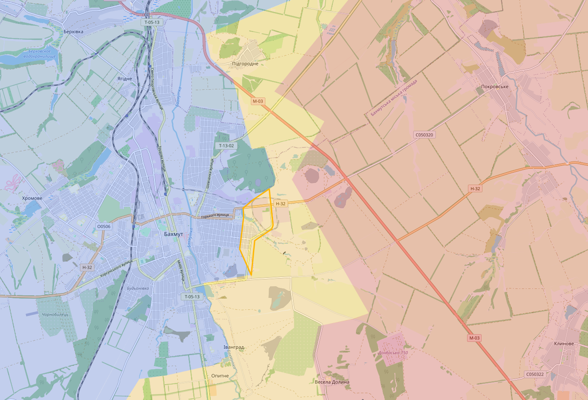
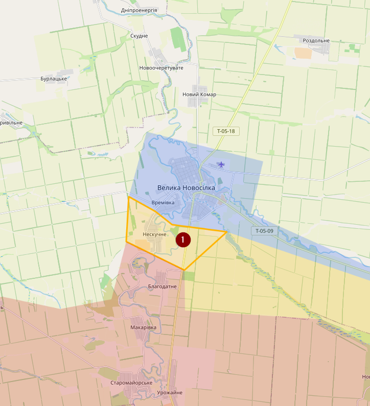
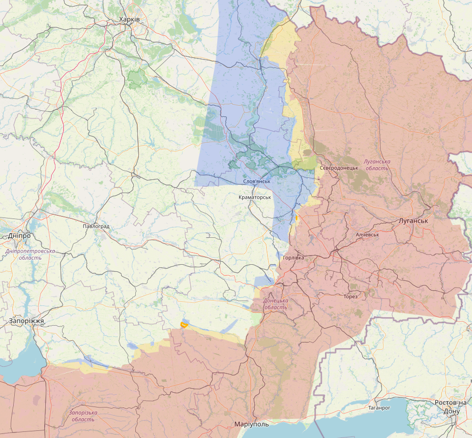
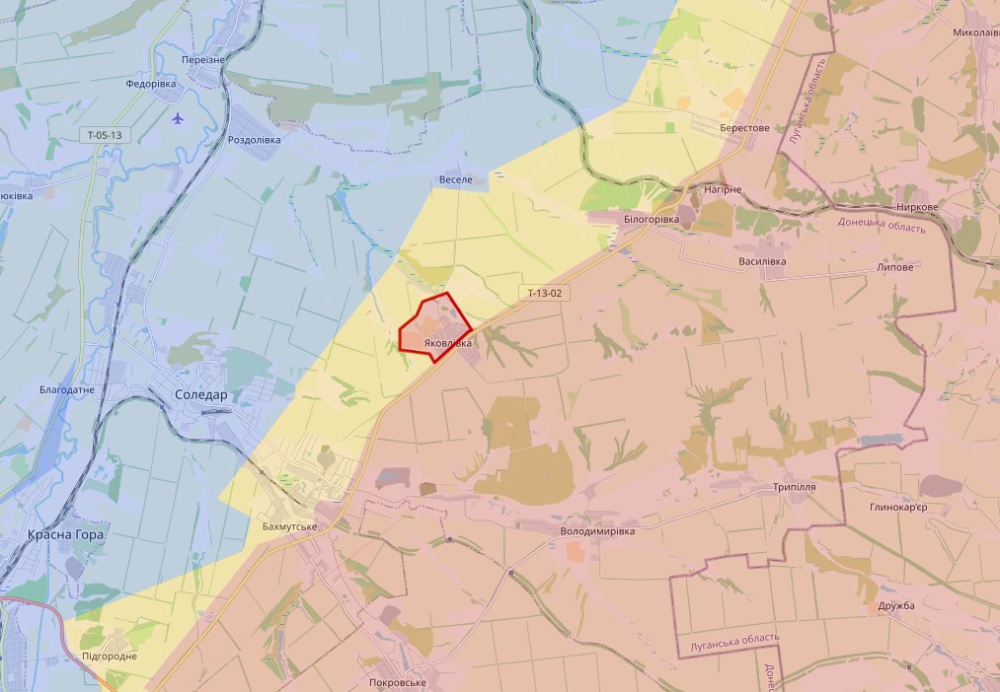
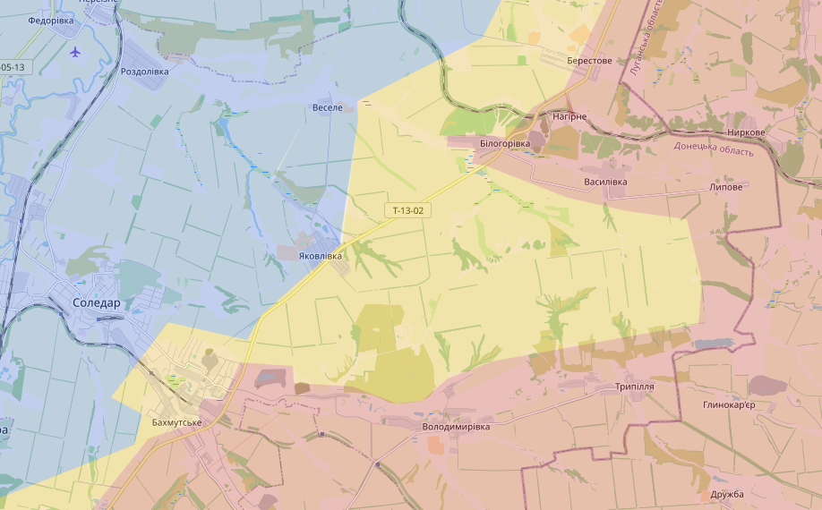
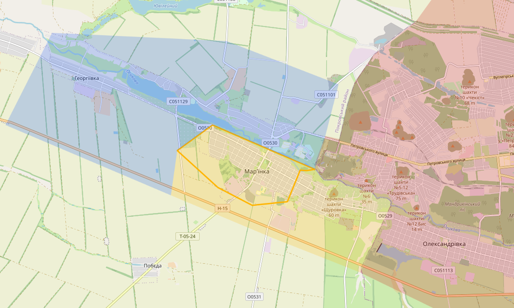
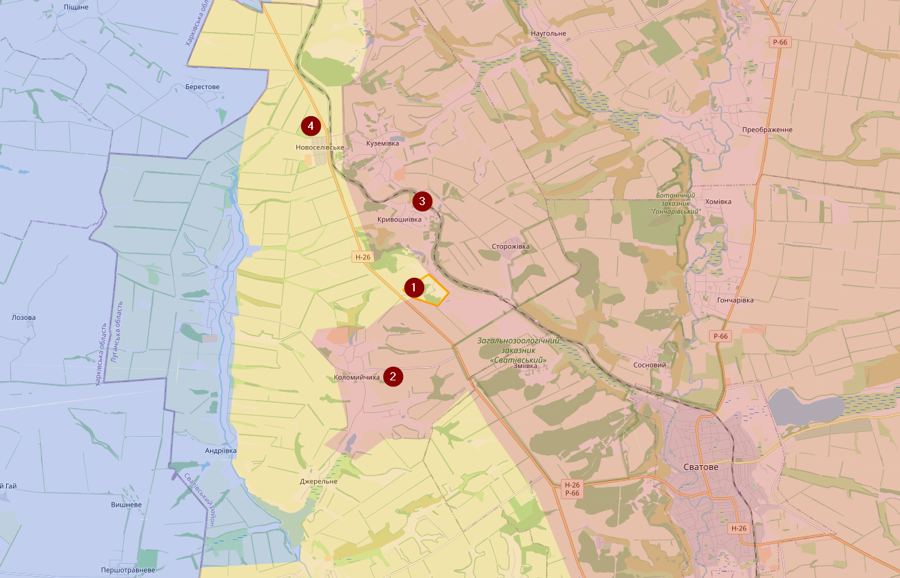
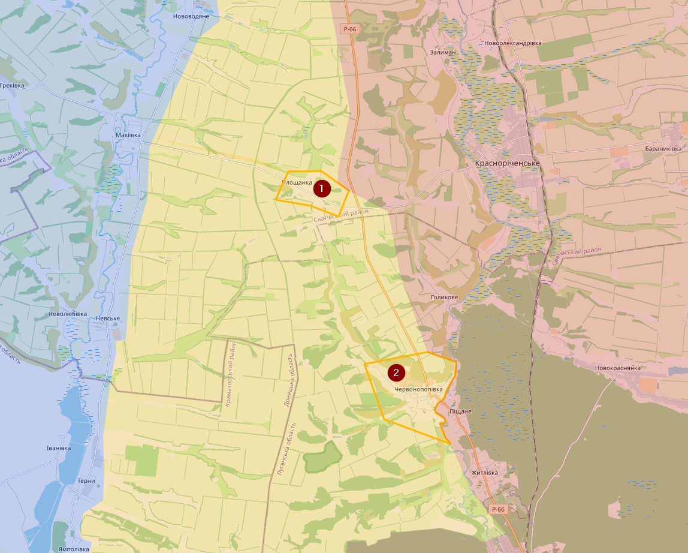
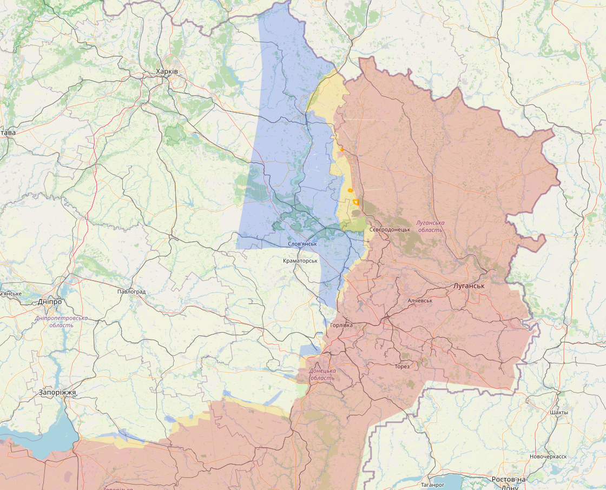

# December 2022

## 06/12/2022

Update 06/12/2022: Over de aanvallen op de luchtmachtbasissen, vermoedelijk gaat het over de Tupolev Tu-141 zoals de meeste media melden. Oekraïne beweert dat tegen februari een die tegen een hoog tempo te kunnen fabriceren.

Verder is zien we weinig veranderingen op het slagveld. Beide kampen slagen er niet in om nieuwe terrein vast te houden.

Kharkiv regio. Ten noorden van Svatove heb ik redelijk wat gebied aangepast in het voordeel van Oekraïne. Dat gebied was vermoedelijk al een lange tijd onder Oekraïense controle maar nooit visueel bevestigd. Krokhmalne (1) is zeker onder Oekraïense controle en vermoedelijk is een groot deel ten oosten van de spoorweg contested. Novoselivske (2) is al enkele keren van kamp veranderd, volgens de laatste visuele berichten is het nu onder Oekraïense controle, niet dat daar nog iets rechtstaat in dat dorp.

Zo zag de kaart ervoor uit. Meer ten noorden (bij de grens) moet ik ook nog een hoop gebied van contested naar Russisch veranderen, dat is voor een andere keer

Oekraïne zou (volgens Russische accounts) enkele dagen terug erin geslaagd zijn om de P-66 te bereiken ten noorden van Kreminna (1), maar ondertussen zou Oekraïne teruggedrongen zijn (volgens diezelfde Russische accounts), ik heb twijfels of dit effectief heeft plaatsgevonden. Oekraïne zou wel regelmatig kleine aanvallen uitvoeren op Kreminna vanuit het bos ten zuiden van de stad.

Bakhmut regio. Rusland beweerd hier grote progressie te maken, maar in de realiteit zien we het gebied voorduren van kant wisselen. Ozaryanivka (1) heeft Rusland vermoedelijk onder controle, maar bij Kurdiumivka (2) zien we ondertussen weer aanvallen ten oosten van het dorp, ondanks dat ze vorige week met visuele beelden beweerde de controle te hebben over dit dorp.

Ten noorden van Bakhmut bij Soledar beweert Rusland ook vooruitgang te boeken. Deze zomer beweerde Rusland dat ze dat gebied bijna hellemaal onder controle hadden, maar in realiteit zien ze zelfs vandaag nog steeds gevechten in contested gebied in de buurt van de knauf fabriek.

In het zuiden is het dan weer wat rustiger geworden. De Russen hebben weken gevochten om in het zuiden van Pavlivka een vlag te hangen en sindsdien blijven ze daar weg.

Oekraïne is technisch gezien de Dnieper overgestoken, ze hebben daar een vlag gehesen bij enkele kranen, maar verwacht niet dat ze van daar een actief offensief gaan uitvoeren (daarom contested).

De volledige kaart

## 11/12/2022

Svatove, weinig verandering. Op dit moment zou geen enkel kamp de controle hebben over Novoselivske (1). Ik heb het contested gebied hier wat uitgebreid ten oosten van de spoorweg.

Bakhmut, de Russen hebben daar wat successen gekend in het zuiden, Kurdiumivka (1) is nu wel onder Russische controle en het gebied in de buurt van de spoorweg heb ik ook als contested ingekleurd op basis van visuele bevestigingen (lees: Russische lijken in de buurt van de spoorweg). Maar we zien ook nog Oekraïense (artillerie/drone) aanvallen richting T-05-13. De situatie in Andriivka (2) is dan weer onduidelijk.

In een artikel van Vrt NWS wordt er beweert dat Bakhmut cruciaal is voor de bevoorrading, maar dat klopt niet (meer). Sinds de herovering van Lyman (1) in de Kharkiv regio hebben de Oekraïners weer voldoende bevoorradingsroutes richting Siversk (2). Enkele maanden terug is er enorm gevochten voor Lyman. <https://www.vrt.be/vrtnws/nl/2022/12/10/oekraiense-stad-odessa-zonder-elektriciteit-na-russische-aanval/>

In het zuiden zijn er enkele kleine offensieven geweest van Oekraïne, maar niets grootst. In Pavlivka bevinden zich geen Russen meer. Die zitten meer zuidelijk.

De volledige map

## 13/12/2022

Rusland is redelijk actief geweest op verschillende, op de meeste locaties zonder successen

Het oostelijk gedeelte van Bakhmut is wel contested geraakt.

In het zuiden heb ik het gebied Neskuchne (1) gemarkeerd als contested en het gebied ten zuiden ervan als Russisch, maar dit is niet nieuw. Vermoedelijk is Neskuchne zelfs eerder Russisch, er is echter weinig informatie bekend uit dit gebied, het is goed mogelijk dat de situatie hier al maanden zo is.

Grote kaart

## 16/12/2022

Vandaag is er visuele confirmatie dat Rusland controle heeft verkregen over Yakovlivka. Rusland was daar rond 13 november gestart met een nieuw offensief.

Voorheen zag de kaart er zo uit:

Meer in het zuiden zijn er visuele beelden van gevechten in het centrum van Marinka. Het gros is nog onder Oekraïense controle, maar heb het centrum toch gemarkeerd als contested.

Grote kaart

## 20/12/2022

We zien maar weinig verandering aan het front. Redelijk wat signalen dat de Russen weer uit Bakhmut zijn gedreven. In het zuiden van Bakhmut beweren de Russen terreinwinst, maar de visuele posities zijn gelijk aan die van enkele weken terug.

## 23/12/2022

Svatove regio: Enkele dagen terug waren er meldingen van Oekraïne dat ze controle hebben over Pidkuichansk, helaas zonder geolocatie, daarom markeer ik het als contested. Het is een beetje een vreemde locatie, gezien er geen aanwijzingen zijn dat de Russen de controle hebben verloren over Kolomyichykha (2) of Kryvoshyivka (3), wat de bevoorrading tot die locatie niet meteen makkelijk maat. Het enige logische is dat Oekraïne de controle heeft over Novoselivske (4) en de H-26 weg tot die locatie.

Iets ten zuiden van die locatie heb ik Ploshchanka (1) ook gemarkeerd aan contested, vermoedelijk heeft Oekraïne zelfs al controle over dit dorpje. Als we de P-66 verder afgaan zouden de Russen de stad Chervonopopivka (2) al enkel dagen aan het bestoken zijn met artillerie, wat zou kunnen wijzigen op aanwezigheid van Oekraïense troepen.

Bij Bakhmut zijn de Russen terug uit de stad gepushed.

Uit het zuiden heb ik geen info.

Grote kaart

