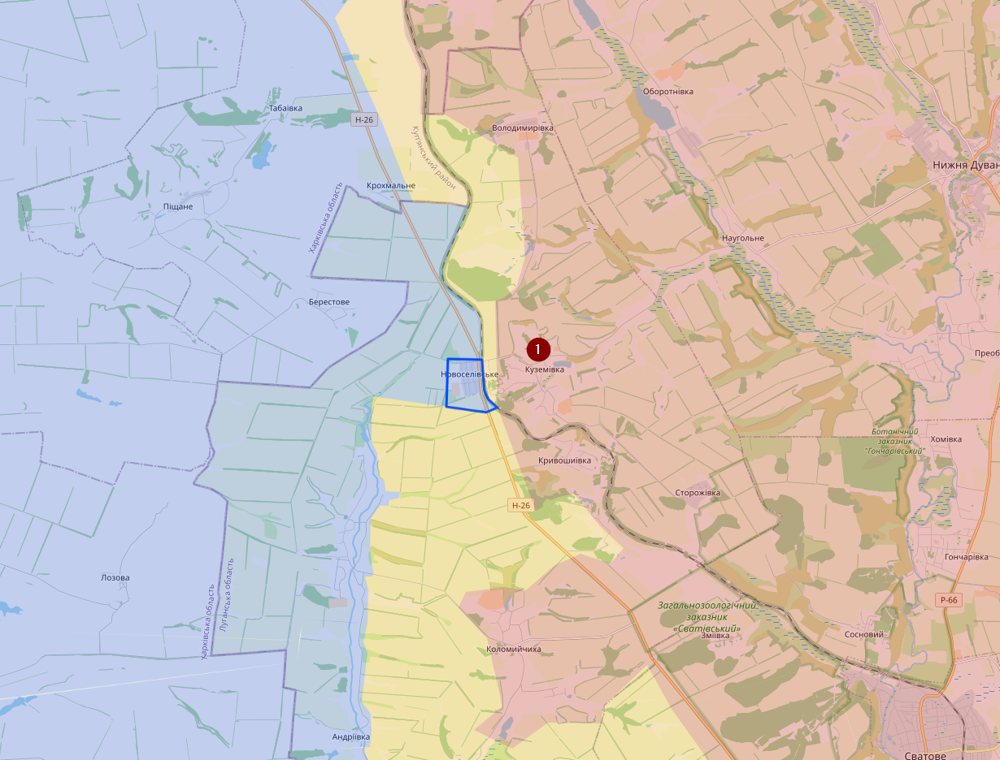
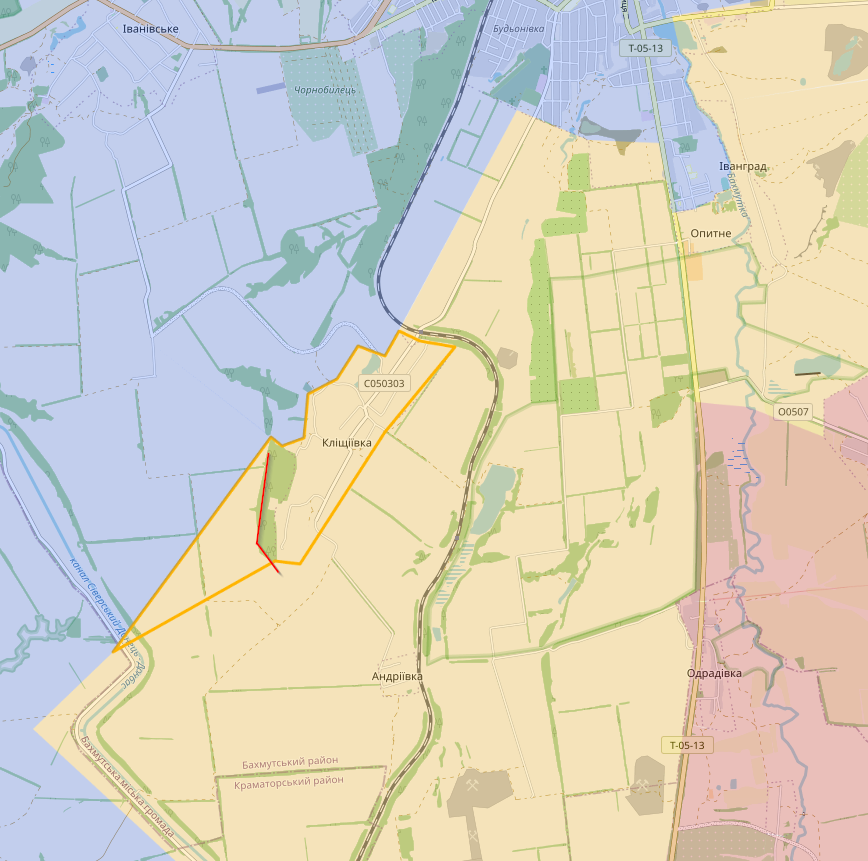
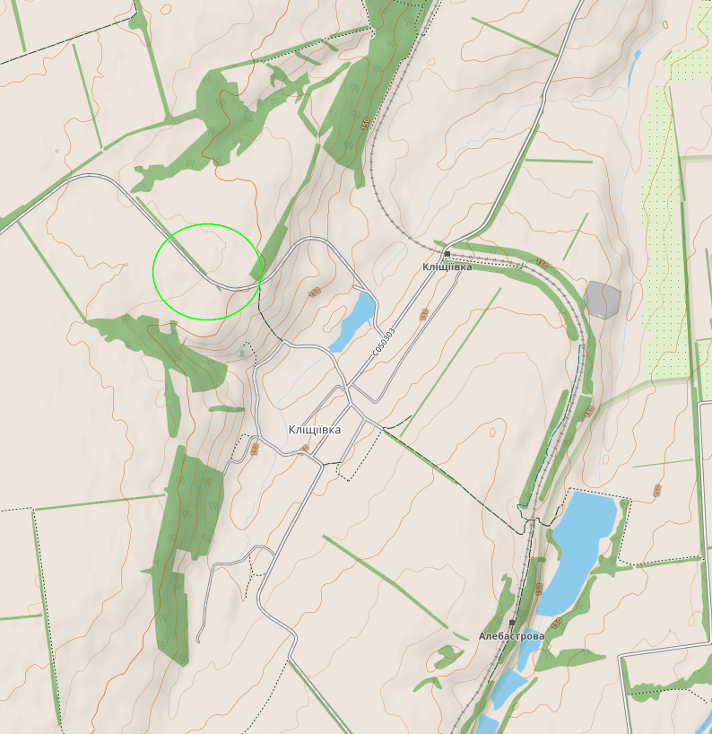
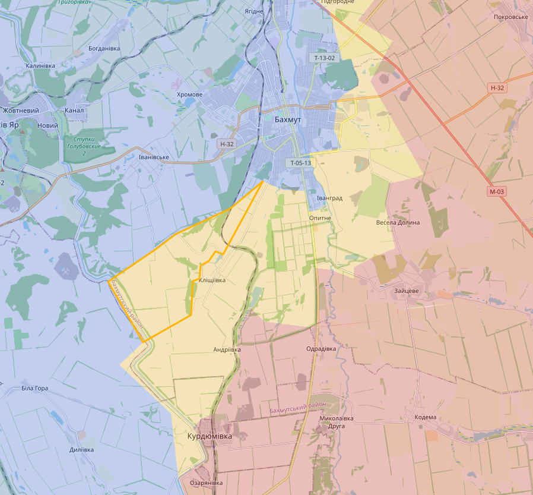
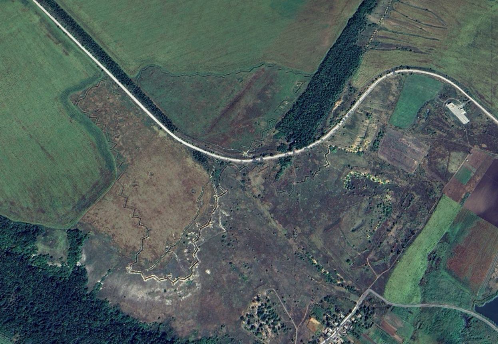
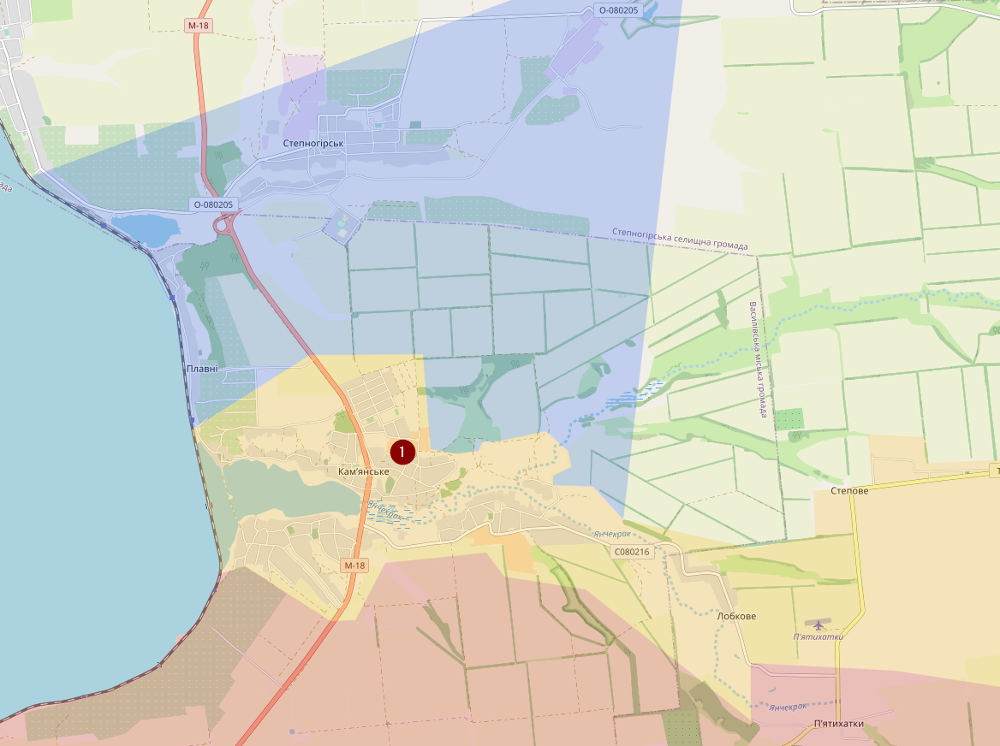

# January 2023

## 02/01/2023

Over die aanval bij school 19. Het dodental zou daar nu “officieel” op 89 staan. <https://www.vrt.be/vrtnws/nl/2023/01/02/rusland-voert-nieuwe-luchtaanval-uit-op-kiev/>

Verder eigenlijk weinig nieuws te melden. In het noorden heb ik eindelijk mijn kaart kunnen updaten in de regio van Dvorichna (1). Hiervoor was de regio ten oosten van de rivier volledig gemarkeerd als contested, omdat ik niet echt wist hoe de verhoudingen waren. En eigenlijk weet ik die nog niet voor de volle 100%. Tot enkele weken terug wist ik dat Rusland de controle had over Dvorichne (2), maar veel (Oekraïense) bloggers beweren dat dit niet meer het geval zou zijn, alleen zie ik geen visueel bewijs, behalve dat Oekraïne hun artillerie meer richting Tavilzhanka (3) richt. Hrianykivka (4) zou ook onder Oekraïense controle staan, maar geen visuele confirmatie. Masiutivka (5) is Oekraïens en Lyman Pershyi (6) is Russisch.

Bakhmut: daar heb ik het noorden van Soledar (1) gemarkeerd als contested omdat de Russen aanvallen vanuit Yakovlivka (2). Hoewel de situatie daar ook redelijk tegenstrijdig is. Er zijn beelden afkomstig van een Russische blogger waar Rusland een artillerieaanval uitvoert ter hoogte van punt (3). Dat zou betekenen dat Rusland veel minder terrein zou hebben dan ze beweren, onder voorbehoud dat het recente beelden zijn (wat nooit een zekerheid is). Ten zuiden van Bakhmut had ik initieel ook wat meer terrein gemarkeerd als contested op basis van Russische beweringen, maar dat heb ik ongedaan gemaakt, omdat die beweringen gebaseerd zijn op unicorn farts.

Verder nog veel te veel tijd verloren aan beelden die zogezegd afkomstig waren van Oekraïense soldaten en ik had ze bijna voor waar aangenomen zonder een grondige controle; tot ik merkte dat het geposts was door een account dat enkel anti-Oekraïense propaganda poste en populair is onder het wappie publiek. Soms zijn die juist, maar in dit geval was het complete BS. En nu ben ik lastig op mezelf dat ik daar zoveel tijd aan verloren ben. o_o

Grote map

## 08/01/2023

Update 08/01/2023
In het noorden zijn er weinig veranderingen. Vorige week heeft Oekraïne wel massaal gebombardeerd in de zone gemarkeerd met groen. Maar verder is daar geen nieuws uit gekomen.

Bij Soledar (1) bij Bakhmut is de situatie een stuk moeilijker. De Russen hebben vorige week ergens een rotatie gedaan en hebben enkele dagen terug massaal aangevallen met veel slachtoffers aan Russische kant, maar ook met wat succes en meer gebied van Soledar is nu contested. Merk op dat dit gebeurde tijdens de periode dat Rusland een eenzijdig staakt het vuren had aangekondigd. Situatie bij Pidhorodne (2) is redelijk onduidelijk. De Russen bronnen beweren dat ze er de controle over hebben. Oekraïense bronnen spreken dat tegen.

Verder geen nieuws, behalve dat ik Alpha-Two heb uitgebracht van de tool die ik gebruik om de situatie op te volgen. Nog steeds met tientallen bugs, maar ik kan er vaak rond werken. Mocht je interesse hebben: <https://github.com/BlackC0ffee/Ukraine> In de branch Map-Updates kan je de laatste updates vinden van de kaart. 

## 10/01/2023

De situate in Soledar

Verder nog een draadje ivm clustermunitie dat Oekraïne zou ontvangen hebben van Turkije <https://twitter.com/JackDetsch/status/1612919104649699348>

## 11/01/2023

De Russen hebben iets meer terreinwinst kunnen boeken de afgelopen uren. Er is visuele confirmatie van Russische troepen ter hoogte van de groene vierhoek.

Soledar is een redelijk grote stad, dus de bewering van Wagner dat ze de volledige controle hebben is fout, maar een groot deel is wel al in handen of contested.

## 16/01/2022

In Soledar zijn de Russen (Wagner) kunnen doorstoten tot het station Sol (1) en Krasnopolivka (2) is contested. Ten zuiden van het station had Oekraïne tot gisteren de controle over mijn #7 (3). De huidige situatie is echter onbekend. Rusland heeft ook een aanval uitgevoerd op het noorden van Krasna Hora (4)

Ten zuiden van Bakhmut hebben de Russen het dorpje Klishchiivka (1) vanuit het zuiden aangevallen. Voorlopig zonder succes. Het gebied ten zuiden heb ik gemarkeerd als contested. Er zijn ook Oekraïense artillerie aanvallen geweest ter hoogte van de weg bij het kanaal (rode lijn).

Als we uitzoomen, dan zien we dat er voorlopig nog zeker 2 hoofdwegen en 1 spoorweg richting Bakhmut gaan die onder Oekraïense controle staan. Toch bestaat er het gevaar dat de M-03 binnenkort in het bereik van Russische soldaten of artillerie komt.

Door de situatie bij Bakhmut heeft Oekraïne een deel van zijn troepen uit het noorden moeten weghalen, met het gevolg dat het daar redelijk tot stilstand is gekomen.

## 21/01/2023

Hoewel ik nog steeds geen officiële communicatie heb gezien, ben ik vrij zeker dat Novoselivske het dorpje is dat Oekraïne onder controle heeft gekregen in het noorden. Nuja, wat er nog van over is. Oekraïne is ook al stevig bezig met artilleriebeschietingen op Russische posities in en rond Kuzemivka (1). <https://discord.com/channels/701168115349979147/946311403017498674/1065401645783072809>

In de regio Bakhmut ziet het er naar uit dat het Russisch offensief bij Soledar tot stilstand is gekomen. Ten zuiden van Bakhmut beweren Russische accounts al enkele dagen dat de russen het dorpje Klischiivka hebben veroverd. Maar daar is geen enkel visueel bewijs van. Het enige visuele van Russische troepen is aan de buitenrand van het bos aan de zuidkant van het dorpje (rode lijn). Toch durf ik te denken dat Oekraïne zich misschien tactisch heeft teruggetrokken (daarom contested).

De reden is simpel. Het dorpje ligt vlak bij een heuvel waar Oekraïne vermoedelijk zich stevig hebben ingegraven.

Verder geen ander nieuws. Er zijn redelijk wat beweringen van Russische accounts dat Rusland in het offensief is gegaan in het zuiden (Zaporizhia Oblast), maar die beweringen kunnen niet geverifieerd worden en zijn vermoedelijk 100% bs.  

## Update 24/01/2023

Er zijn Russische infanterie gespot op de heuvel ten westen van Klischiivka (zuiden van Bakhmut), dus ik heb dat gebied ook gemarkeerd als contested en een deel ten oosten van de spoorweg heb ik veranderd naar Russisch. Is al een lange tijd dat ik daar nog Oekraïense artillerie of troepen actief heb gezien.

Ergens verbaast me het dat ze zo makkelijk die heuvel hebben kunnen innemen. Zelfs op foto’s uit 2021 zie je daar loopgraven. Vermoedelijk gaat het wel over een gecontroleerde terugtrekking (nuja, als zoiets bestaat).

Locatie op google maps: <https://www.google.be/maps/@48.5389871,37.9476349,992m/data=!3m1!1e3>

Zowel in het noorden en het zuiden zie ik weinig verandering. Alle visuele bevestigingen van een Russisch offensief vanuit het zuiden gebeurde in contested gebied.

Enkele dagen terug was er een Russisch onbetrouwbaar gerucht de Russen het dorpje Kamianske (1) hadden veroverd en dat werd door veel bekende pro-russische accounts overgenomen. Ondertussen is die bewering al afgezwakt en dat het dorpje contested is. Raad eens, dat is het al sinds April ofzo en ik ben vrij zeker dat die aanval nooit heeft plaatsgevonden. Een aanval daar is ook weinig logisch, gezien beide kampen dit dorpje gebruiken voor het ruilen van gevangengenomen soldaten.

