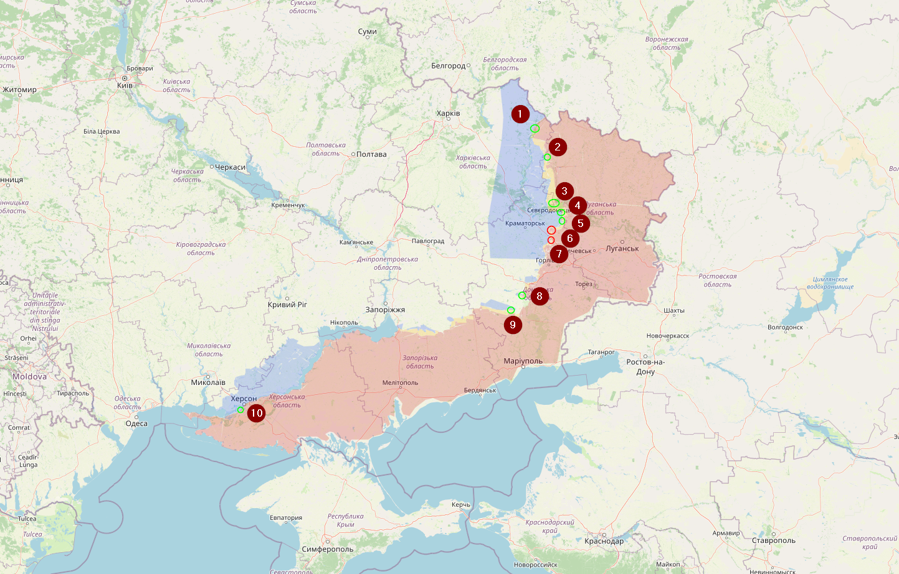
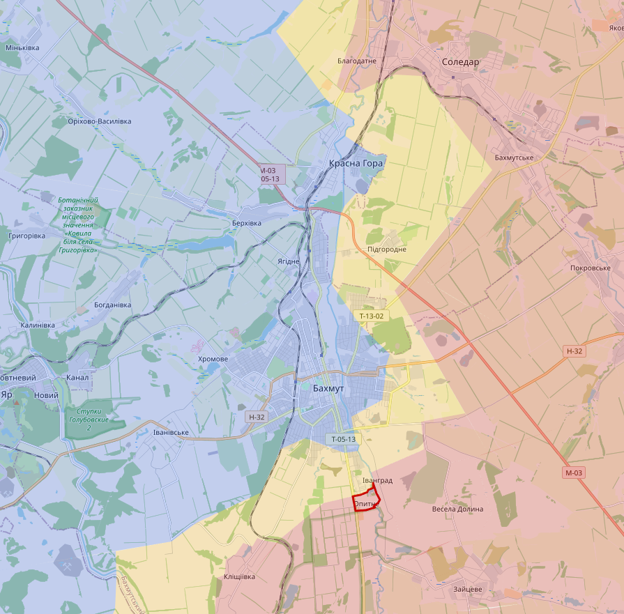
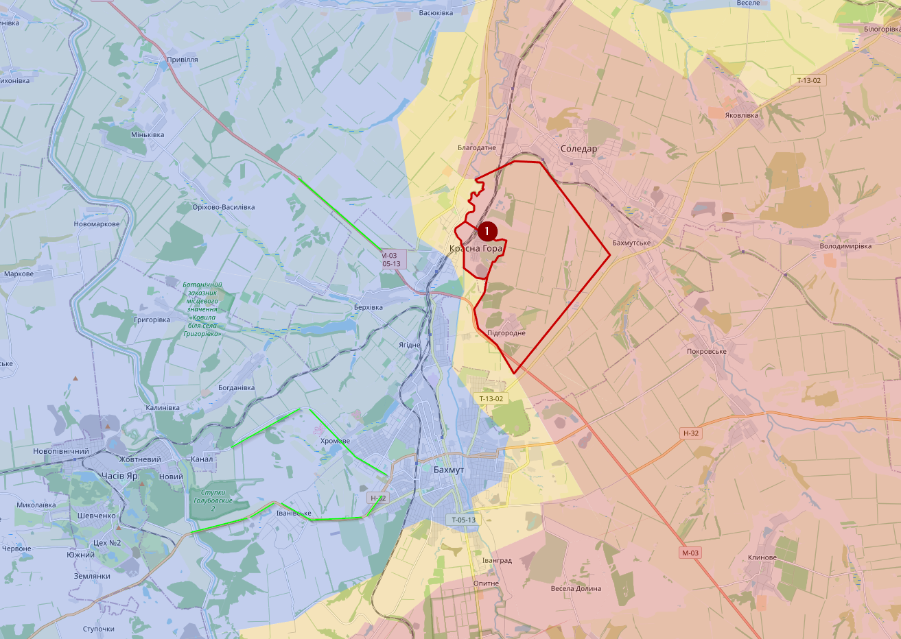

# February 2023

## Update 02/02/2023

Situatie in het noorden van Bakhmut blijft moeilijk, hoewel het offensief van de Russen een stuk geminderd is. Op 01/02 claimde ze nog trots dat ze het dorpje Sakko I Vantsetti (1) hebben kunnen veroveren en op 02/02 is daar Mykolaivka (2) bijgekomen. Maar die dorpjes bestaan uit minder dan 10 huizen. In het oosten van Bakhmut (3) zelf vinden er al urban gevechten plaats in platgebombardeerde wijken.

Dit was de situatie op 29/01/2023

Verder is er ook meer (visuele) activiteit van Oekraïense artillerie die Russische posities bestoken aan de oostkant van de Dnieper, ter hoogte van Kherson.
Van andere fronten heb ik geen opmerkelijk nieuws of grote veranderingen. Je ziet eigenlijk enkel veel activiteit in het Oosten.

## Update 07/02/2023

Eventjes een volledig overzicht van waar er nog gevochten wordt. Groene cirkels betekent dat er maar weinig of marginale progressie is. Rood betekent hevige gevechten. Novomlynsk (1) De russen zijn daar recent weer actief geworden, zonder weinig resultaat. Kuzemivka (Svatove regio) (2). De enige locatie waar Oekraïne nog duidelijk resultaat boekt atm. Kreminna (3) In dit gebied gaat het voortduren alle kanten op. Dit is ook een zeer bosrijk gebied. Iets zuidelijk aan de overkant van de Donets is er Bilohorivka (Lysychansk regio) (4) waar de Russen ook recent weer wat actiever zijn geworden. Ondanks Russische beweringen is er geen verandering aan de frontlinie daar. Verkhnokamianske (5), dat is vlak bij die raffinaderij, ook daar, ondanks beweringen van Rusland, staat het daar redelijk stil. Soledar (6) en Bakhmut (7) spreekt voor zich. Marinka (8) is wat onduidelijk, sommige bronnen beweren dat Rusland daar de laatste dagen wat successen heeft geboekt, maar visuele beelden spreekt dat eigenlijk tegen. Vuhledar (9), ook daar worden de aanvallen van Rusland voorlopig afgeslagen. Kherson (10), hier is het vooral artillerie van beide kampen, maar ook drone scouting/aanvallen van Oekraïne. Er zijn uiteraard nog een hoop meer locaties waar soms kleine offensieven gebeuren of artillerie actief is.

In Bakhmut is de situatie nog steeds moeilijk, maar vermoedelijk is het offensief vanuit het noorden gestopt. In het zuiden zou er dan weer wel gevochten worden in de stad, maar daar heb ik nog geen visuele confirmatie, enkel ten noorden van Opytne (vanaf nu gemarkeerd als Russisch) zijn er beelden van gevechten en zelfs daar is het nog redelijk beperkt.

## Update 13/02/2023

In de afgelopen dagen zijn er enkel veranderingen in het noorden van Bakhmut. Daar is Rusland erin geslaagd om Krasna Hora (1) onder controle te krijgen. Vermoedelijk slaagt Rusland er ook in om de M-03 met artillerie te bestoken. Dat is 1 van de 3 aanvoer wegen naar Bakhmut.

Verder hebben Finse en Noorse OSINT’ers ontdekt aan de hand van satellietbeelden dat Rusland terug begonnen is met de opbouw  van troepen ten noorden van Oekraïne, maar voorlopig nog niet voldoende om een dreigen te betekenen voor Oekraïne.
