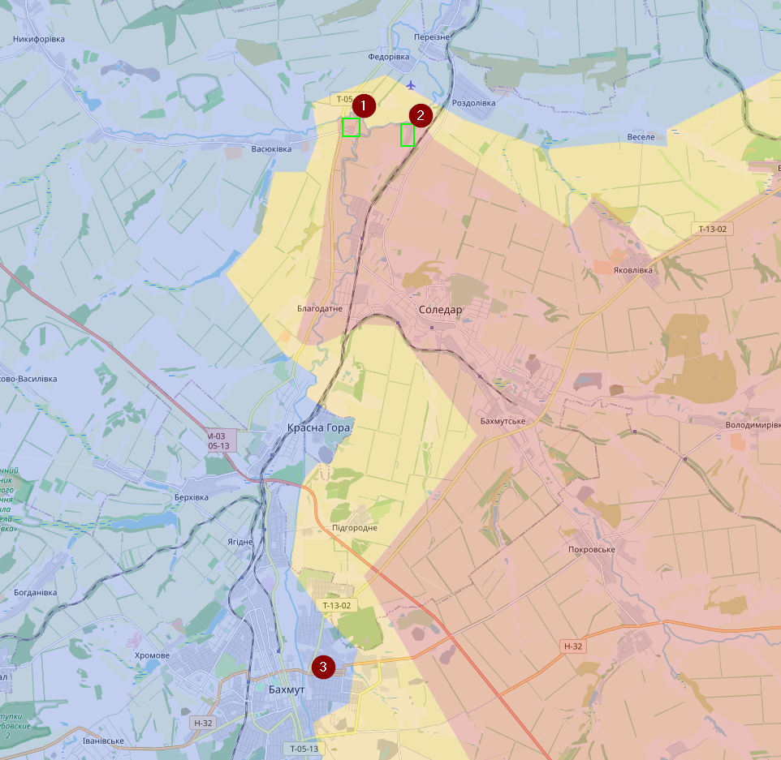
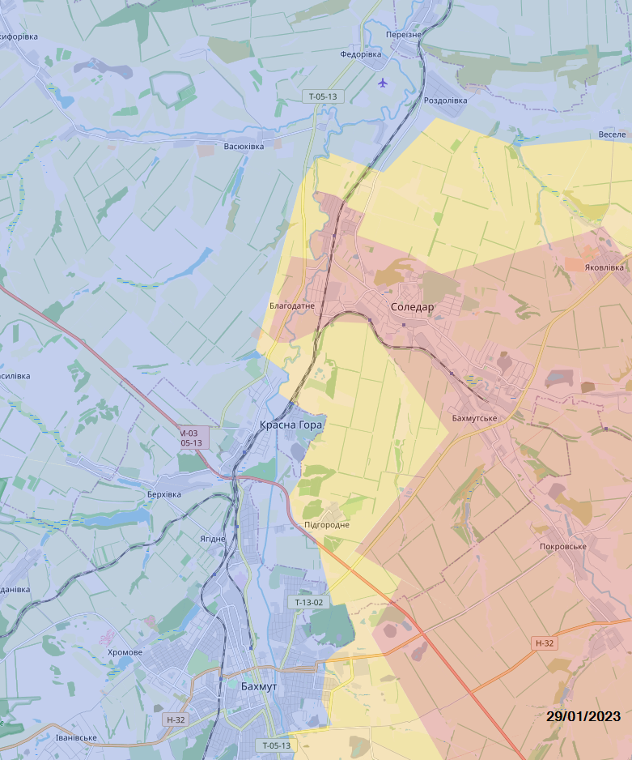

# February 2023

## Update 02/02/2023

Situatie in het noorden van Bakhmut blijft moeilijk, hoewel het offensief van de Russen een stuk geminderd is. Op 01/02 claimde ze nog trots dat ze het dorpje Sakko I Vantsetti (1) hebben kunnen veroveren en op 02/02 is daar Mykolaivka (2) bijgekomen. Maar die dorpjes bestaan uit minder dan 10 huizen. In het oosten van Bakhmut (3) zelf vinden er al urban gevechten plaats in platgebombardeerde wijken.

Dit was de situatie op 29/01/2023

Verder is er ook meer (visuele) activiteit van Oekraïense artillerie die Russische posities bestoken aan de oostkant van de Dnieper, ter hoogte van Kherson.
Van andere fronten heb ik geen opmerkelijk nieuws of grote veranderingen. Je ziet eigenlijk enkel veel activiteit in het Oosten.
