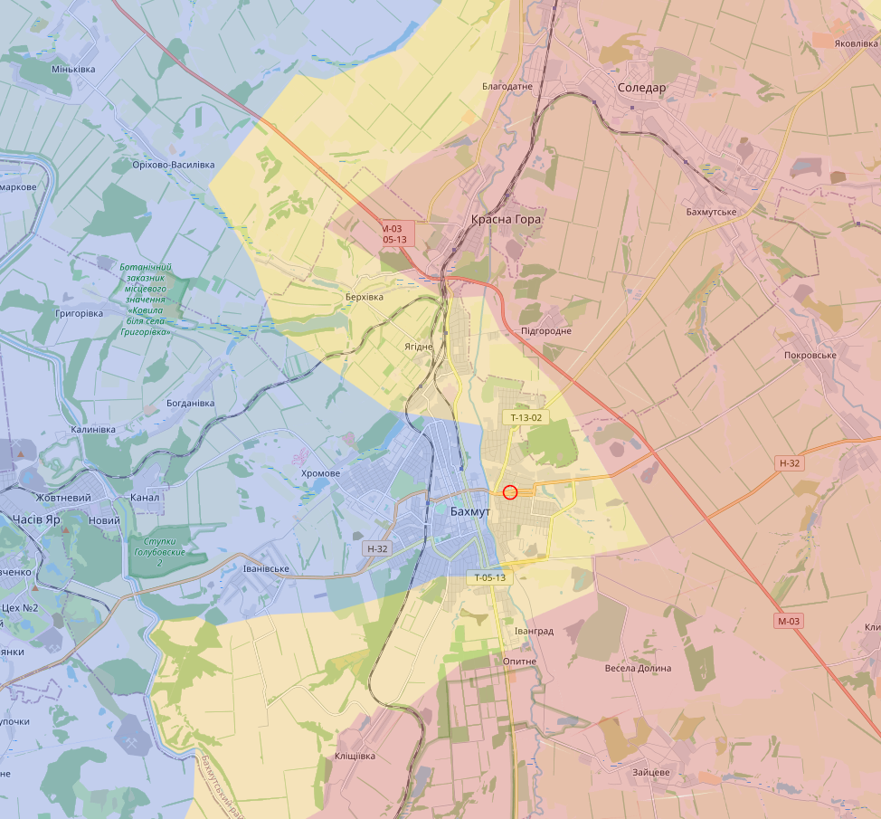
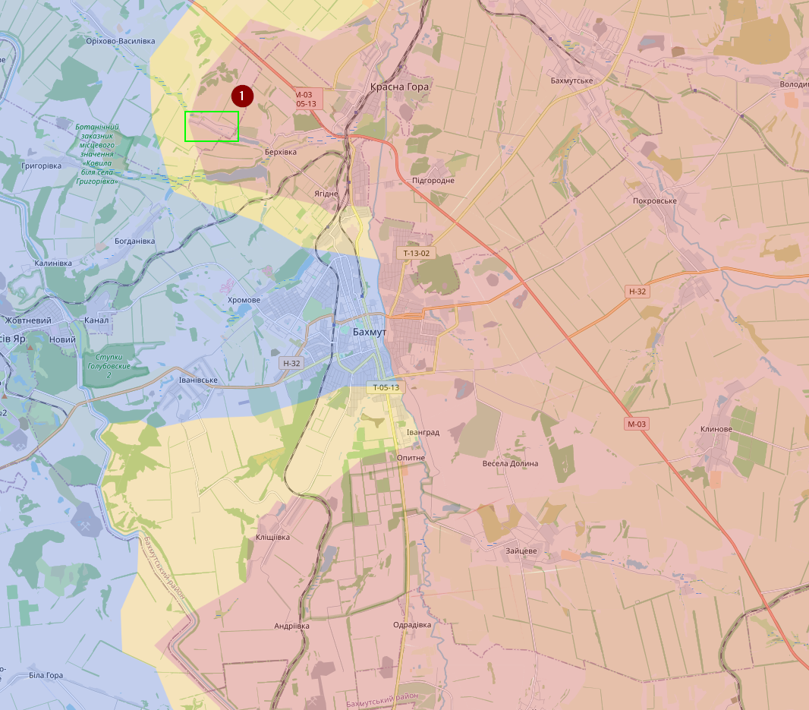
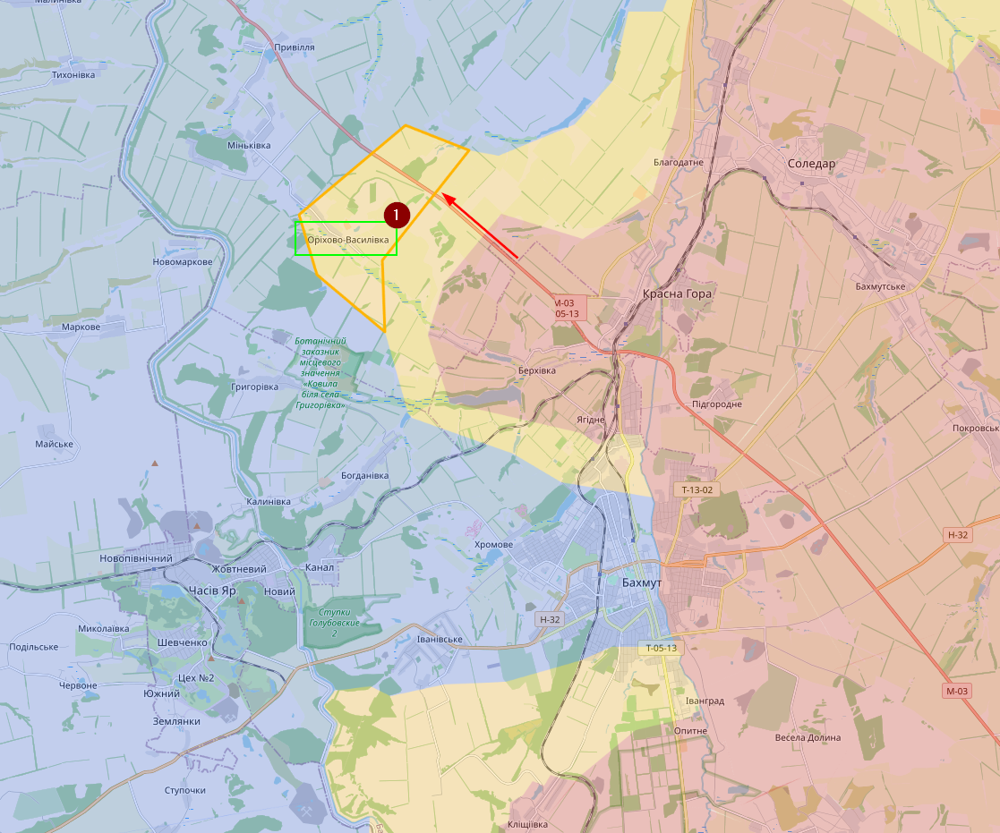
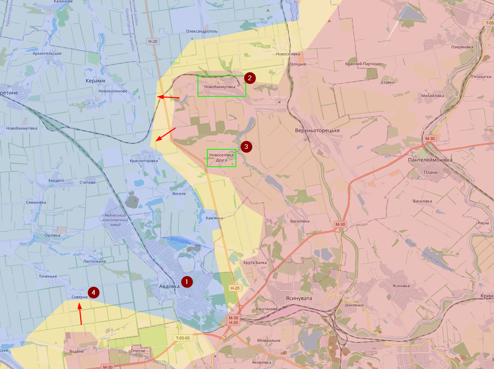
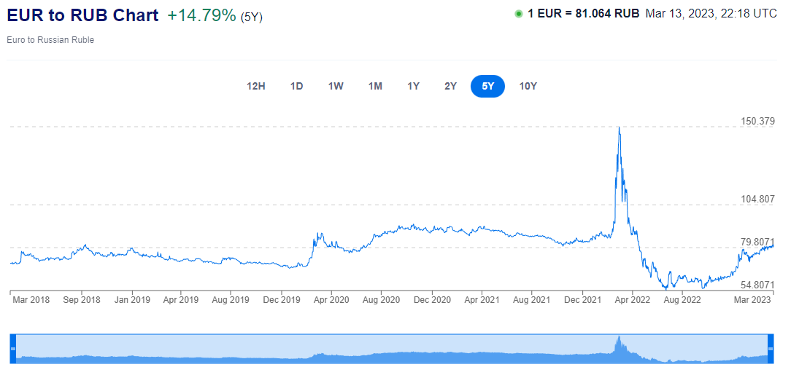
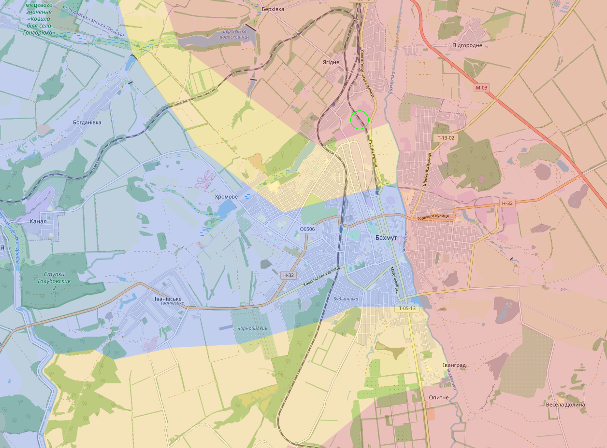
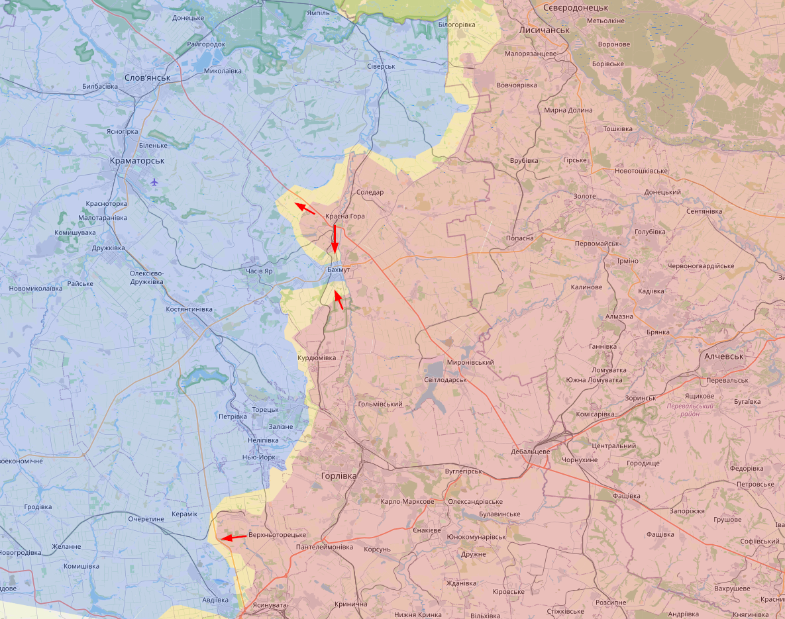
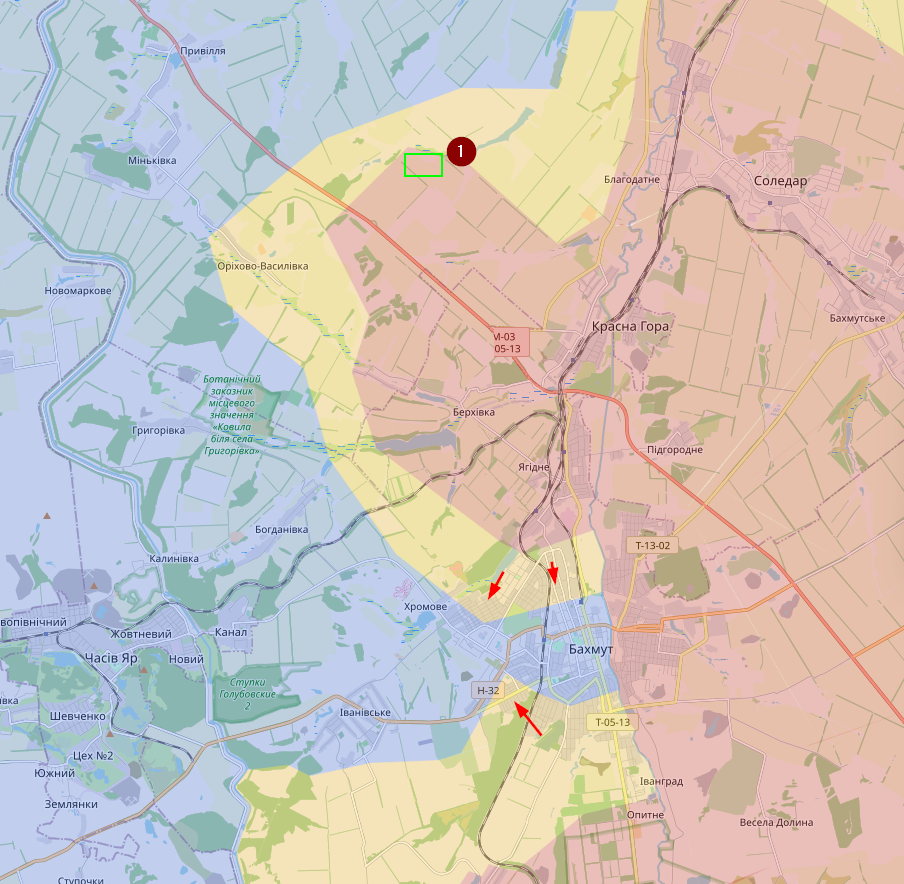
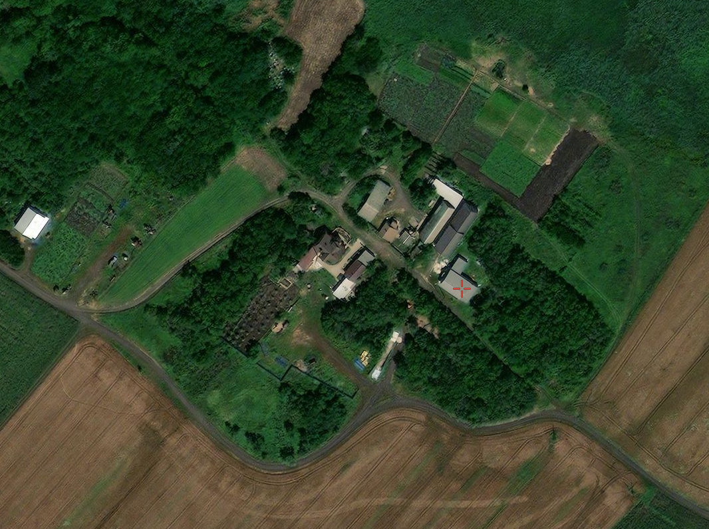
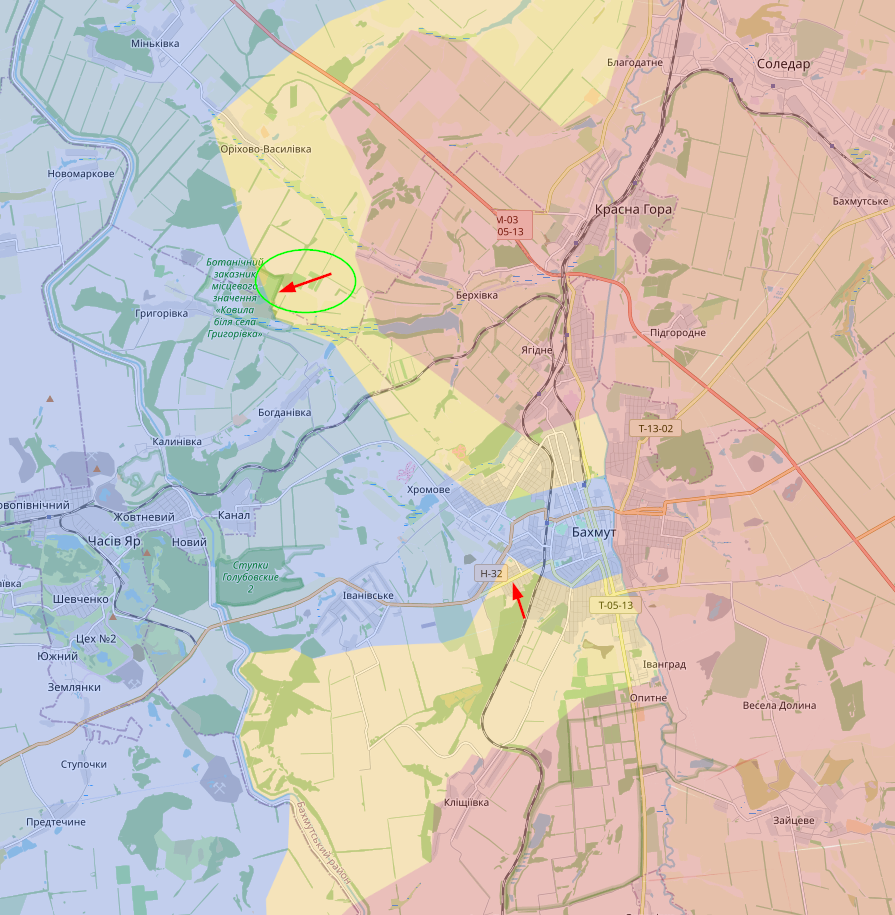

# March 2023

## Update 06/03/2023

Niet veel te melden. Op de meeste fronten staat het zo goed als stil. Enkel in Bakhmut gooien de Russen (en vooral Wagner) er alles tegenaan wat ze hebben en slagen ze erin om terrein te veroveren. De situatie in het oosten is van Bakhmut is redelijk onduidelijk. Het vermoeden is dat de Oekraïners daar zijn weggetrokken, maar ik heb geen duidelijke bevestiging, behalve dat Wagner vandaag tot aan het kruispunt is geraakt dat is aangeduid met een rode cirkel. In het zuiden zou Oekraïne er gisteren in geslaagd zijn om wat in de tegenaanval te gaan. De situatie blijft hoe dan ook moeilijk. Er zijn geruchten van een tekort aan (zware) munitie en veel slachtoffers. Desondanks zouden er nog steeds meer Russen sneuvelen dan Oekraïners.

## Update 09/03/2023

Bakhmut… Veel informatie is afkomstig van Wagner, die zijn sinds kort ook begonnen met het verspreiden van informatie en die is redelijk in lijn is met Oekraïense (betrouwbare) bronnen en visuele confirmaties. Het westen van Bakhmut is vermoedelijk wel onder volledige controle van de Russen. Ook het dorpje Dubovo-Vasylivka (1) is onder controle van de Russen.

## Update 13/03/2023

In de regio van Bakhmut blijft de situatie moeilijk, maar de laatste week hebben de Russische troepen geen grote veroveringen meer gemaakt richting de stad. Rusland is wel verder getrokken naar het noorden langs de M-03. Russische accounts beweerde dat Rusland de controle had over Orikhovo-Vasylivka (1). Zowel Oekraïne als Wagner ontkennen.

Meer in het zuiden heb ik ook wat meer tijd gespendeerd aan het front rond Avdiivka (1). De afgelopen weken (of maanden?) is Rusland er in geslaagd om een deel van de H-20 te veroveren. Met name Novobakhmutivka (2) en Novoselivka Druha (3) hebben de Russen kunnen veroveren, maar het exacte moment is redelijk onduidelijk. De Russen vallen Avdiivka aan van zowel het zuiden als noordoosten. Van Sieverne (4) zou bijna niets meer over zijn.

Het grootste probleem voor Oekraïne is vooral munitie. De EU is aan het bekijken hoe ze aan de noden van Oekraïne kunnen voldoen, maar dat gaat niet makkelijk zijn. Op dit moment produceert de EU ongeveer 25000 artillerie projectielen per maand. Oekraïne vraagt er 250000 per maand. Anderzijds merken we dat Russische economie door zijn buffer heen begint te geraken. Nadat ze massaal geld in hun economie hebben gepompt staat die nu weer ongeveer vanop het niveau van voor de invasie.

## Update 14/03/2023
Situatie in Bakhmut blijft moeilijk, vooral in het noorden en Wagner is erin geslaagd de industriële zone binnen te gaan in het noorden (groene cirkel)

Om je dit even in perspectief te zetten een uitgezoomde map waar er vandaag veel activiteit was.

Update 16/03/2023

Situatie rond Bakhmut. Gisteren is Wagner verder de M-03 opgegaan en daar het dorpje Zalianske (1) veroverd. Nuja, dorp… eerder boerderij. In het zuiden is Wagner ook richting de H-32 beginnen te pushen.

Dit is Zalianske

Minder duidelijk, maar Oekraïne is afgelopen weken op verschillende locaties begonnen met verkenningen en battelfield shaping. Waar (Russische) Osinters eerst overtuigd waren dat Oekraïne een offensief ten zuiden van Bakhmut zou starten en daarna ten noorden van Soledar; zijn ze vandaag overtuigd dat het zal plaatsvinden in de Zaporizhzhia Oblast. Time will tell...

Vandaag per toeval erachter gekomen dat Julia Sanina, de frontvrouw van The Hardkiss, de co-host gaat zijn op het Eurovisiesongfestival. The Hardkiss is echt een goede band, mocht je die nog niet kennen. 😊

## Update 21/03/2023

Ik wou al een tijdje een nieuwe update doen, maar ik kreeg redelijk tegenstrijdige berichten, maar durft nu voorzichtig zeggen dat het front rond Bakhmut de laatste dagen tot stilstand is gekomen en dan vooral in het centrum. Vanuit Wagner is de laatste tijd redelijk stil (of ik heb de berichten gemist) en zelfs Oekraïne durft minder negatief te klinken. In het noordwesten maakt Wagner vermoedelijk wel nog wat terreinwinst in de velden (groene cirkel)

Bij Avdiivka is de toestand redelijk stabiel. Beweringen van Russische accounts dat ze vooruitgang hebben geboekt ten noorden is vermoedelijk BS.
