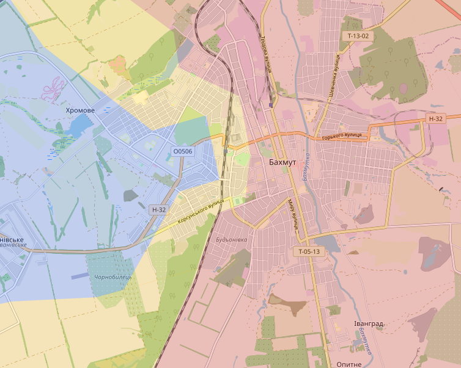
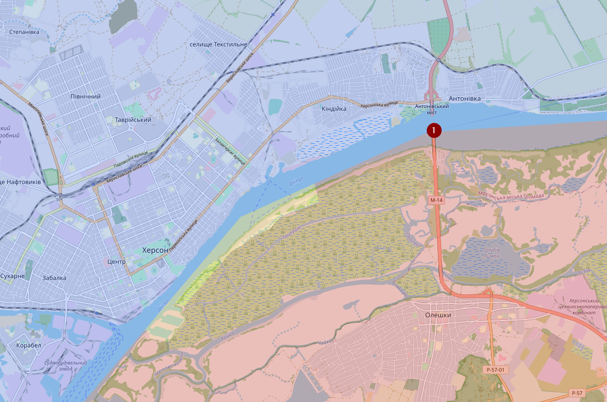
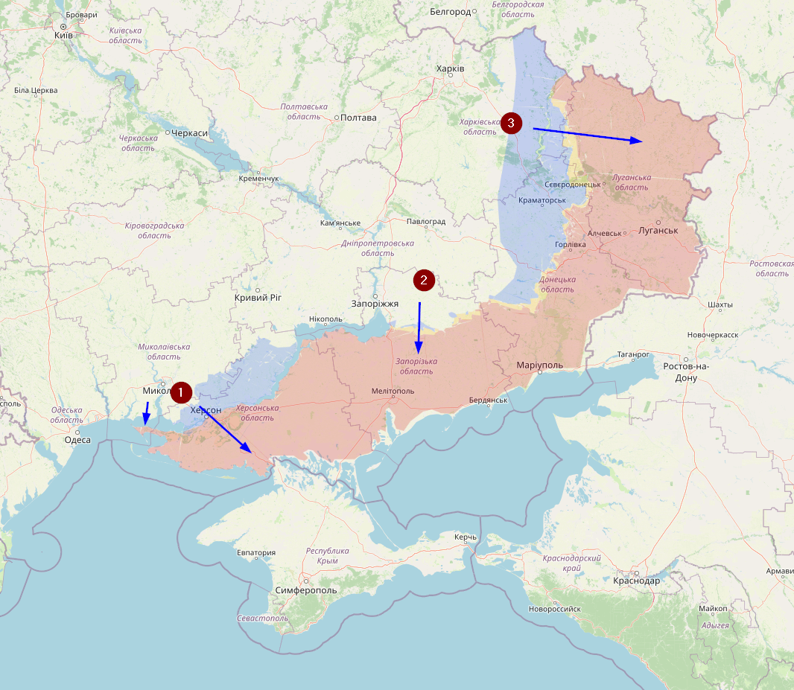
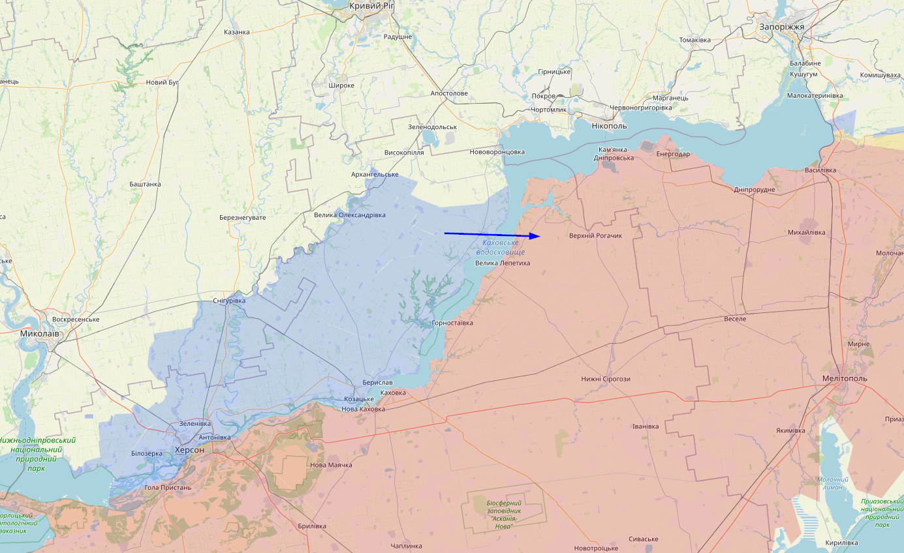
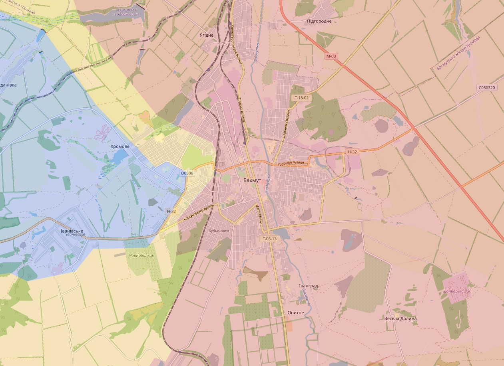
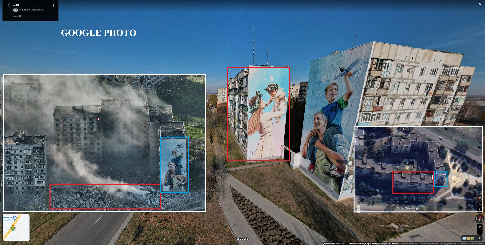

# April 2023

## 05/04/2023

Situatie Bakhmut blijft moeilijk. Het administratief gebouw dat Wagner heeft had Oekraïene de dag ervoor met de grond gelijk gemaakt.

Hier een filmpje van enkele dagen terug van iemand die evacuaties doet in Bakhmut.
<https://t.me/kolabaok/628>

## 08/04/2023

Situatie In Bakhmut. Wagner blijft pushen en er zou nog maar één lifeline (aanvoerweg) beschikbaar zijn.

## 10/04/2023

Ik heb het contested gebied in Bakhmut nog wat meer uitgebreid. De situatie veranderd daar constant.

In Avdiivka heb ik Krasnohorivka (1), Vesele (2) en Kamyanka (3) gemarkeerd als contested. Vermoedelijk is dat al enkele weken zo

Kort over waarom Rusland sowieso deze oorlog aan het verliezen is. Dit zijn foto’s uit Sievierodonetsk. Maanden na de “bevrijding” is de stad nog steeds complete in puin en is er nog niet begonnen aan de heropbouw. De enige locatie waar Rusland vandaag nog actief bezig is met de heropbouw, is Mariupol en zelfs daar gaat het maar héél traag (en is het vooral PR). Heel de oorlog was gebudgetteerd voor een paar weken oorlog, niet voor maanden en het heropbouwen van verschillende steden.
<https://twitter.com/den_kazansky/status/1642271026032566279>

## Update 18/04/2023

In Bakhmut hebben de Russen de afgelopen dagen nog wat terrein kunnen innemen. Maar de russen hebben het er steeds moeilijker. Vermoedelijk door een combinatie van factoren en het kan goed zijn dat dit maar een tijdelijke situatie is.

In het noorden melde Wargonzo een Russische aanval richting Lyman Pershyi (1), wat vreemd is, want ik dacht dat dit Russisch was, dus heb ik het nu veranderd. Hoewel ik eigenlijk niet denk dat er Oekraïense of Russische troepen zitten.

Onze beide leiders zijn vandaag op bezoek geweest aan het “front”. Poetin bezocht Henichesk (1). Zelenskyy deed iets meer zijn best en bezocht Avdiivka (2)  

## Update 23/04/2023

Eventjes die regio bij Kherson eens opgezocht en al sinds 6 december is het geweten dat Oekraïne de Dnieper daar zijn overgestoken. Vermoedelijk heeft Oekraïne stuk voor stuk steeds meer terrein ingenomen zonder gevechten, want vanuit die locatie is er niet echt een verbinding met de rest van het vasteland.

Morgen bekijk ik de rest, maar op eerste zicht is er enkel in de regio van Bakhmut wat verandering (in het nadeel van Oekraïne)

## Update 24/04/2023

Ik had een update beloofd van Bakhmut, maar veel nieuws is er niet te vertellen, behalve dat het daar enorm moeilijk blijft en dat Wagner vooral enorm pushed vanuit het noorden.

In de regio van Kherson heb ik het contested gebied een beetje uitgebreid, met de nadruk op contested, want nogmaals; Ik verwacht daar geen grote Oekraïense troepenmacht. Er zijn redelijk wat media en osint’ers die zelfs de Antonivka brug (1) als Oekraïens markeren, maar enkel op basis van Russische berichten en niet op basis van visueel bewijs. Ik heb moeite om te geloven dat Oekraïne (al) controle heeft over de brug.

Steeds meer en meer signalen dat er een offensief in de maak is. Ik ben geen militair expert dus het volgende stukje is puur op basis van eigen vermoedens. Wanneer het offensief zou beginnen weet ik niet. Dat kan morgen zijn, dat kan binnen drie maand zijn. Maar volgens mij zijn er vandaag maar drie locaties waar een potentieel offensief kan starten. 1. Kherson: Dat is de snelste weg richting het Krim en dat zou een enorme logistieke klap kunnen zijn voor Rusland. Bovendien kan het Krim gebruikt worden als pasmunt voor eventuele vredesonderhandelingen. De Dnieper zelf oversteken met voldoende militair materiaal zou echter een enorme uitdaging zijn, maar als Oekraïne erin zou slagen dan zou er weinig verdedigingslinies op hun pad liggen tot aan het Krim. 2. Zaporizhzhia: Deze regio zal heel moeilijk worden omdat de Russen daar enorm zijn ingegraven. Als ze echter voldoende kunnen doorstoten dan kunnen ze redelijk wat logistieke routes aanvallen, wat een potentiële oversteek over de Dnieper makkelijker zou maken ter hoogte van Kherson. 3. Luhansk: Om een of andere duistere reden hebben de Russen daar maar één verdedigingslinie gebouwd en vermoedelijk is het aantal Russische troepen daar maar beperkt. Een aanval daar zou de logistieke situatie voor Oekraïne in de Donetsk Oblast kunnen verbeteren, maar heeft maar weinig strategische of diplomatieke waarde. Rusland kan bovendien vlotjes nieuwe soldaten en materieel aanvoeren vanuit Rusland zelf.

Een aanval vanuit Kherson zou ook meer in het noorden kunnen plaatsvinden. Maar de rivier daar is wel een stuk breder.

## Update 26/04/2023

De situatie in Bakhmut zou vandaag enorm verslechterd zijn. Nog maar een klein deel zou in handen zijn van Oekraïne. Ik wacht nog even af om mijn kaart een update te geven tot ik meer duidelijkheid heb. Maar situatie is extreem slecht.

Ondertussen is er visueel bewijs dat de Antonivka brug nog steeds onder Russische controle is. Bets opmerkelijk dat redelijk wat OSINT’ers (zowel Russisch als Oekraïens) dat gewoon verspreide enkel op basis van geruchten (inclusief gedetailleerde kaarten) 🤦

Vandaag zijn veel OSINT-maps op Google offline gehaald door Google. Velen zien dat als een signaal dat het offensief elk moment zou kunnen beginnen. Ook Jan Balliauw zei vandaag op de radio dat er geruchten de ronde doen dat het offensief voor zondag zou kunnen zijn. Ik durf daar geen uitspraken over doen. We zullen wel zien wanneer er een offensief start. 🤷

## Update 27/04/2023

Situatie in Bakhmut

Wagner is trouwens niet bezig met het veroveren van de stad Bakhmut, maar met het veroveren van de ruïnes: <https://twitter.com/Liberov/status/1651246491304972298>

Niet dat het voor hen iets uitmaakt, want het is niet de taak van Wagner om de stad te herbouwen. Bovendien is dit een direct gevolg van de munitie dat we zeer krijgen van het Russisch leger.
