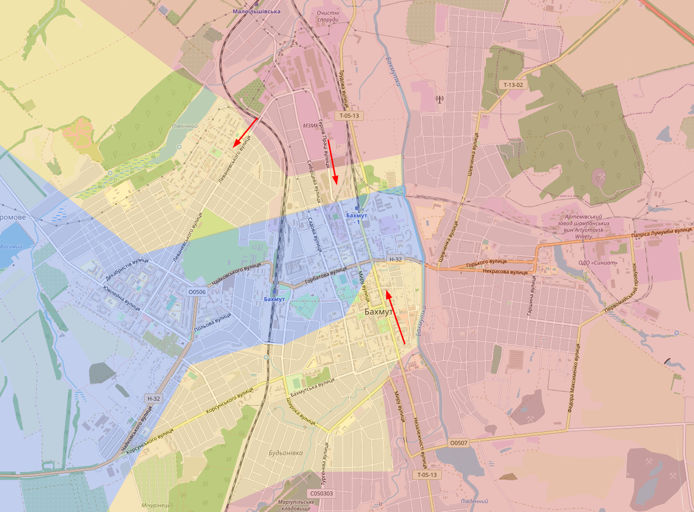
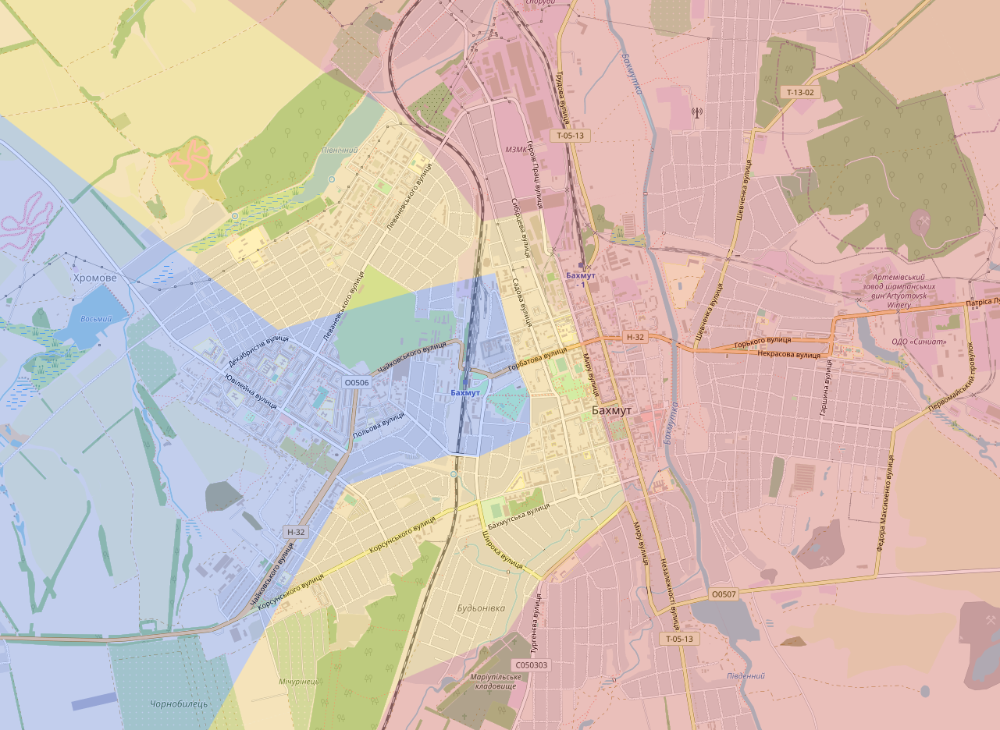
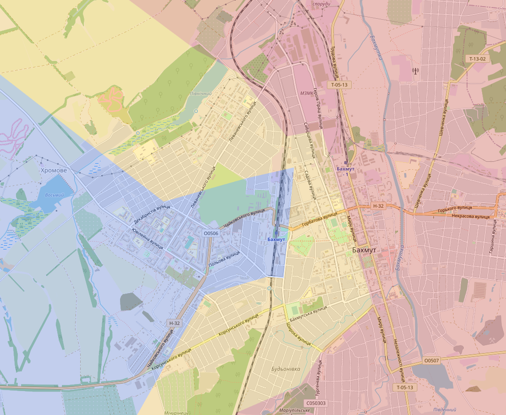
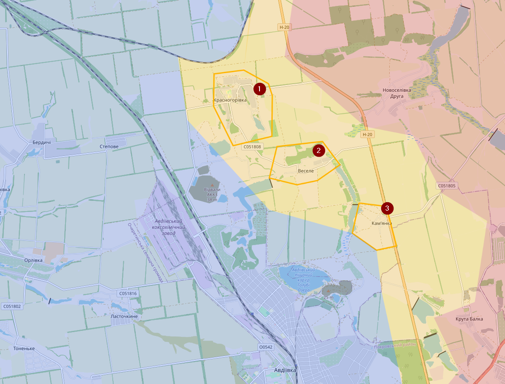
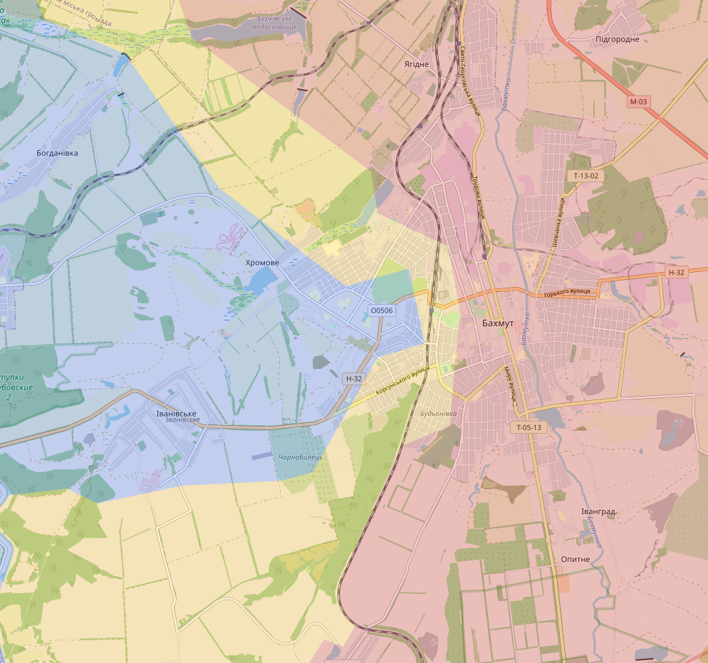
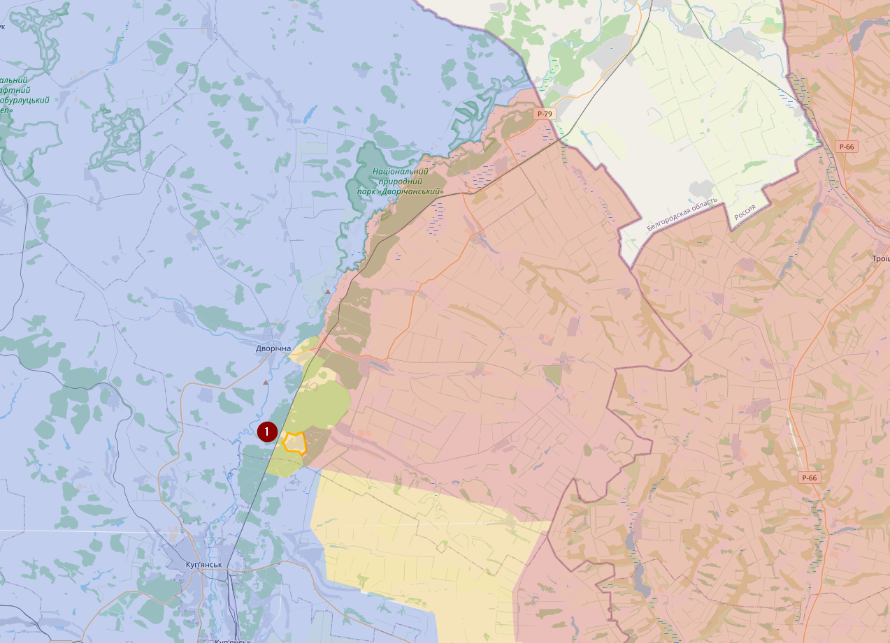
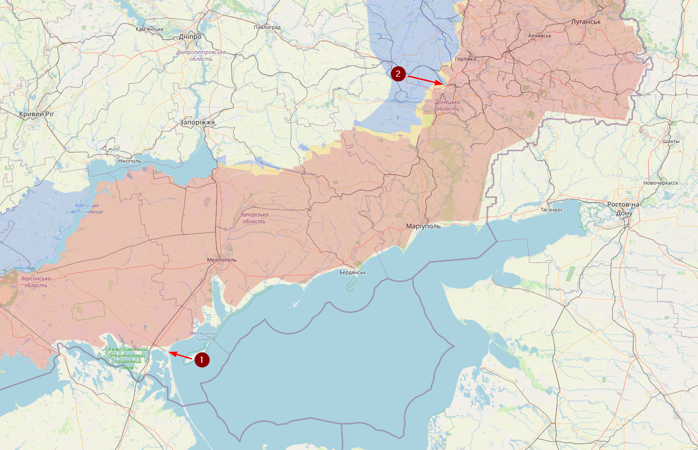
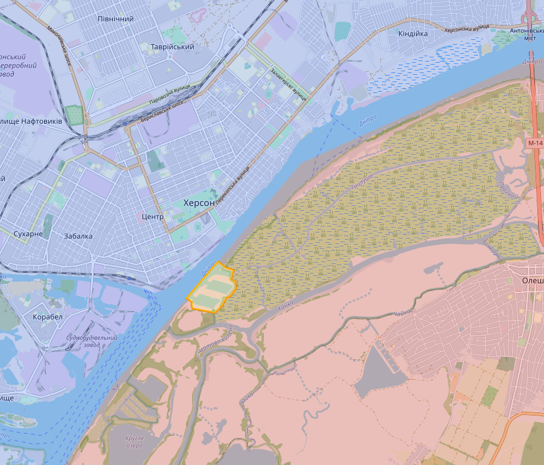

# April 2023

## 05/04/2023

Situatie Bakhmut blijft moeilijk. Het administratief gebouw dat Wagner heeft had Oekraïene de dag ervoor met de grond gelijk gemaakt.

Hier een filmpje van enkele dagen terug van iemand die evacuaties doet in Bakhmut.
<https://t.me/kolabaok/628>

## 08/04/2023

Situatie In Bakhmut. Wagner blijft pushen en er zou nog maar één lifeline (aanvoerweg) beschikbaar zijn.

## 10/04/2023

Ik heb het contested gebied in Bakhmut nog wat meer uitgebreid. De situatie veranderd daar constant.

In Avdiivka heb ik Krasnohorivka (1), Vesele (2) en Kamyanka (3) gemarkeerd als contested. Vermoedelijk is dat al enkele weken zo

Kort over waarom Rusland sowieso deze oorlog aan het verliezen is. Dit zijn foto’s uit Sievierodonetsk. Maanden na de “bevrijding” is de stad nog steeds complete in puin en is er nog niet begonnen aan de heropbouw. De enige locatie waar Rusland vandaag nog actief bezig is met de heropbouw, is Mariupol en zelfs daar gaat het maar héél traag (en is het vooral PR). Heel de oorlog was gebudgetteerd voor een paar weken oorlog, niet voor maanden en het heropbouwen van verschillende steden.
<https://twitter.com/den_kazansky/status/1642271026032566279>

## Update 18/04/2023

In Bakhmut hebben de Russen de afgelopen dagen nog wat terrein kunnen innemen. Maar de russen hebben het er steeds moeilijker. Vermoedelijk door een combinatie van factoren en het kan goed zijn dat dit maar een tijdelijke situatie is.

In het noorden melde Wargonzo een Russische aanval richting Lyman Pershyi (1), wat vreemd is, want ik dacht dat dit Russisch was, dus heb ik het nu veranderd. Hoewel ik eigenlijk niet denk dat er Oekraïense of Russische troepen zitten.

Onze beide leiders zijn vandaag op bezoek geweest aan het “front”. Poetin bezocht Henichesk (1). Zelenskyy deed iets meer zijn best en bezocht Avdiivka (2)  

## Update 23/04/2023

Eventjes die regio bij Kherson eens opgezocht en al sinds 6 december is het geweten dat Oekraïne de Dnieper daar zijn overgestoken. Vermoedelijk heeft Oekraïne stuk voor stuk steeds meer terrein ingenomen zonder gevechten, want vanuit die locatie is er niet echt een verbinding met de rest van het vasteland.

Morgen bekijk ik de rest, maar op eerste zicht is er enkel in de regio van Bakhmut wat verandering (in het nadeel van Oekraïne)
