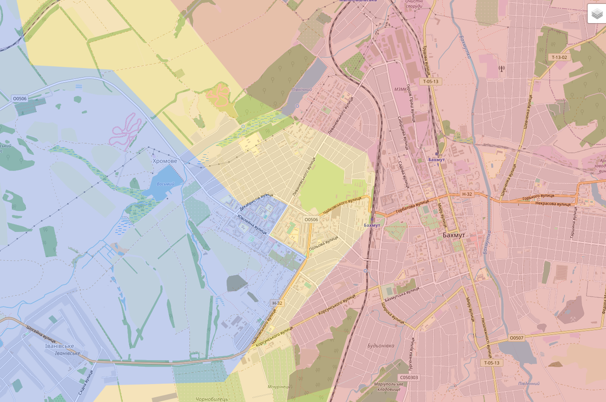
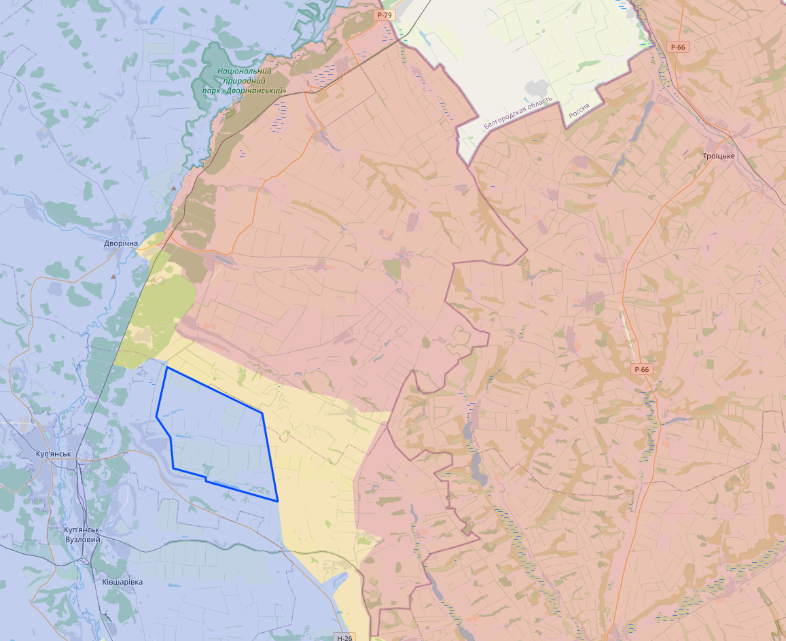
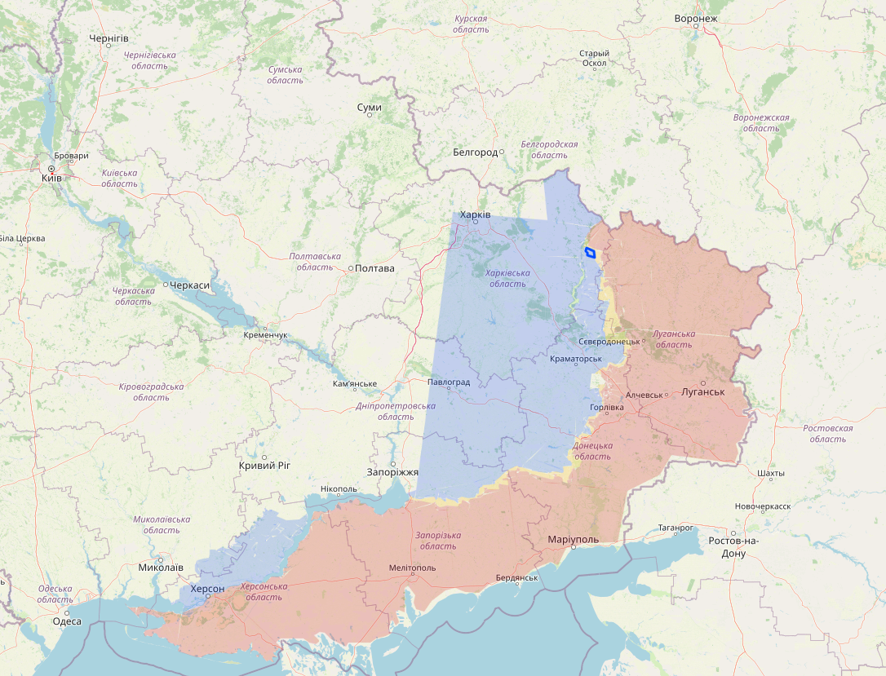
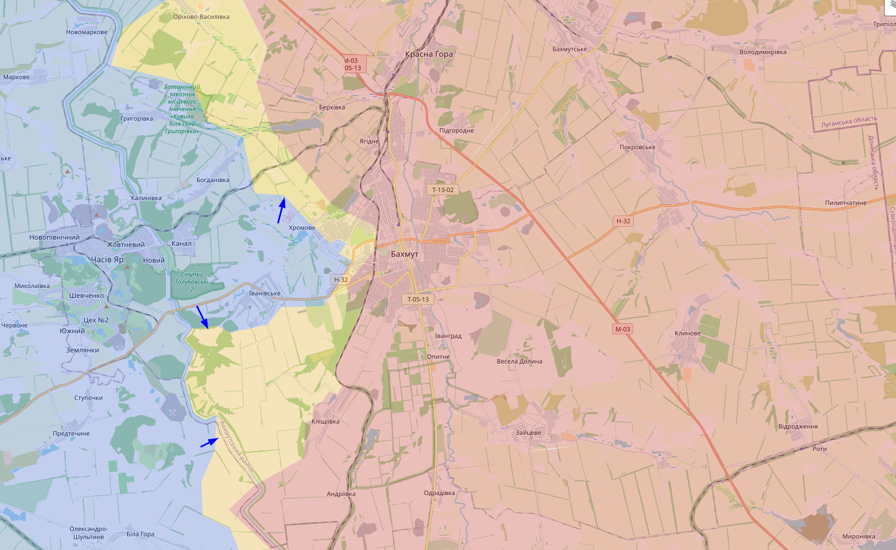
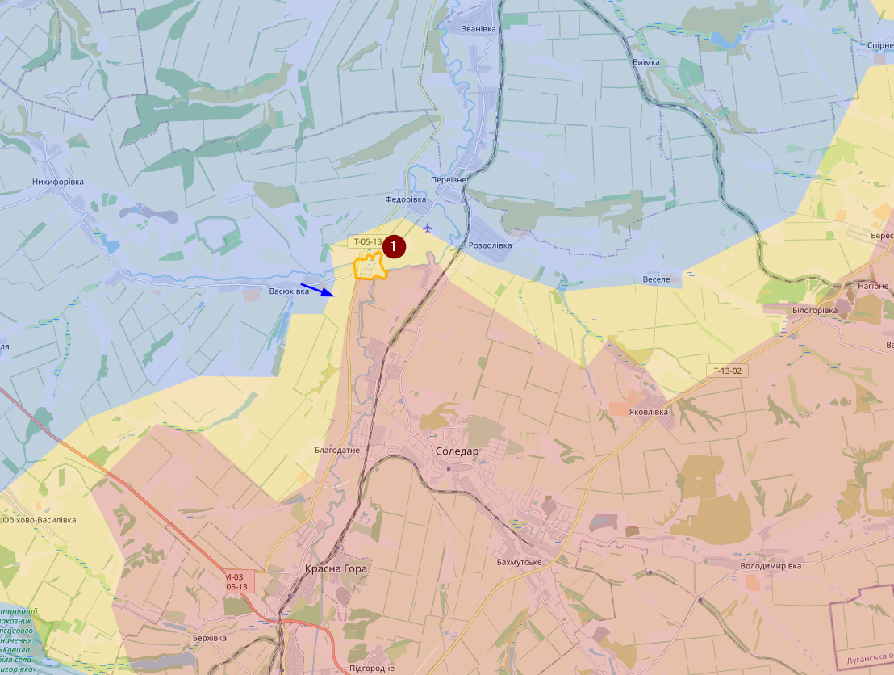

# May 2023

## 02/05/2023

Bakhmut blijft moeilijk, maar ik denk niet dat Oekraïne terrein heeft verloren. (van wat er nog overblijft 0_0 )

Verder zien we toch dat Oekraïne actiever wordt op verschillende locatie langs de frontlinie en soms verbeterd dat hun posities op sommige locaties.

Er zijn ook duidelijk meer aanslagen in Rusland, vooral tegen treinen.
Dit is wel nog een leuke video opgenomen in het Krim:

- "Aren't you afraid of the counteroffensive of the Armed Forces of Ukraine?
- "We are for Ukraine!"
<https://twitter.com/666_mancer/status/1653318651913596931>

Wat later hebben ze hem wel gearresteerd en is een video gepubliceerd waar hij zijn verontschuldiging aanbied aan Rusland en Poetin

## 08/05/2023

Het gaat een korte update worden. De situatie in Bakhmut blijft moeilijk en Oekraïne heeft in de afgelopen week-ish weer terrein verloren in het westen.

Verder heb ik hier en daar enkele aanpassingen gedaan aan mijn map omdat sommige gebieden die gemarkeerd waren als contested, nu duidelijker zijn door visuele confirmaties. Het voornaamste gebied is dat in het noorden. De blauwe blok was gemarkeerd als contested, maar Oekraïne is nu meer er ten noorden van dat gebied actief. Voor alle duidelijkheid, dit is géén nieuwe terreinwinst.

De kaart in het groot

## Update 11/05/2023

Eerst de grote vraag. Is het grote Oekraïense offensief begonnen. Neen, et offensief rond Bakhmut is daarvoor op dit moment te beperkt. Dit is ofwel een intensievere vorm van battelfield shaping, of gewoon een afleidingsmaneuver.

Op mijn kaart pas ik voorlopig maar weinig aan, gezien het allemaal in contested gebied gebeurt.

Desondanks heb ik wel één dorpje ten noorden van Soledar gemarkeerd als contested. Sakko I Vantsetti (1) had Wagner begin februari kunnen veroveren. Maar nu zien we al Oekraïense aanvallen ten zuiden van dat dorpje. Dat dorpje stel wel niet veel voor en bestaat maar uit enkele huizen.

Verder zie ik veel beweringen afkomstig van Russische kanalen, maar weinig concreets. Vermoedelijk zullen we de komende dagen meer bewijzen zien van die offensieven. Het zou mij niet verbazen mocht Oekraïne het kanaal zijn overgestoken bij Bakhmut.  
