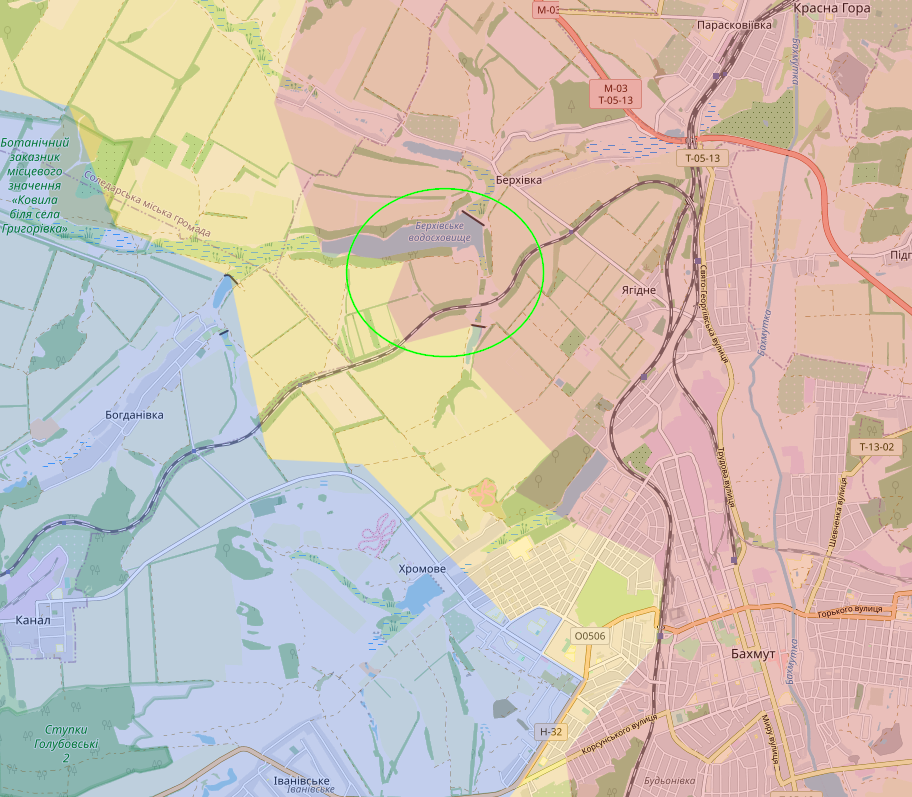
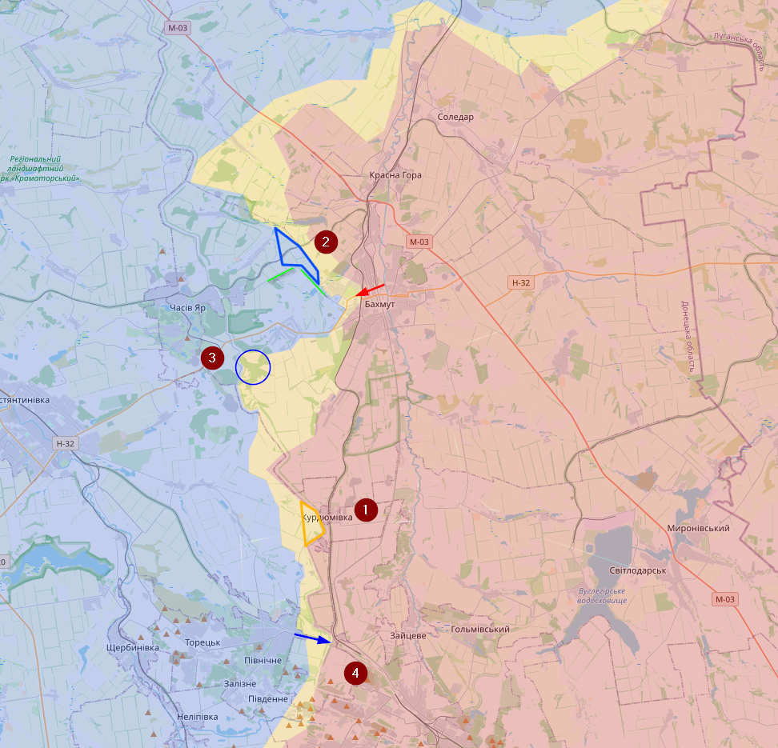
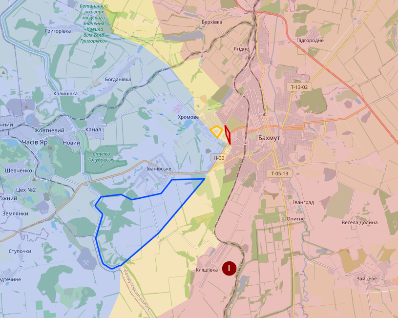
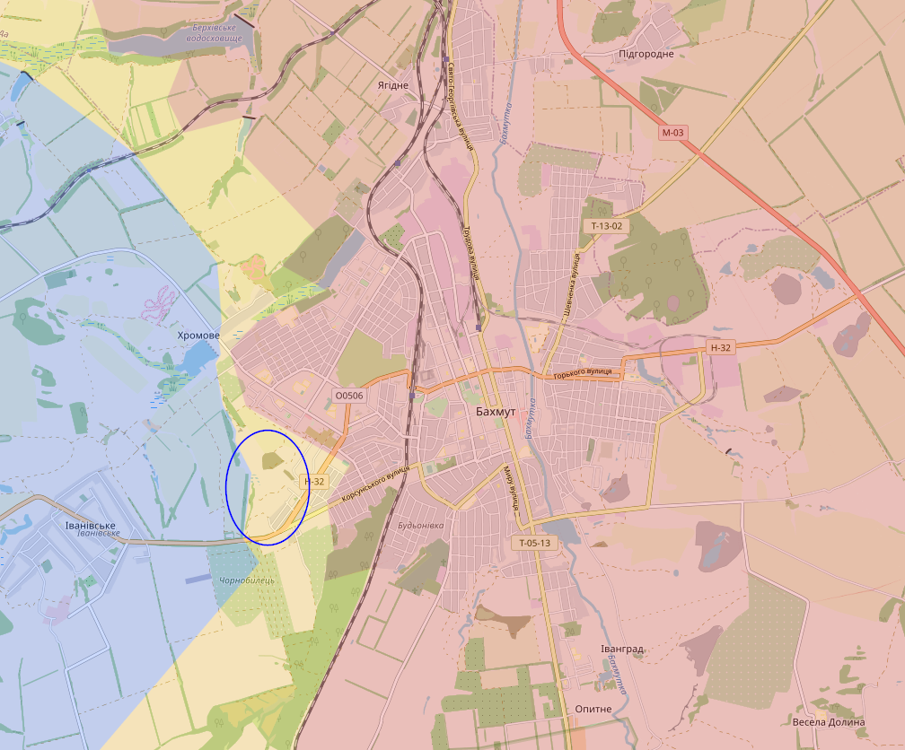
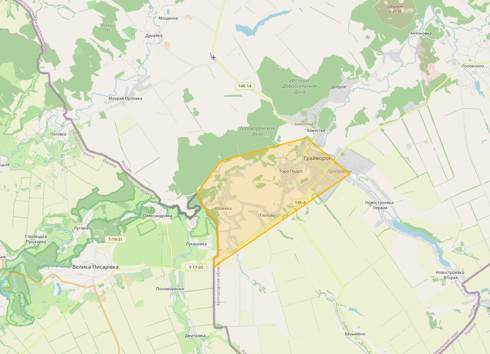
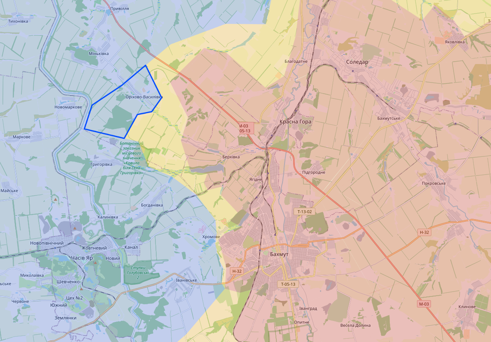

# May 2023

## 02/05/2023

Bakhmut blijft moeilijk, maar ik denk niet dat Oekraïne terrein heeft verloren. (van wat er nog overblijft 0_0 )

Verder zien we toch dat Oekraïne actiever wordt op verschillende locatie langs de frontlinie en soms verbeterd dat hun posities op sommige locaties.

Er zijn ook duidelijk meer aanslagen in Rusland, vooral tegen treinen.
Dit is wel nog een leuke video opgenomen in het Krim:

- "Aren't you afraid of the counteroffensive of the Armed Forces of Ukraine?
- "We are for Ukraine!"
<https://twitter.com/666_mancer/status/1653318651913596931>

Wat later hebben ze hem wel gearresteerd en is een video gepubliceerd waar hij zijn verontschuldiging aanbied aan Rusland en Poetin

## 08/05/2023

Het gaat een korte update worden. De situatie in Bakhmut blijft moeilijk en Oekraïne heeft in de afgelopen week-ish weer terrein verloren in het westen.

Verder heb ik hier en daar enkele aanpassingen gedaan aan mijn map omdat sommige gebieden die gemarkeerd waren als contested, nu duidelijker zijn door visuele confirmaties. Het voornaamste gebied is dat in het noorden. De blauwe blok was gemarkeerd als contested, maar Oekraïne is nu meer er ten noorden van dat gebied actief. Voor alle duidelijkheid, dit is géén nieuwe terreinwinst.

De kaart in het groot

## Update 11/05/2023

Eerst de grote vraag. Is het grote Oekraïense offensief begonnen. Neen, et offensief rond Bakhmut is daarvoor op dit moment te beperkt. Dit is ofwel een intensievere vorm van battelfield shaping, of gewoon een afleidingsmaneuver.

Op mijn kaart pas ik voorlopig maar weinig aan, gezien het allemaal in contested gebied gebeurt.

Desondanks heb ik wel één dorpje ten noorden van Soledar gemarkeerd als contested. Sakko I Vantsetti (1) had Wagner begin februari kunnen veroveren. Maar nu zien we al Oekraïense aanvallen ten zuiden van dat dorpje. Dat dorpje stel wel niet veel voor en bestaat maar uit enkele huizen.

Verder zie ik veel beweringen afkomstig van Russische kanalen, maar weinig concreets. Vermoedelijk zullen we de komende dagen meer bewijzen zien van die offensieven. Het zou mij niet verbazen mocht Oekraïne het kanaal zijn overgestoken bij Bakhmut.  

## Update 12/05/2023

Kleine aanpassing ten noordwesten van Bakhmut, De Russen hebben een new frontier ingenomen bij het water, waardoor het contested gebied is uitgebreid. Ten zuiden van Bakhmut zou Oekraïne ook nog meer successen hebben, maar voorlopig heb ik daar geen visueel bewijs van.

## Update 14/05/2023

Vooral kleine aanpassingen in de regio van Bakhmut. Bij Kurdiumivka (1) heb ik het contested gebied uitgebreid, voorheen was dit Russisch. In het noordwesten (2) is de “levensweg” weer toegankelijk voor Oekraïense troepen en heb ik het gebied dus uitgebreid in het voordeel van Oekraïne. Verder enkel geruchten. Vermoedelijk is het bos in de buurt van Ivanivske (3) onder controle van Oekraïne. En het industriegebied bij Maiorsk (4) is vermoedelijk contested. Desondanks meld Wagner nog steeds marginale successen in het centrum van Bakhmut.

## Update 17/05/2023

Situatie Bakhmut. Wagner blijft pushen in het centrum met succes, waarbij ze wel de appartementsgebouwen gewoon tegen de vlakte bombarderen met artillerie. Anderzijds heeft Oekraïne wel een heel grote lap velden kunnen heroveren en komen ze in de buurt van Klishchiivka (1).

## Update 20/05/2023

Situatie in Bakhmut. Vermoedelijk heeft Oekraïne nog controle ter hoogte van de blauwe cirkel en is dat deel nog niet in handen van Wagner.

## Update 22/05/2023

We kunnen nu wel zeker zijn dat Bakhmut onder volledige controle is van Rusland (Wagner). Voor de rest zijn er weinig veranderingen in Oekraïne. Wat betreft het incident in Rusland bij de grens. Vermoedelijk gaat het hier wel om een actie van extreemrechtse Russische organisatie. Uiteraard zal Oekraïne ontkennen, maar ik gok dat die wel degelijk bewapend zijn geweest door Oekraïne om onrust te stoken. Hoe succesvol dat gaat zijn valt nog af te wachten, maar ik kan mij herinneren dat Rusland in het begin van het conflict sowieso rekening hier met domestic terrorisme in de Belgorod Oblast.

## Update 31/05/2023

Sinds de laatste update is er maar weinig gebeurt aan het front. De enige merkwaardige verandering dat ik zie is Orikhovo-Vasylivka bij Bakhmut dat nu weer onder Oekraïense controle staat.

