# June 2023

## 04/06/2023
Redelijk wat actie op het terrein en dat voor een zondag! Doorgaans zijn die een stuk rustiger.

Ten noorden van Oekraïne in de Belgorod Oblast is het Russian Volunteer Corps het grensstadje Novaya Tavolzhanka binnengevallen. Het zou daar een tijd redelijk chaotisch geweest zijn. Vermoedelijk is de situatie ondertussen weer genormaliseerd en is het RVC terug weggetrokken.
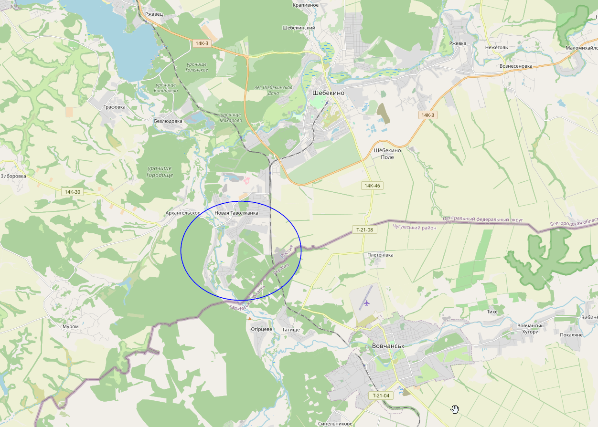

Situatie in Bakhmut. Prigozhin heeft toegegeven dat Oekraïne aanwezig is de “Gardens” van Bakhmut (1). Los daarvan is een groot deel van Bakhmut sowieso redelijk verlaten. O.a. ter hoogte van (2) worden de russen meteen bestookt met drones of artillerie zodra ze worden opgemerkt.
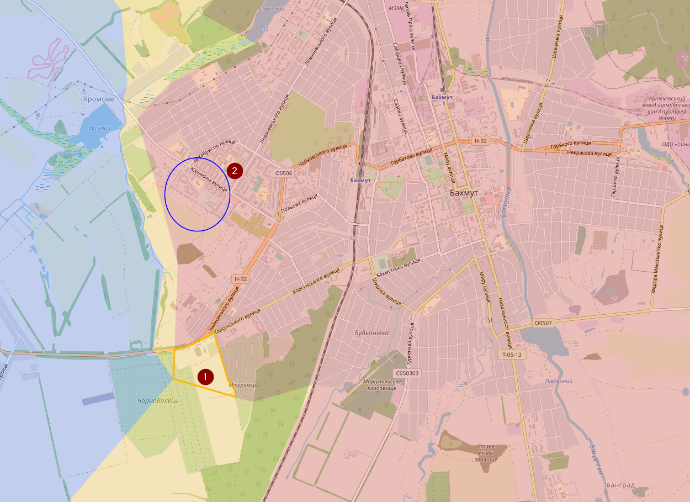

Richting Avdiivka, daar heeft Oekraïne een offensief gedaan richting Vodiane (1). Maar de Russen zouden ook terrein hebben verloren.
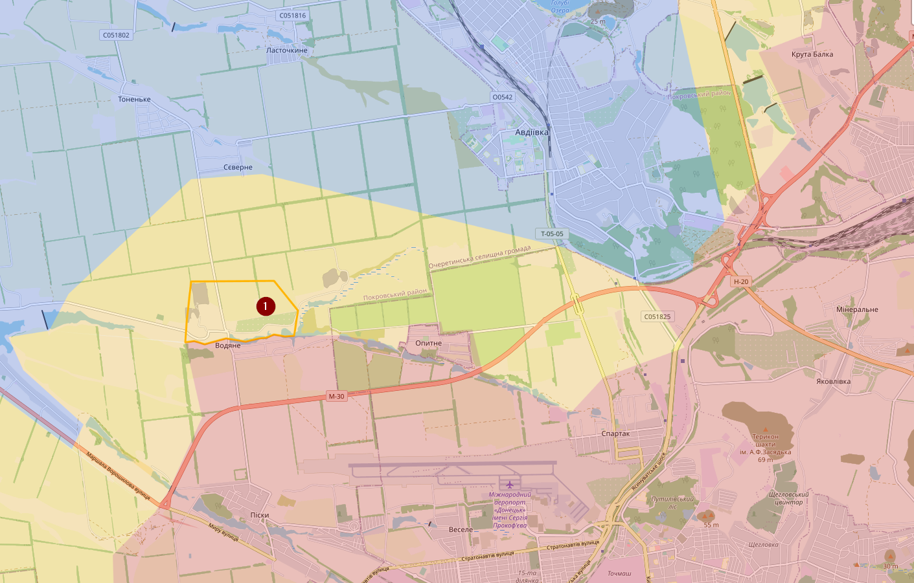

Zaporizhzhia Oblast, ter hoogte van Velyka Novosilka. Daar heeft Oekraïne ook een offensief uitgevoerd. O.a. richting Novodarivka (1), nu moet ik wel toegeven dat deze gemarkeerd was als Oekraïens om mijn kaart, dus deze heb ik aangepast naar contested. Het is onduidelijk of Oekraïne daar succes heeft kunnen boeken. Ook was er spraken van een offensief richting Neskuchne (2). Uitkomst is daar ook onduidelijk.
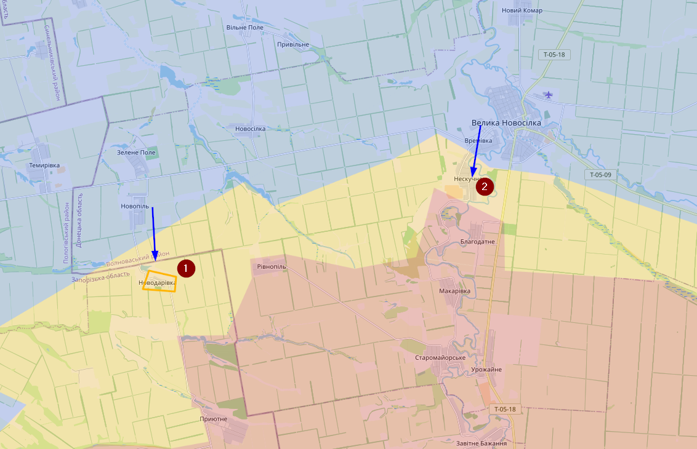

Om dit alles een beetje in context te plaatsen: Bakhmut (1), Avdiivka (2), Velyka Novosilka (3)
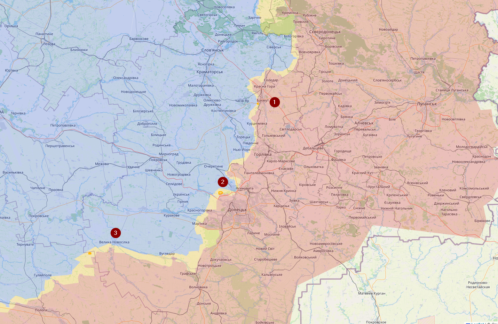

## 05/06/2023

Laat ik even starten met het posten van een foto van het RVC… want ik ben geen fan van die gasten.
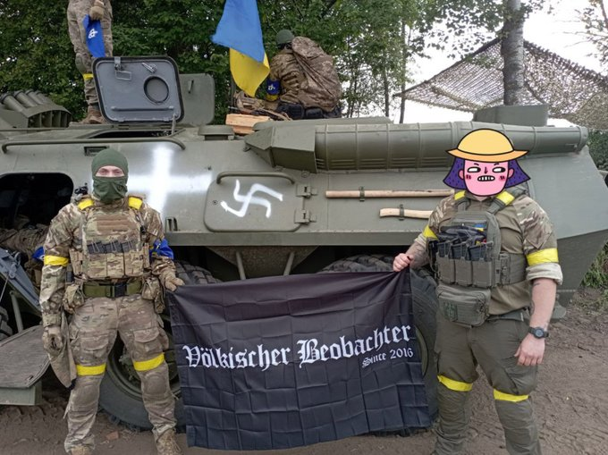

Gaan we richting Bakhmut dan zou Oekraïne zowel in het noorden als in het zuiden succes hebben geboekt. Dat is de enige locatie dat ook vermeld is door Oekraïne in hun officiële communicatie. Maar de exacte details ontbreken voorlopig. Enkel Prigozhin vermeld de locatie Berkhivka.
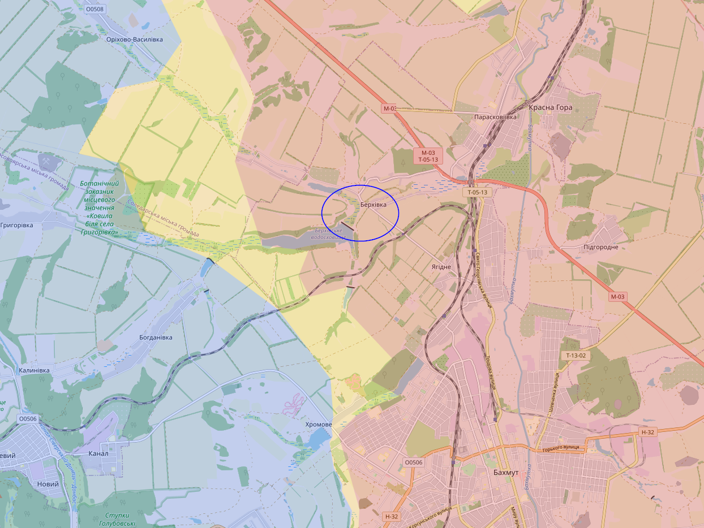

Bij Velyka Novosilka zijn er beweringen dat Rusland een Leopard tank hebben vernietigd. O.a. dit is het beeld dat de ronde doet, maar dat is vermoedelijk afkomstig uit een documentaire.
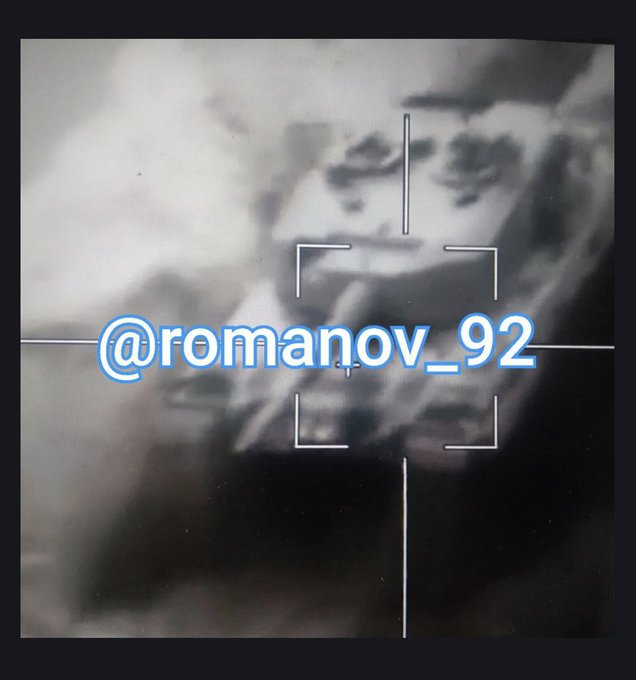

Verder is er redelijk wat zekerheid dat Oekraïne controle heeft over Novodonetske (1). Voorlopig markeer ik het als contested wegens het uitblijven van visuele bevestiging.
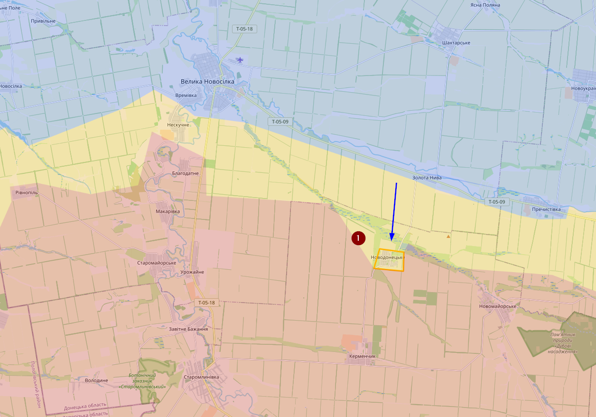

Er is op een hoop andere locaties ook gevochten, maar er is op dit moment weinig betrouwbare informatie. Sowieso is dit nog niet HET offensief. Daarvoor zijn de aanvallen te kleinschalig.

## 07/06/2023

Even terug naar Rusland, blijkbaar zit het RVC nog steeds in Novaya Tavolzhanka
https://discord.com/channels/701168115349979147/946311403017498674/1115027454407479316

Bakhmut: Oekraïne is aan het oprukken langs de spoorweg. Ik verwacht dat de Russen de komende dagen daar nog terrein gaan verliezen. Dit is ook het enige gebied waar Oekraïne melding maakt over terreinwinst.
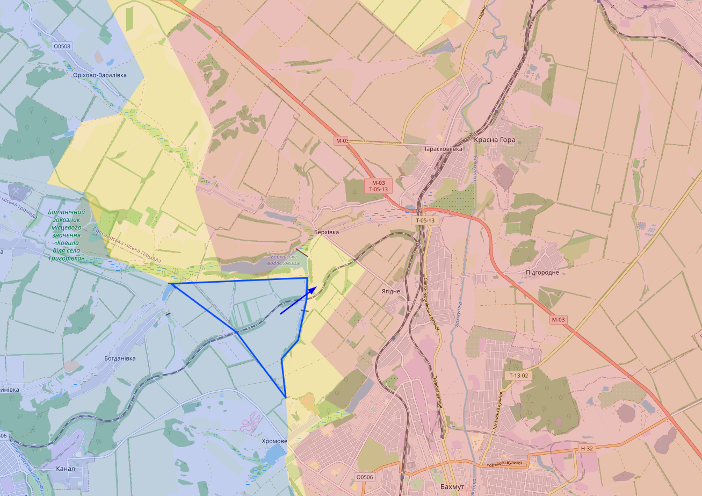

In de Zaporizhzhia Oblast zijn er op verschillende locaties kleine offensieven geweest van Oekraïne. Er is weinig bekend vanuit Oekraïense kant en de berichtgeving is bijna uitsluitend afkomstig van Russische Account (vermoedelijk mis ik er nog een hoop)
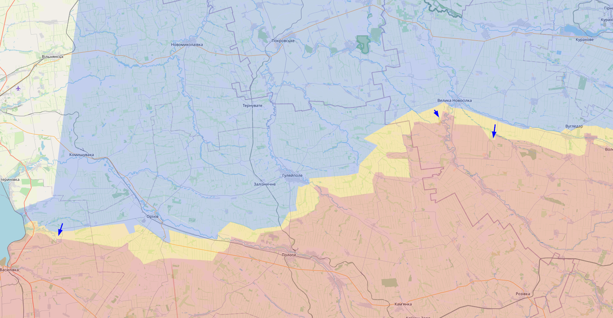

Over de Nova Kakhovka dam. Het blijft daar een frontlinie en beide kampen zetten daar nog steeds actief wapens in en dus niet enkel Rusland, zoals sommige media beweren. Het blijft daar dus moeilijk om burgers te evacueren. 

## 08/06/2023

Ik ga redelijk vaag moeten blijven, omdat de situatie gewoon onduidelijk is en informatie is schaars.

Oekraïne meldt dat er weer progressie zou gemaakt zijn rond Bakhmut, zowel in het noorden (1) als in de “gardens” (2), maar exacte details zijn er niet. Bij Kurdiumivka (3) zien we vooral veel artillerie.
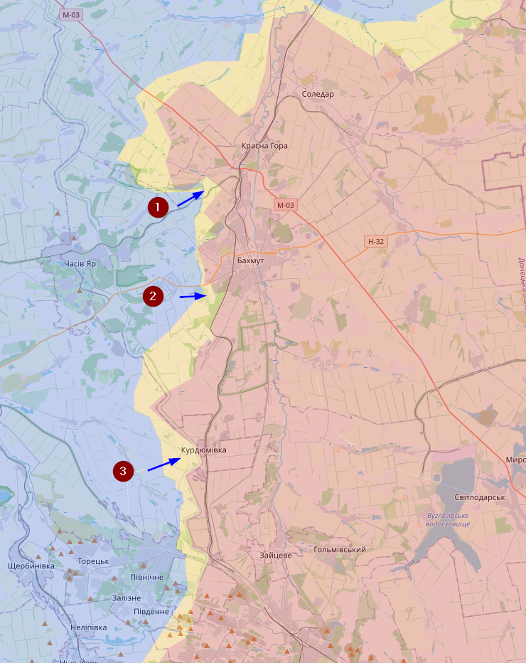

In de buurt van Velyka Novosilka zien we overal kleine offensieven maar niets serieus.
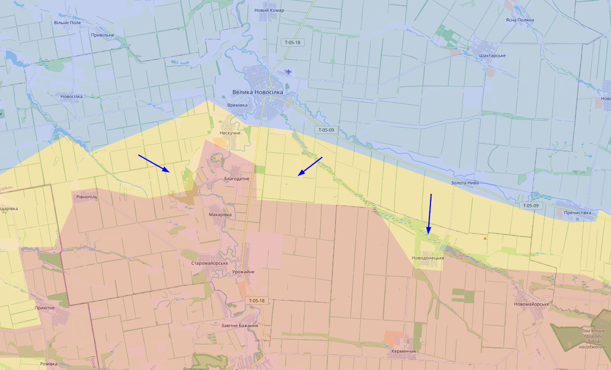

Echter bij Mala Tokmachka (1) is er al sinds gisteren nacht bijna constant gevechten. Dat is ook de locatie waar de eerste Leopards zijn opgedoken. De situatie daar is zeer onduidelijk. Vermoedelijk hebben de Oekraïners daar (marginaal) succes kunnen boeken. De gevechten gaan in elk geval de nacht in.
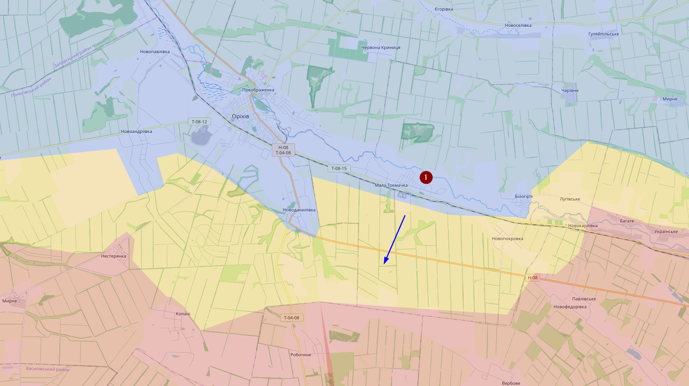

Nog even over de dam, gisteren waren al geruchten dat Oekraïne begonnen is met het evacueren van inwoners aan de linkeroever, dat is ondertussen ook bevestigd door reporters van het NOS-journaal.

## 11/06/2023

Na een week geroep van Russische accounts over hoe ze alle aanvallen hebben afgeslagen, zijn er eindelijk confirmaties van Oekraïense kant ter hoogte van Velyka Novosilka, dat officieel trouwens tot de Donetsk Oblast behoord (maar het is makkelijker om te verwijzen naar het Zaporizhia front.)

Dit was een week-ish geleden…
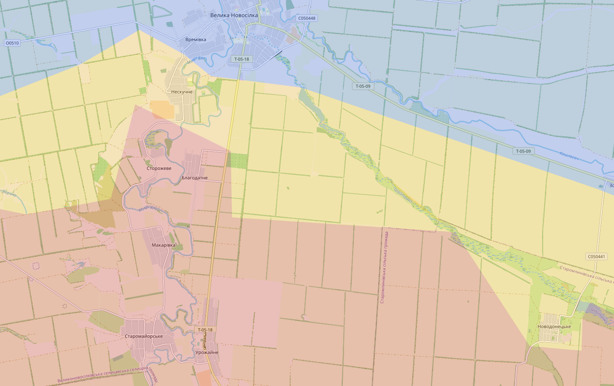

Dit is vandaag
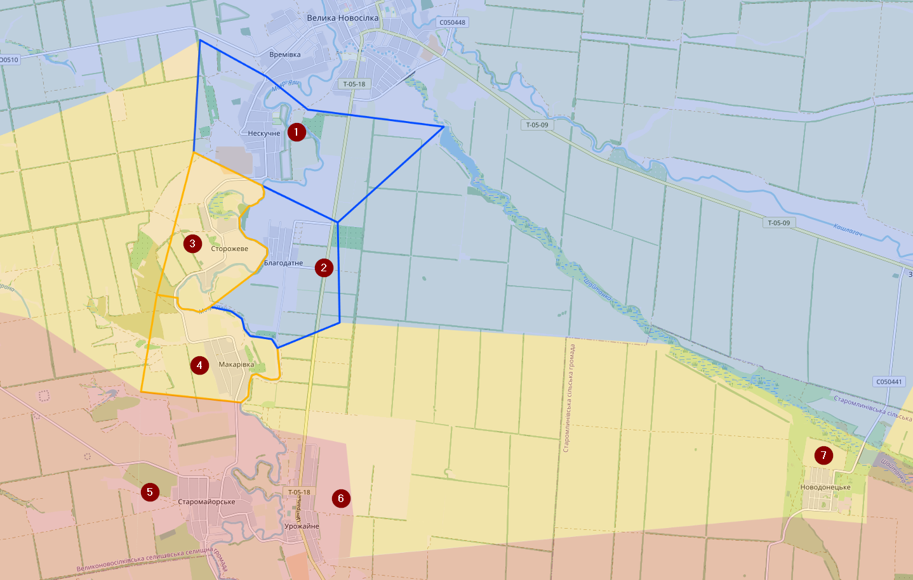

Neskuchne (1) en Blahodatne (2) zijn visueel bevestigd. Zowel Storozheve (3) als Makarivka (4) zijn vermoedelijk onder Oekraïense controle, maar nog niet bevestigd aan Oekraïense kant. Staromaiorske (5) en Urozhaine (6) zijn volgens sommige bronnen al contested, maar voorlopig zijn er weinig concrete aanwijzingen, dus hou ik het op Russisch. Novodonetske (7) is zeker niet meer in Russische handen en gevechten vinden zich plaats ten zuiden van het dorp. Maar voorlopig heeft Oekraïne nog niet bevestigd dat ze de controle hebben.

Vermoedelijk hebben de Russen meer terrein verloren in één week dan dat ze veroverd hebben in de afgelopen maanden.

## 12/06/2023

Situatie bij Velyka Novosilka. Zoals eerder gezegd vandaag, Storozheve (1) is onder Oekrainse controle. Volgens Oekraïne gaat dat ook op voor Novodarivka (2) en Levadne (3), maar dat is wel geen (goede) visuele bevestiging van. Oekraïne beweert ook dat Makarivka (4) onder Oekraïense controle staat, maar ook daar geen visueel bewijs en Russische accounts spreken dat iets te hard tegen. Urozhaine is vermoedelijk contested, er zijn veel Oekraïense accounts die beweren dat Oekraïne ook al actief is in Zavitne Bazhannia (6) en zelfs verder naar het zuiden, maar volgens mij is dat bs.
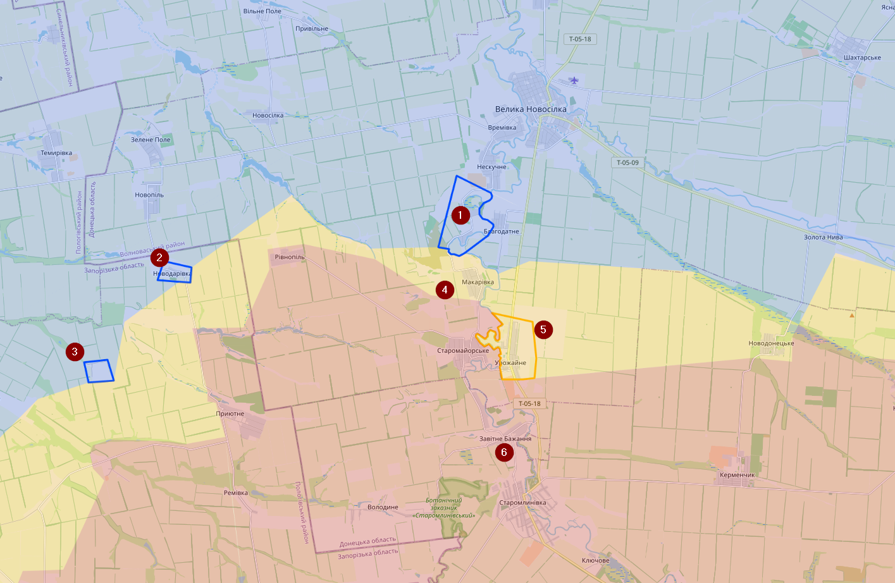

Grotere map
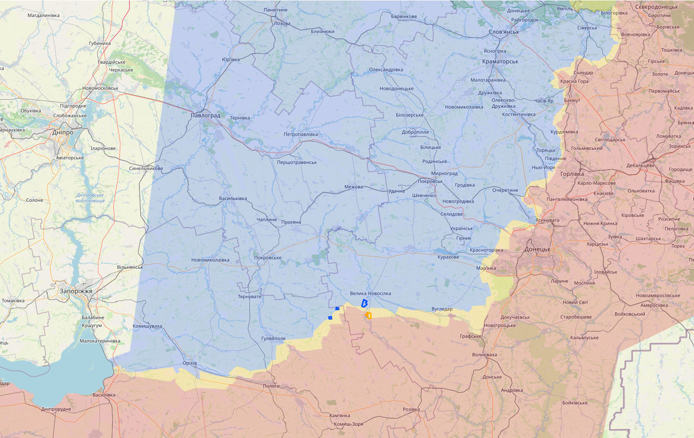
