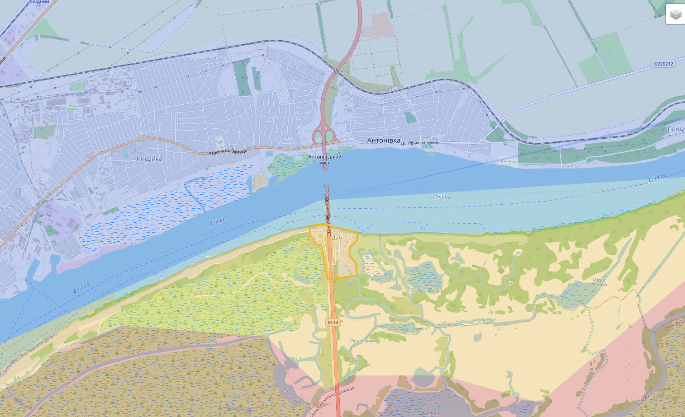
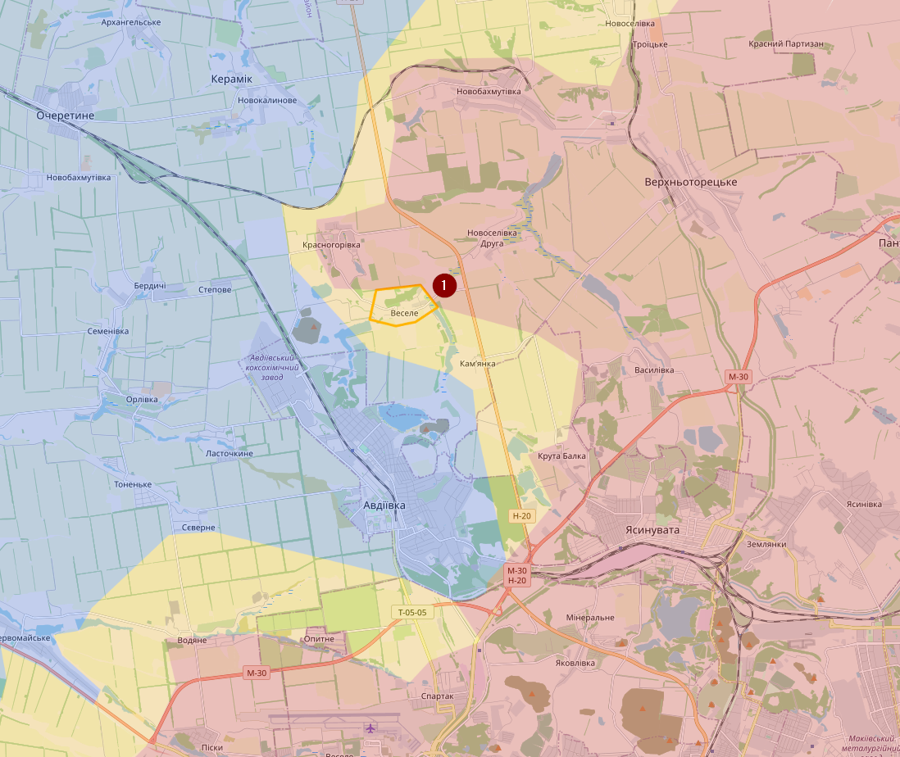
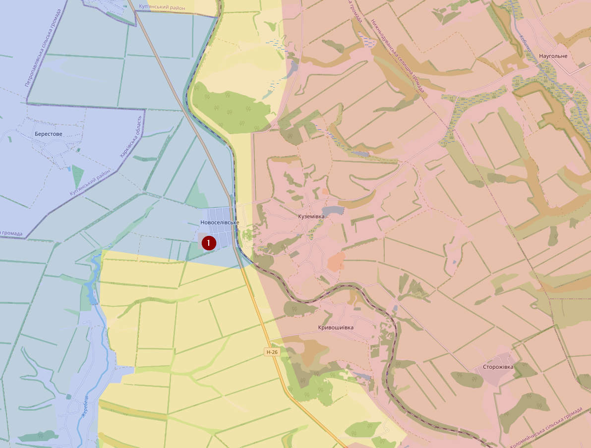
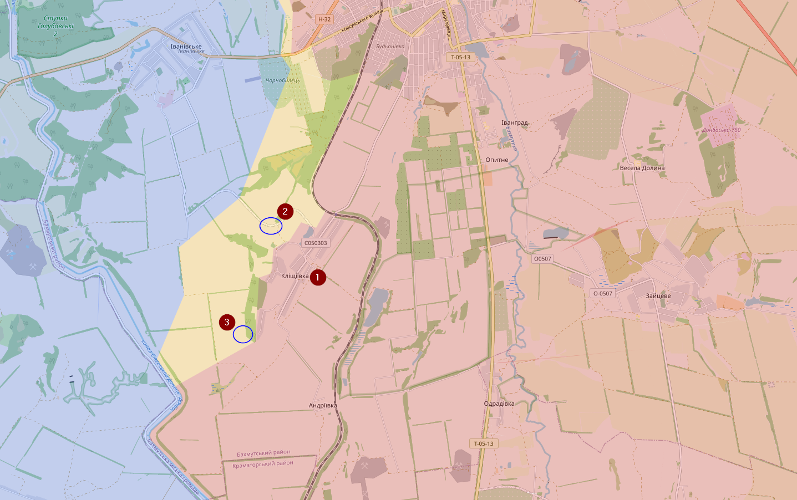
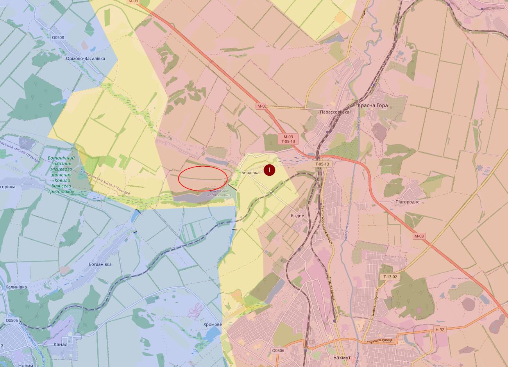
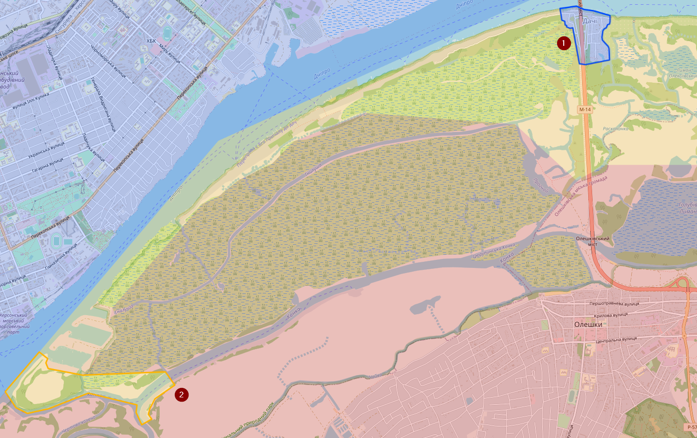
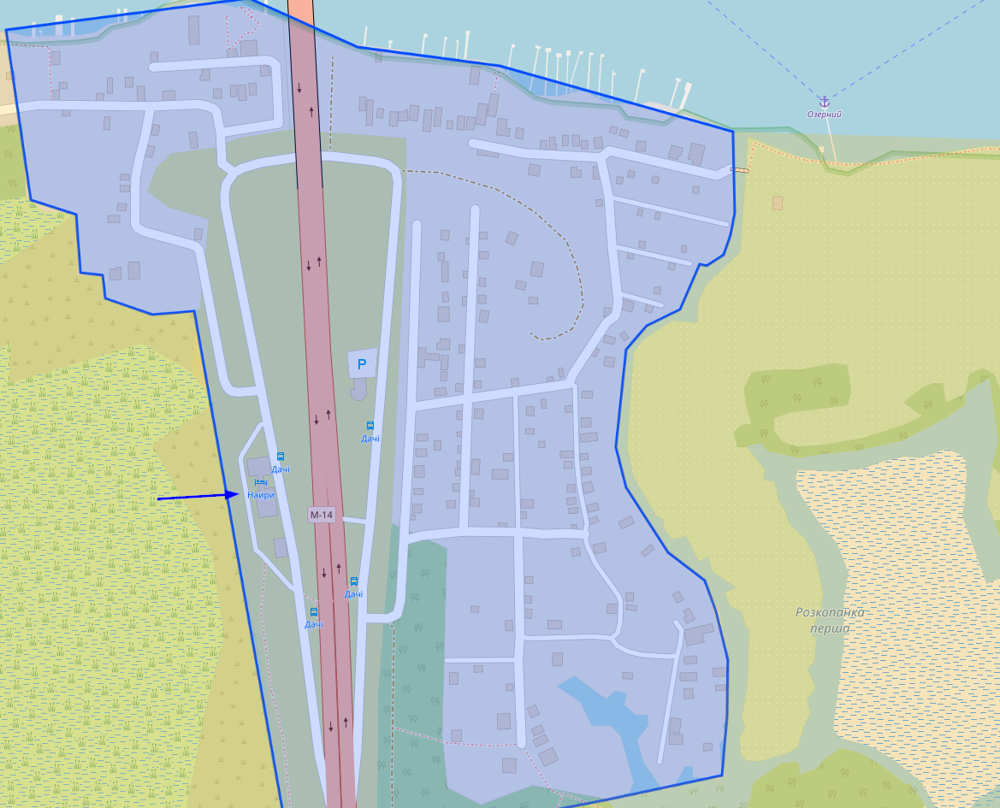
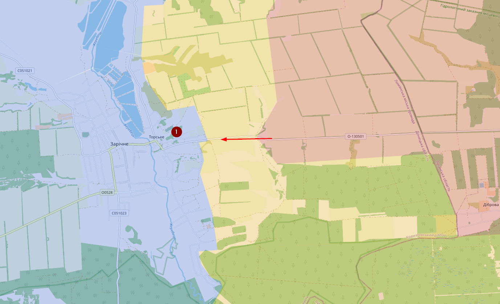
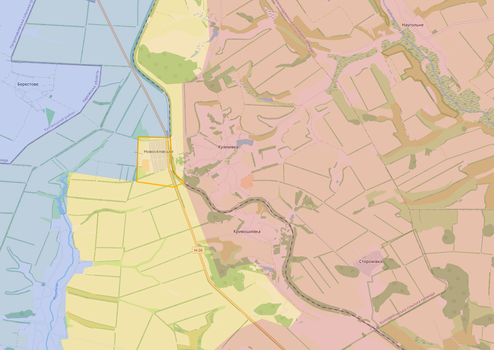
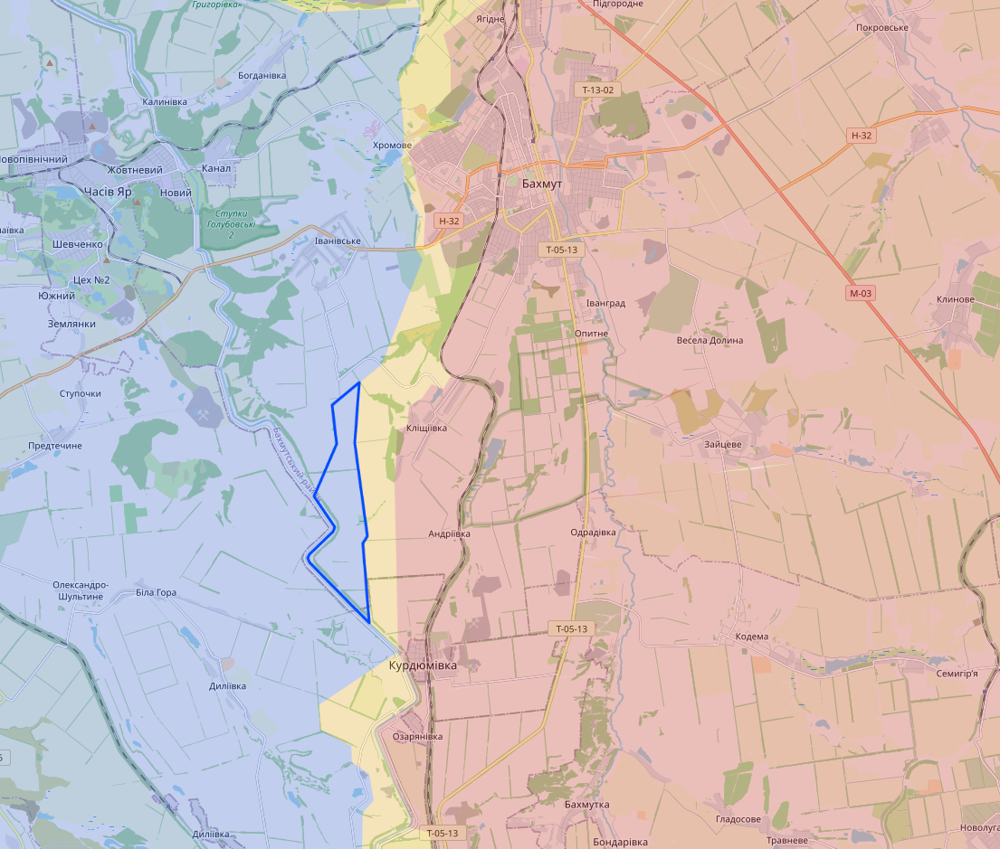

# July 2023

## 01/07/2023

Ik heb de regio bij de Antonivka-brug terug gemarkeerd als contested. Rusland heft de brug aangevallen met kruisraketten waardoor Oekraïne niet langer onder de overgebleven brug kan schuilen. Maar het is zeer onwaarschijnlijk dat de Russen de controle hebben. De enige weg naar daar wordt constant onder vuur genomen door Oekraïne.

Bij Avdiivka is he dorpje Vesele (1) contested (voorheen Russisch).

Voor de rest zien we dat Oekraïne enorm pushed in de regio van Bakhmut. Maar ook in de regio van Kreminna

En ook een dikke fuck you richting Elon musk, door fratsen zoals het limiteren van het aantal tweets zal er redelijk wat info verloren gaan.

En als laatste nog eens het volgende bericht delen: <https://www.vrt.be/vrtnws/nl/2023/06/28/kramatorsk-nederlanders-en-belg-waren-vlak-in-de-buurt/>

Als je die mensen wil sponsoren dan kan dat op hun website: <https://www.frankyandcoen.nl>

## 05/07/2023

In het noorden beweren de Russen dat ze het treinstation bij Novoselivske (1) hebben kunnen bemachtigen. Novoselivske is zo goed als vernietigd en er zijn (nog) geen visuele bewijzen.

Bij Klischiivka (1) ten zuiden van Bakhmut, heb ik redelijk wat contested zone veranderd naar Oekraïens. Hoewel het nog steeds onduidelijk is hoe dicht Oekraïne bij het dropje zit. Ofwel hebben ze successen gehad in het westen (2) of het zuiden (3).

Related-ish... het brand nog steeds in Israël

## 10/07/2023

We zijn op dit moment in een fase aanbeland dat Oekraïne elke dag marginaal succes maakt. Dat gaat ook op voor de Russen in het noorden (in de buurt van Kraminna), maar in verhouding verliezen de Russen vandaag meer terrein dan de Oekraïners.

Het grootste probleem is en blijft een tekort aan artilleriemunitie in combinatie met zeer beperkte lucht controle. Dat ze daardoor moeten terugvallen op clustermunitie is geen goede ontwikkeling, maar eigenlijk is de EU dat hier toch deels tekortschiet met het leveren van de nodige munitie.

Nu goed, marginale progressie, het meest bijzondere is ten noorden van Bakhmut bij Berkhivka (1). Daar hebben de Russen zich moeten terugtrekken. Oekraïne kan echter niet oprukken zolang de Russen controle hebben over het hoger gelegen gebied ten westen daarvan (rode cirkel). Vermoedelijk is het in dat soort locaties waar Oekraïne in de toekomst de clustermunitie zal inzetten. (Again, not a fan).

## 11/07/2023

Volgens een Russische bron heeft Oekraïne nog steeds controle op de linkeroever bij de Kherson brug (1) en Oekraïne zou zelfs ook gebied ter hoogte van (2) hebben heroverd. Vermoedelijk zijn er zelfs geen Russen (of Oekraïners) te vinden in het moeras rond dat gebied.

Volgens die bron zou Oekraïne het hotel bij de brug onder hun controle hebben.

Als we kijken naar het noorden dan zou er een aanval gebeurd zijn op Torske (1) en dat is wel nieuw. Die weg ernaartoe is al enkele keren van kamp veranderd, maar Torske is al een tijd onder controle van Oekraïne. Ik heb geen aanwijzingen om te geloven dat die aanval succesvol was, dus voorlopig laat ik het gewoon gemarkeerd als Oekraïens

Nog meer noordelijk zouden de Russen in Novoselivske zitten. Nu moet je weten dat die locatie complete platgebombardeerd is, dus er valt daar maar weinig te verdedigen of te veroveren.

## 14/07/2023

Korte update. Ten zuiden Bakhmut heft Oekraïne vermoedelijk weer terrein gewonnen.

