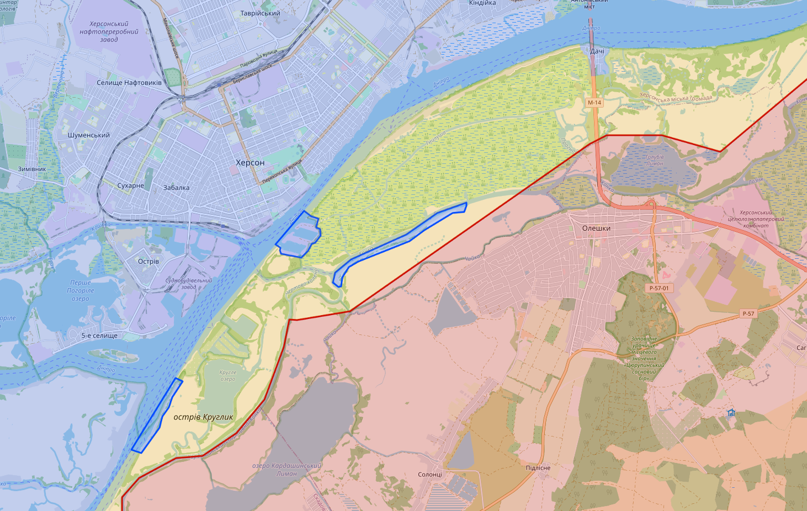
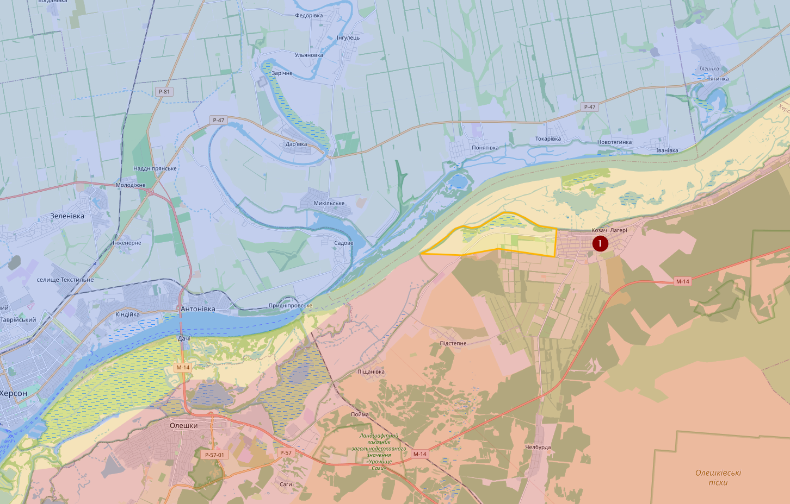

# August 2023

## 07/08/2023

De laatste update is van twee weken geleden als ik mijn git commit history mag geloven en eigenlijk is er maar weinig spannends te vermelden. Beide partijen verliezen en winnen terrein, maar dat gaat vaak maar om marginale verschillen. Het is niet dat er dorpen of bewoonbare gebieden veranderen van kant.

De enige locatie waar wat meer duidelijkheid is (nuja), is de linkeroever van de Dnieper rivier bij Kherson. Op basis van Russische artillerie aanvallen ben ik vrij zeker dat Oekraïne redelijk stevig op de blauwe locaties aanwezig is. Het blijft daar moerasgebied, dus het is niet dat Oekraïne van daar echt een offensief kan beginnen.

## 08/08/2023

Oekraïne is weer de Dnieper rivier overgestoken. Meer bepaald ten westen van Cossack Camps (1). Situatie is er op dit moment redelijk onduidelijk (daarom contested). Bovendien is het moeilijk in te schatten hoe betrouwbaar de informatie is, maar er zijn ondertussen foto’s opgedoken van enkele gevangengenomen Russische soldaten en ook beweringen (maar geen visueel bewijs) dat er vier Russische tanken zouden zijn vernietigd. Vooral over dat laatste heb ik enorme twijfels.

