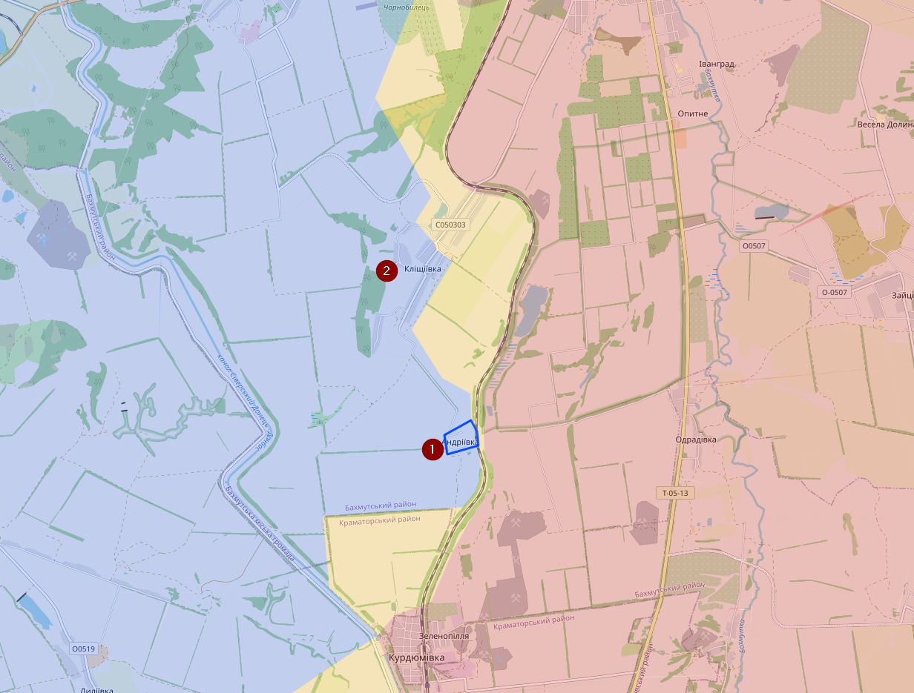
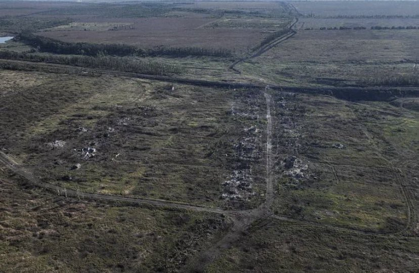
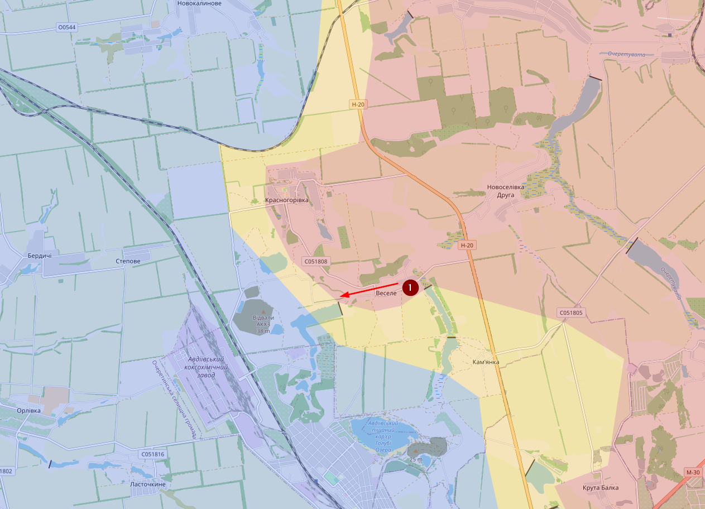
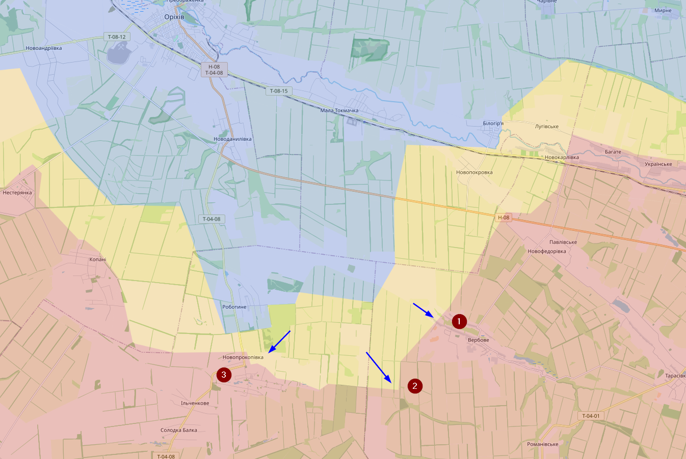

# September 2023

## 11/09/2023

Twee weken sinds mijn laatste update? Het front staat op redelijk wat locaties zo goed als stil.

Desondanks zijn er wel enkele successen te documenteren. Bij Opytne (1) heeft Oekraïne enkele dagen terug de aanval ingezet en is het dorpje contested.

Ten zuidoosten van Velyka Novosilka (1) is Oekraïne sinds vorige week ook actief richting op Novomaiorske (2)

Ook bij het Orikhiv front heeft Oekraïne nog steeds marginale succes maar situatie is voor mij daar niet complete duidelijk, dus heb ik mijn kaart daar nog niet aangepast. 

Verder is Oekraïne ook aan boord gegaan van enkele boorplatformen die in het verleden bemand waren door Russische troepen. Het is best opvallend dat Rusland daar geen troepen meer heeft gestationeerd, maar wel nog materiaal zoals een radar.

## 15/09/2023

Andriivka (1) bij Bakhmut staat onder Oekraïense controle (what’s left of it). Er zijn ook meldingen dat Klischiivka (2) onder Oekraïense controle staat, maar ik denk dat dit nog te vroeg is.

Dit is trouwens Andriivka

## 25/09/2023

Vorige week heeft Rusland een succesje gehad vanuit Vesele (1) richting Avdiivka. Dag gebied is al enkele keren van kamp vervangen.

Bij het Orikhiv front blijft Oekraine druk zetten op de Russen. Er is weer een aanval geweest richting Verbove (1). Daar niet ver vandaan zijn er voor het eerst ook zwaar materieel opgemerkt achter de Surovikin line (2). En bij Novoprokopivka (3) zijn er gevechten geweest in het noorden van het dorp. Merk wel op dat de Surovikin line achter dat dorp loopt.

