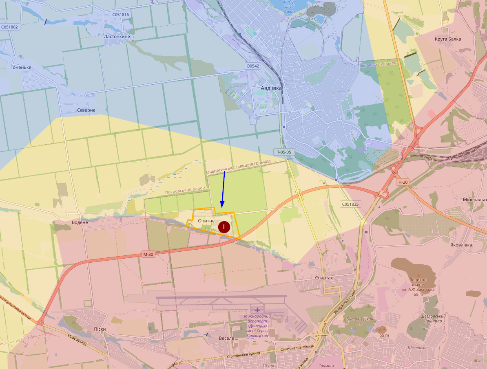
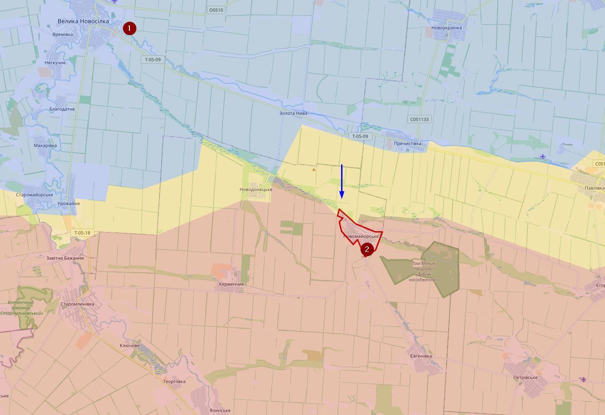

# September 2023

## 11/09/2023
Twee weken sinds mijn laatste update? Het front staat op redelijk wat locaties zo goed als stil.

Desondanks zijn er wel enkele successen te documenteren. Bij Opytne (1) heeft Oekraïne enkele dagen terug de aanval ingezet en is het dorpje contested.

Ten zuidoosten van Velyka Novosilka (1) is Oekraïne sinds vorige week ook actief richting op Novomaiorske (2)

Ook bij het Orikhiv front heeft Oekraïne nog steeds marginale succes maar situatie is voor mij daar niet complete duidelijk, dus heb ik mijn kaart daar nog niet aangepast. 

Verder is Oekraïne ook aan boord gegaan van enkele boorplatformen die in het verleden bemand waren door Russische troepen. Het is best opvallend dat Rusland daar geen troepen meer heeft gestationeerd, maar wel nog materiaal zoals een radar.
