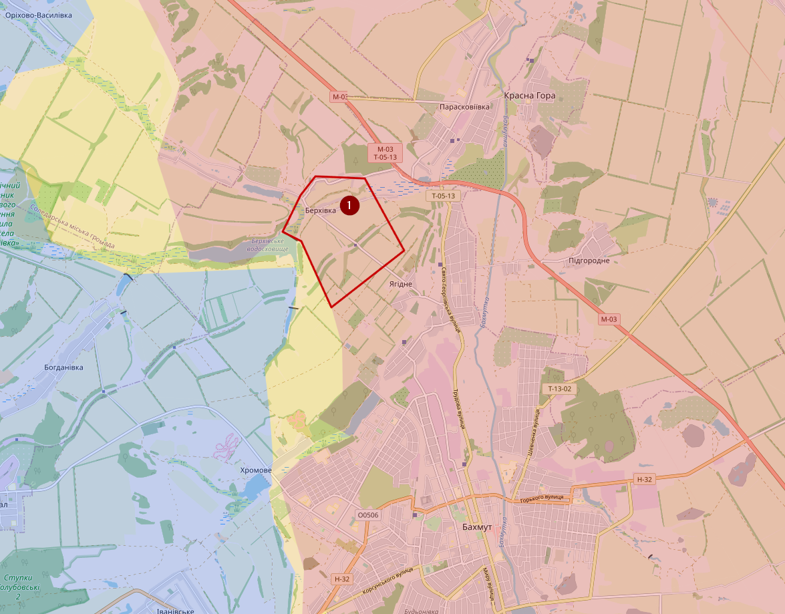
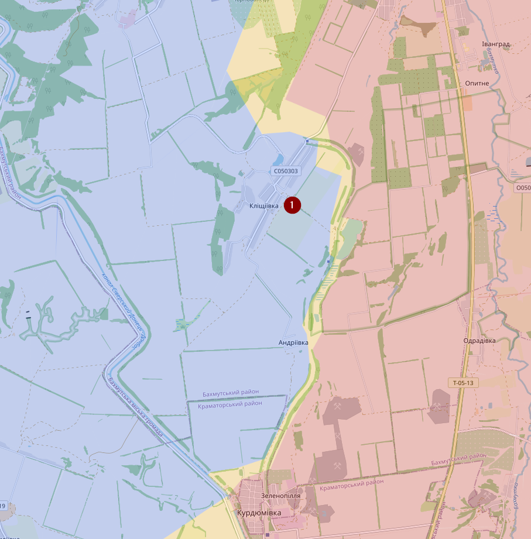
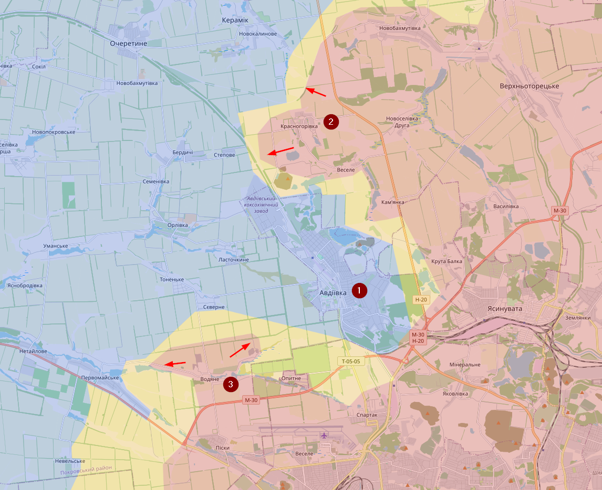
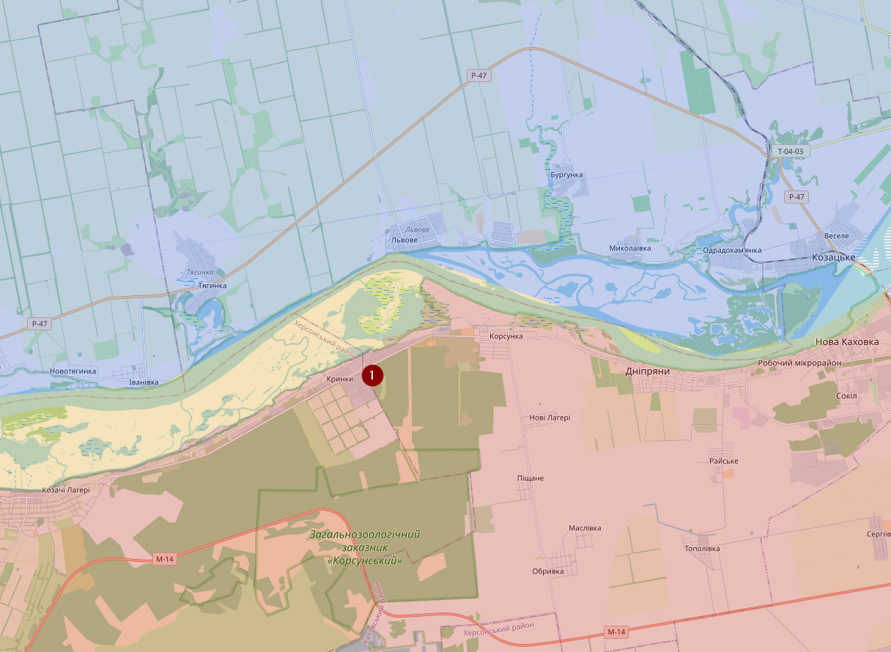
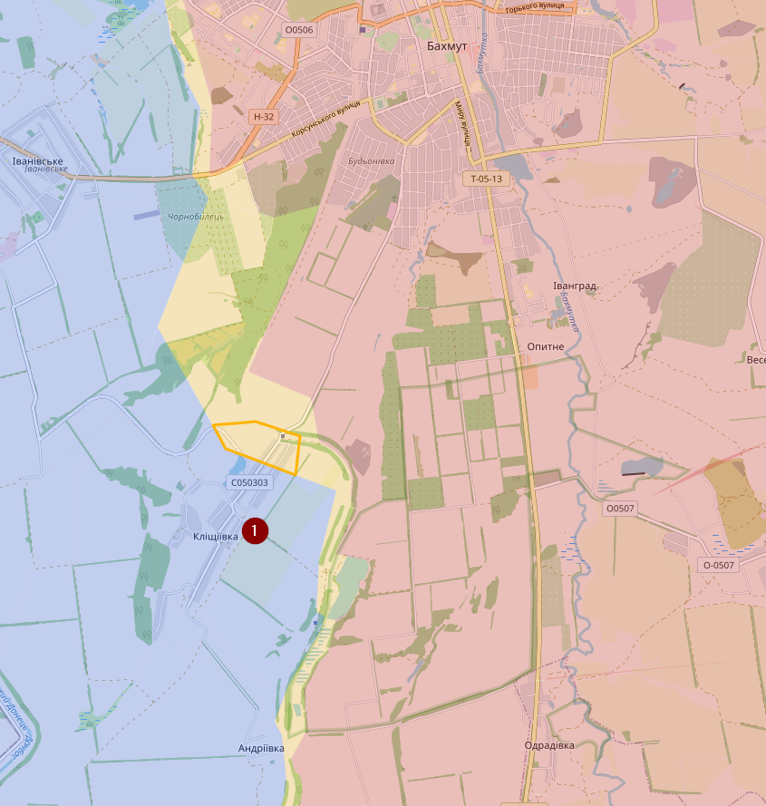
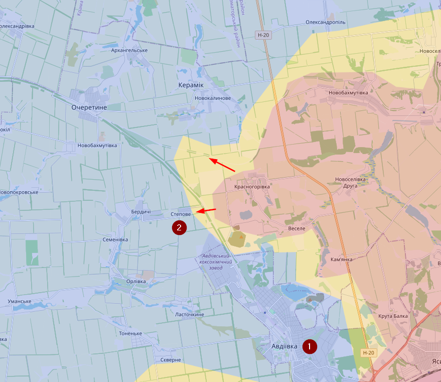
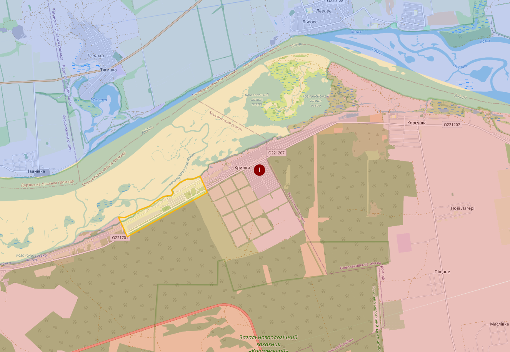
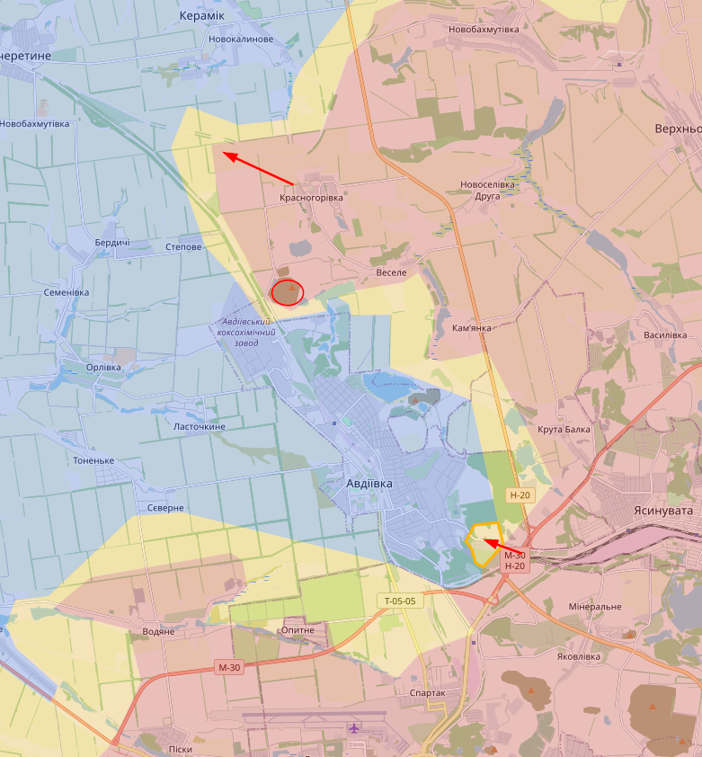
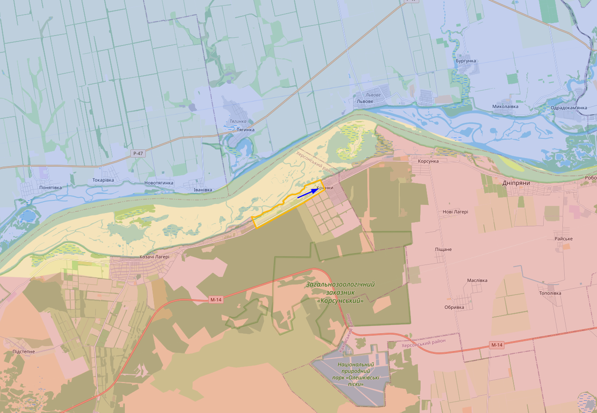

# November 2023

## 06/11/2023

Laatste tijd het redelijk druk gehad, tijd voor nog eens een update.

In het noorden van Bakhmut is Berkhivka (1) terug in handen van de Russen (hiervoor contested)

Ten zuiden van Bakhmut bij Klischiivka (1) heeft Oekraïne zijn posities verstevigd, maar staat het sindsdien stil.

Bij Avdiivka (1) hebben de Russen, ondanks verliezen, de afgelopen twee weken wel wat successen geboekt. O.a. rond Krasnohrivka (2) waarbij ze spoorlijn ten noorden van het dorpje hebben kunnen bemachtigen. Op zich is dat niet de eerste keer trouwens, vorig jaar hadden ze daar ook de controle over. De mijn ten zuiden van Krasnohrivka is een twijfelgeval. Daar is al een Russische vlag gespot en Oekraïense droneaanvallen, maar ben niet overtuigd dat Rusland daar stevige controle heeft. Bij Vodiane zijn eigenlijk de grootste (nieuwe) successen te melden, zowel richting het westen als het oosten.

Ik ga het hierbij laten want ik heb best wel wat in te halen (te veel voor één avond). Op de meeste andere locaties lijkt er op eerste gezicht ook niet zoveel veranderd, hoewel er wel redelijk wat lawaai is rond de linkeroever van de Dnieper en meer bepaald rond Krynky (1), maar dat moet ik nog verder bekijken.

## 13/11/2023

Bij Klischiivka (1) ten zuiden van Bakhmut zijn de Russen de aanval ingegaan en hebben vermoedelijk een deel van het station kunnen innemen.

Bij Avdiivka (1) hebben de Russen ook meer succes. Vooral Stepove (2) is op dit moment in gevaar.

Nu Kherson. Technisch gezien is Oekraïne al op verschillende locaties de Dnieper overgestoken. Maar meestal waren dat locaties met weinig tactisch voordeel dat redelijk doodlopend was. Denk maar aan moerasgebied of Dachi bij de Kherson brug. Meer stroomopwaarts zijn de Oekraïners al enkele weken bezig met aanvallen bij Krynky (1). Situatie blijft daar redelijk vaag/dynamisch. Je kan wel redelijk wat artillerieschade zien op (lowres) satellietbeelden op die locatie.

## 27/11/2023

Weinig verandering de afgelopen 14 dagen en ik verwacht de komende dagen nog minder, want sneeuw.

Bij Avdiivka hebben de Russen wel ten noorden wat succes gehad en ook in het zuiden zijn de russen opgerukt in het industrieel gebied. De mijn in het noorden heb ik ook gemarkeerd als Russisch.

Bij Krynky heeft Oekraïne iets dieper in het centrum geraakt, maar durf dat nog steeds niet te markeren als Oekraïense.

Update 04/12/2023
In verhouding tot vorige week zie ik atm niet veel veranderingen aan het front. Bij Avdiivka hebben de Russen wat terrein gewonnen. Bij Krynky heeft Oekraïne wat terrein gewonnen. Maar voor beide locaties gaat het over marginale winst.