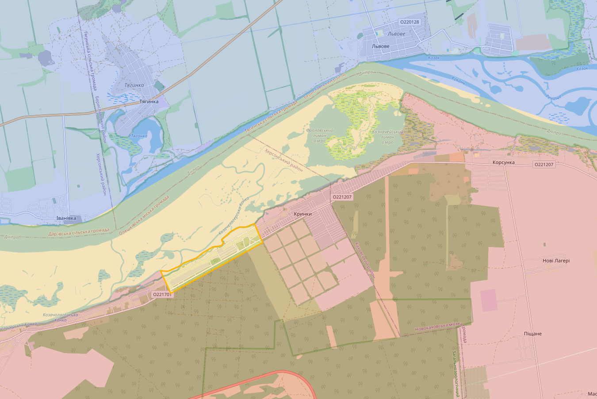
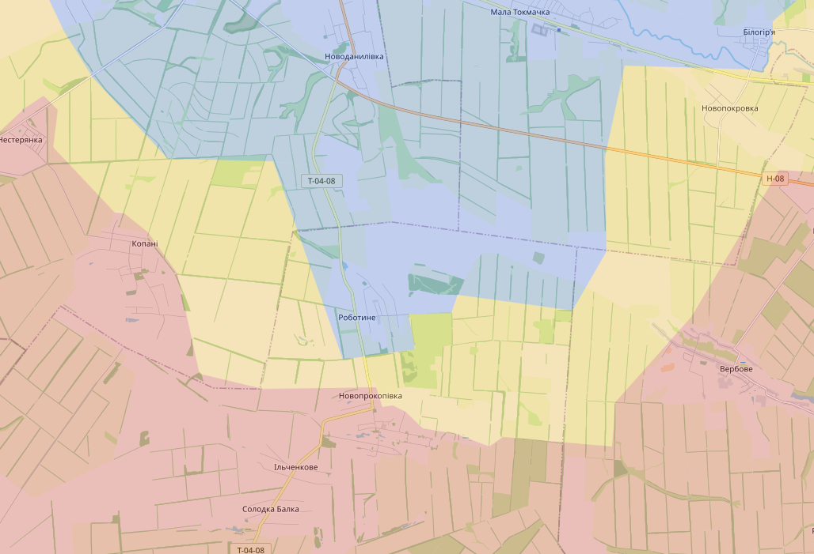
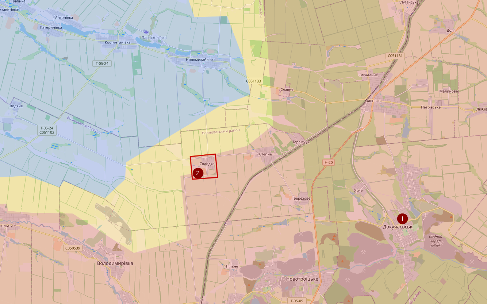
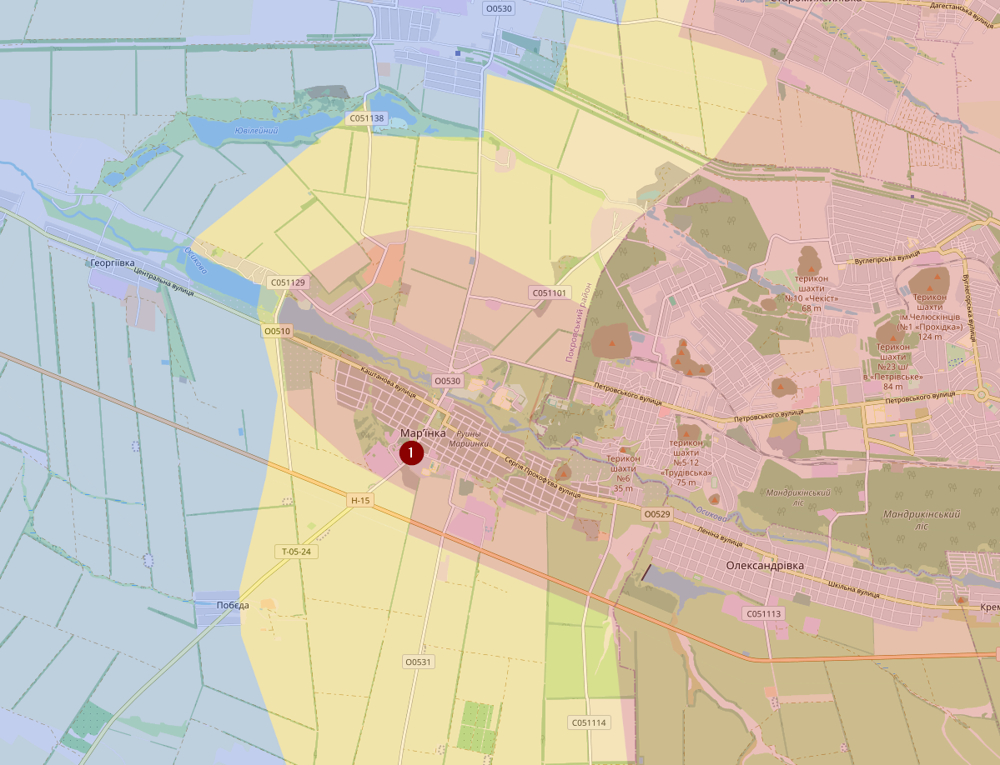
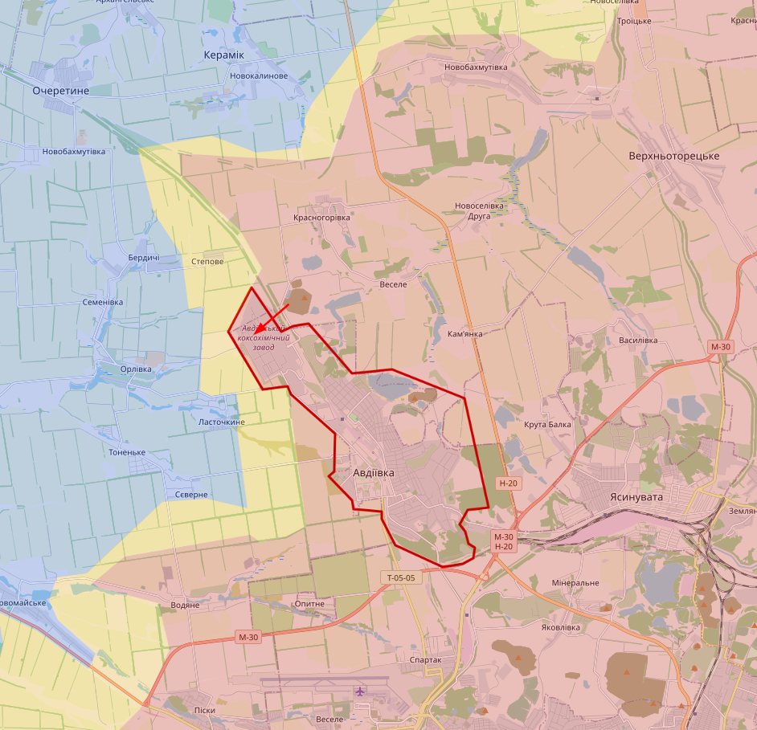
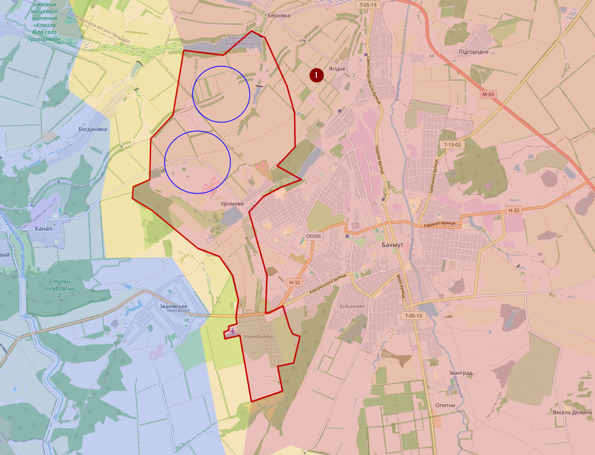
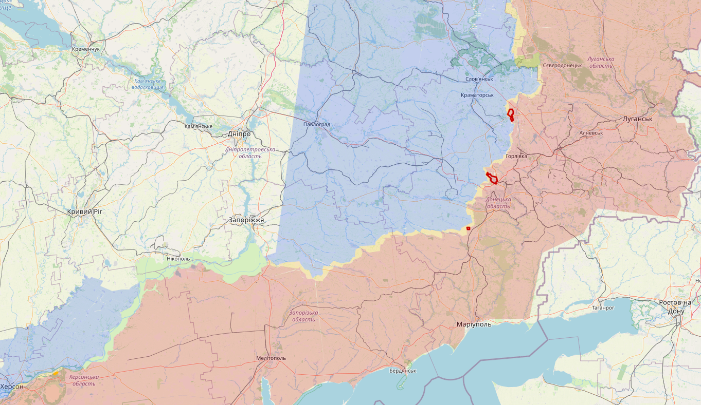
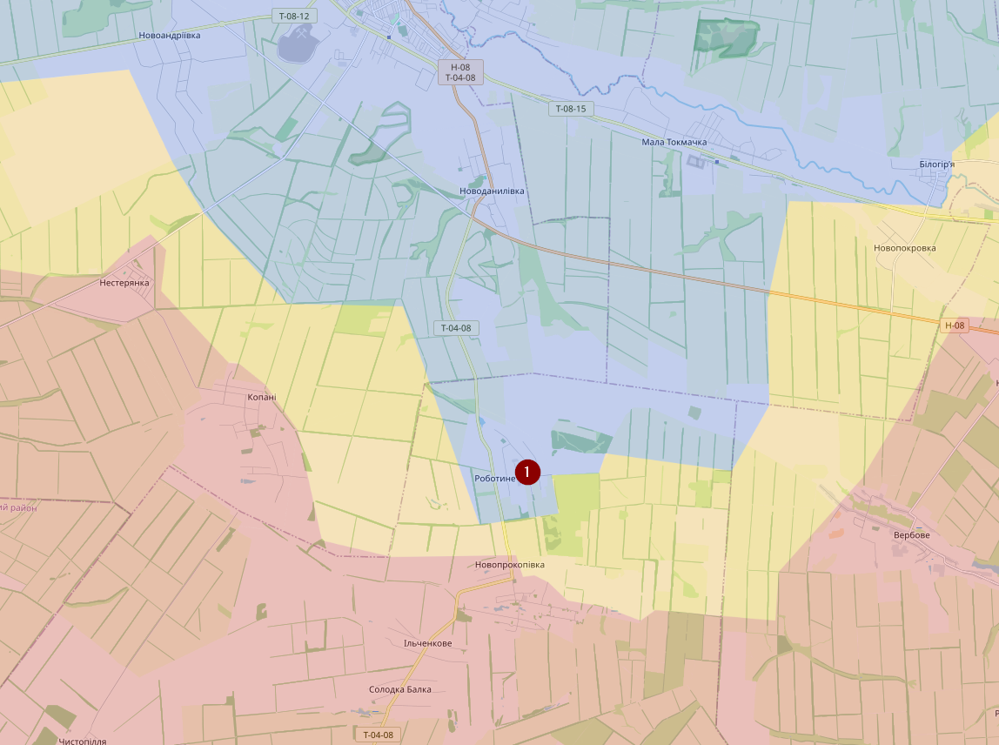
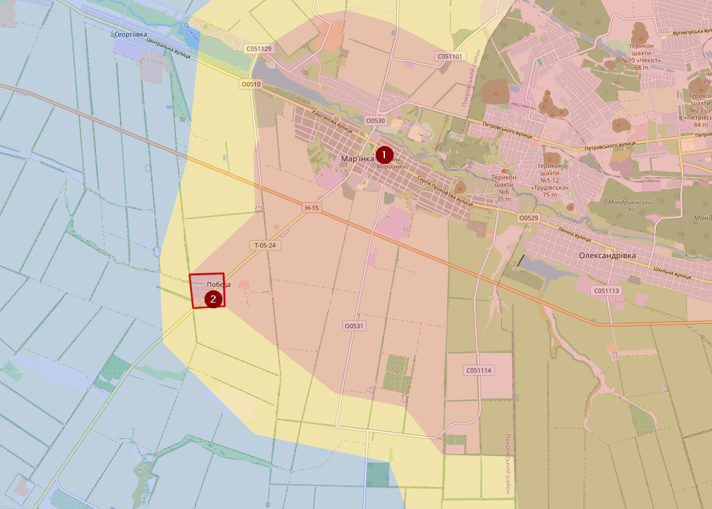
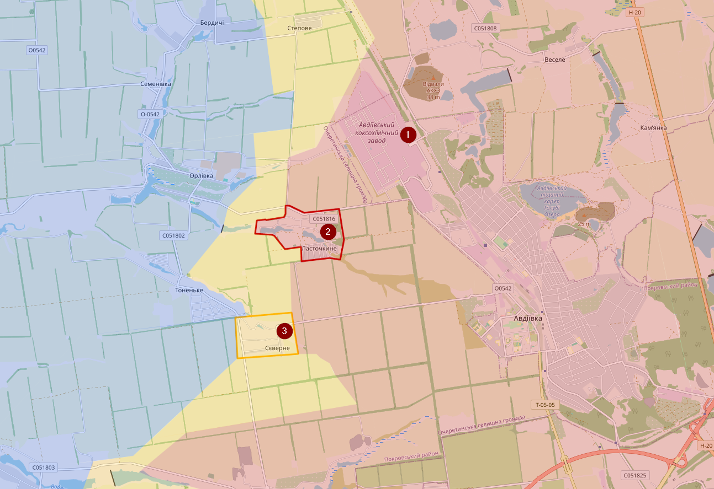

# February 2023

## 19/02/2024

Heel lang geleden dat ik nog eens een update heb gegeven... because reasons. Ik ga mij dus enkel beperken tot het zuiden en oosten. En niet alles is in detail afgecheckt. Dus sorry als ik ergens fouten heb gemaakt, maar daarmee hebben jullie een idee. Ik begin in het zuiden en ga dan naar het oosten.

Laten we beginnen bij Krynky. Still standing strong (kinda).

Robotyne... same.

En daarmee zijn we aan het einde van het goede nieuws... (sinds laatste update)

Bij Dokuchaievsk (1) hebben de russen het dorpje Solodke (2) kunnen veroveren

Ook bij Marinka (1) is de stad compleet onder controle van Rusland, vorige keer was dat maar voor de helft.

Dan Avdiivka, dat is onder de controle van Rusland. Rusland was erin geslaagd om het centrum grotendeels aft e snijden vanuit de mijn (rode pijl) en er was nog maar één aanvoerlijn beschikbaar dusja...

Minder bekend in de media, maar eigenlijk ook een potentiële dreiging, is west Bakhmut. Daar hebben de russen de afgelopen maanden ook redelijk wat terrein gewonnen. Oekraïne had op en bepaald moment controle over de locaties in de buurt van de blauwe cirkels en zelfs Yahidne (1) was op een bepaald moment contested geweest door Oekraïne

En daar ga ik het voorlopig bij laten. Hier nog de volledige map.

Een van de reden waarom Oekraïne terrein verliest is makkelijk te verklaren, gebrek aan munitie. Waar Rusland zijn munitieproductie enorm heeft verhoogd doet Europa... veel te weinig.

## 26/02/2024

Krynky, still standing strong. Ondanks beweringen van Rusland dat ze nu eindelijk, maar echt eindelijk weer controle hebben over dat gebied. Nu is het wel zo dat er hier niet intensief wordt gevochten.

Bij Robotyne(1) is het de laatste dagen wat intensiever, maar voorlopig slagen de Russen er niet in om de (nieuwe) verdediging van Oekraïne te doorbreken.

Ten zuiden van Marinka (1) is het dorpje Pobieda (2) wel onder Russische controle gekomen.

Ook bij Avdiivka (1) is Rusland verder kunnen oprukken en is het stadje Lastochkyne (2) gevallen. Ook Sieverne (3) is vermoedelijk zo goed al sonder Russische controle. Het is mij niet echt duidelijk waar hier de nieuwe verdedigingslinie ligt. M.a.w. het kan wel eens zijn dat we de Russen hier nog zien oprukken.

