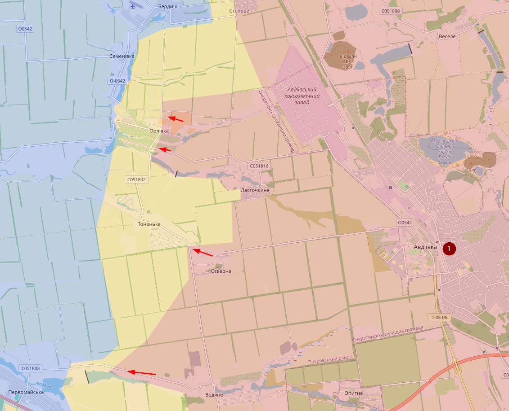
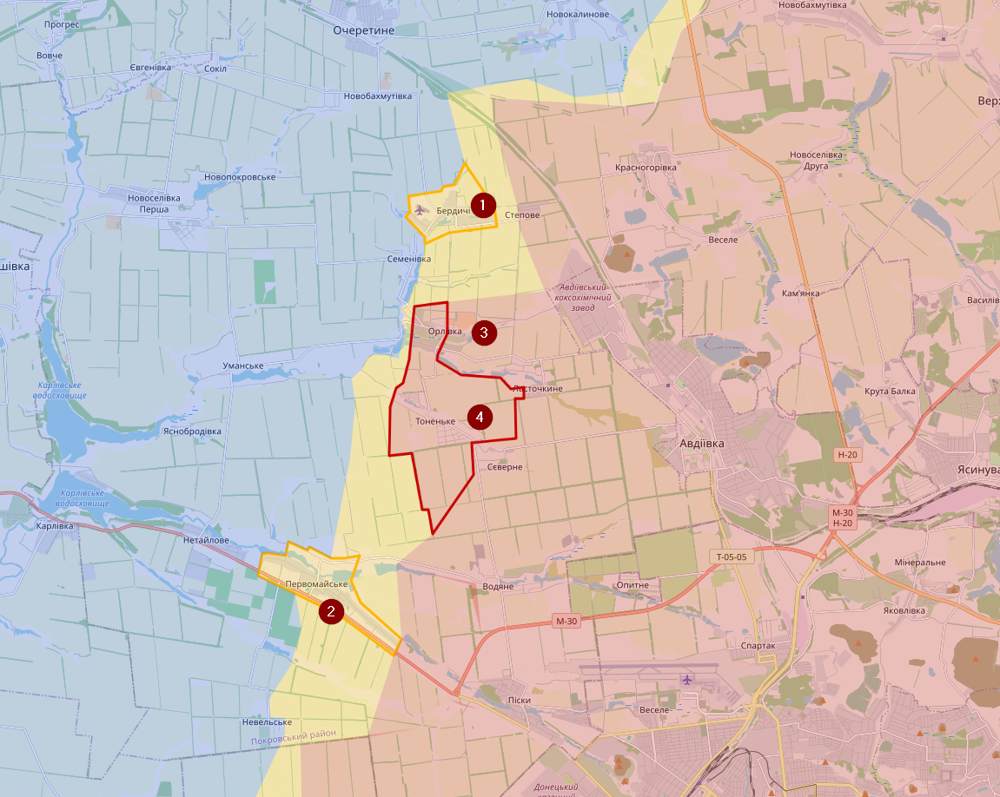

# March 2023

## 11/03/2024

Ik heb been deel van Robotyne gemarkeerd als contested. In de gele zone zijn er russen actief. Robotyne (1) was volgens mij heroverd afgelopen zomer.

Bij Avdiivka (1) hebben de russen da laatste twee weken redelijk wat successen gekend, wat verwacht was. Desondanks is de opmars sterk vertraagd in verhouding tot de eerste week.

## 25/03/2024

Meeste locaties is het redelijk “stabiel”. Enkel bij Avdiivka heeft Rusland terrein gewonnen wat wel in de lijn van de verwachting lag.

Berdychi (1) en Pervomaiske (2) zijn contested, Orlivka (3) en Tonenke (4) zijn onder de controle gekomen van Rusland

