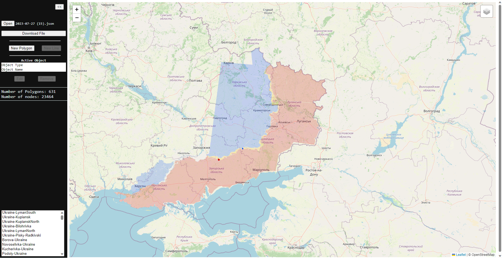
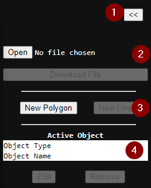
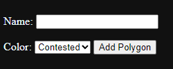
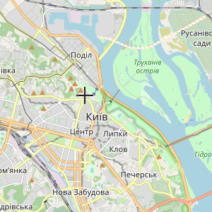
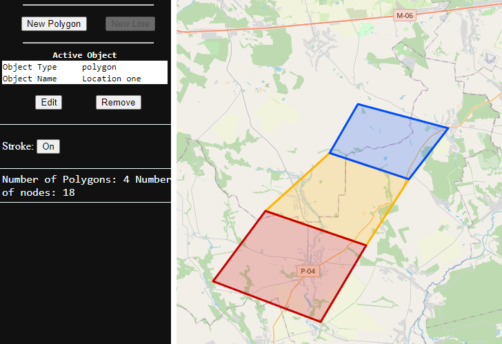

# Ukraine Report - Alpha-Three


> This project is depending on Leafletjs, which is created by [Volodymyr Agafonkin](https://agafonkin.com) who lives in Kyiv (Ukraine).
> If you find the information of this project useful, please consider making a donation to one of the many organisations helping the Ukraine people: [StandWithUkraine]( https://stand-with-ukraine.pp.ua)
>
>Thank You
>
>[](https://stand-with-ukraine.pp.ua)


Welcome to Alpha-Three! This release includes a significant amount of code that has been rewritten and moved to an OsintMap.js file/class.



Please note that the "way-of-working" may change in future updates.

To run the application, follow these steps:

1. Install Docker on your system.
2. Navigate to the root folder of the project.
3. Run the following Docker command to start the container:

```docker run -d -p 80:80 -v $(pwd)/Map:/usr/share/nginx/html nginx```

This command will set up and run the application inside the Docker container, making it accessible on port 80.

If you encounter any issues, feel free to reach out. Enjoy using Alpha-Three!

## Main Menu

The Main Menu is always visible and contains the core part of how to opperate this app.



1. **Sidebar button**:  Click here to open or close the sidebar.
2. **File Operations**:  Use this option to open an existing map or download your current working map.
3. **New Objects**: Click on these buttons to add a new object, such as a polygon area or a line.
4. **Active Object**: Provides information about the currently selected or active object, with options to **edit** or **remove** it.

### File Operations

In this section, you can perform essential file operations for your maps.

* **Open**: Click this button to open a map that you have modified before.
* **Download File**: Use this button to download the current working map. The file will be downloaded locally with the name *yyyy-MM-dd*.json, where *yyyy-MM-dd* represents the current date.

### New Objects

At the moment, the only available object type is the Polygon. For more information about the Polygon Object, please refer to the relevant section in the documentation.

### Active Object

This section provides information about the currently active object like the name and type. 

* **Edit**: allow you to modify the selected object.
* **Remove**: Immediately remove the object without any **confirmation**. ⚠️

## Polygon

A Polygon represents an area on the map that can be used to mark territorial control by a certain party. Currently, three types of polygons are available:

1. **Contested (yellow)**: This type indicates an area that is being disputed or contested by multiple parties.
2. **Ukraine (blue)**: This type signifies an area under the control of Ukraine.
3. **Russia (red)**: This type represents an area under the control of Russia.

### New Polygon

To add an area to the map, click on **New Polygon**.

You will be presented with a form where you need to provide the following information:
* **Name** (Optional): You can add a name to the area. If left blank, it will take the name of the selected party.
* **Color**: Select one of the configured parties from the dropdown.
* **Add Polygon**: Clicking this button will add the object to the map and enable you to start drawing the area.



After clicking **Add Polygon**, you can start adding nodes to define the shape of the polygon. Click the left mouse button to add a node, and use the scroll wheel to zoom in and out while adding nodes.



Clicking **Done** will stop the process of adding nodes, finalizing the polygon's shape.

### Edit a Polygon

To edit an existing polygon, follow these steps:

1. While not editing or adding a new polygon, double click on the polygon you want to make active and then click on **Edit** in the Active Object area.
2. This will start the editing process, allowing you to make changes to the active polygon. You can remove existing nodes or add new nodes to modify the shape of the polygon.
3. Click **Done** to stop the edit process and finalize the polygon's updated shape.



### Polygon Options/Functions

While having a polygon active or while editing or adding it, you can use the following functions:

#### Stroke (On/Off)

Toggles the presence of a line around the polygon. Turning it on adds a stroke, while turning it off removes the stroke.

#### Name

Changing this field during the editing process will update the name of the Polygon.

#### Color

Changing this field during the editing process will update the party associated with the polygon.

#### Undo

Clicking on this button will remove the last node added during the editing process, effectively undoing the last step.

#### Snap (On/Off)

When this option is enabled, a new node will automatically snap to the closest existing node on the map during the editing process.


## Remarks and additonal notes

ChatGPT was utilized to enhance the content and clarity of this document. More information, please visit the official OpenAI website: <https://openai.com/chatgpt>