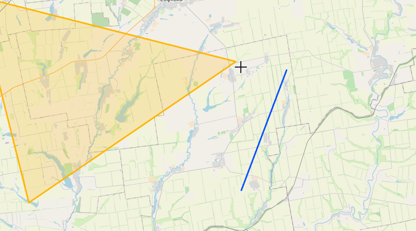

# Ukraine Report - Alpha-Two


> This project is depending on Leafletjs, which is created by [Volodymyr Agafonkin](https://agafonkin.com) who lives in Kyiv (Ukraine).
> If you find the information of this project useful, please consider making a donation to one of the many organisations helping the Ukraine people:
> * [StandWithUkraine](https://stand-with-ukraine.pp.ua)
> * [Franky and Coen into the breach](https://www.frankyandcoen.nl/)
> 
>Thank You
>
>[](https://stand-with-ukraine.pp.ua)


Welcome to alpha-Two. This release provides a buggy but more workable version of my mapping application I use to report over the situation in Ukraine. It still requires clean-up of code and allot of features needs to be added.

Yes, I know the code is a disaster, I’m planning to clean it up -_-

Please note that the "way-of-working" could change in future updates.

To run it. Install Docker and run the container from inside the root folder of the project.

```docker run -d -p 80:80 -v $(pwd)/Map:/usr/share/nginx/html nginx```

## Tools

### Select mode

If "ON" nothing can be edited on the map and a double click causes the polygon to be become active.

### Active Polygon

This will show the name of the Polygon that is currently active. You can make a polygon active by double clicking it when Select Mode is ON, or by creating a new polygon

#### Rename

**⚠ Doesn't work ATM**

Can be used to rename the name of the Polygon. 

#### Change Color

Provides an option to change the 'color' and side of the active polygon on the map.
1. Make sure an Active Polygon is selected (you can use Select mode if needed)
2. Click **Change Color**
3. Select the side or color
4. Click **Save**

#### Stroke

Provides an option to add a "stroke" to the active polygon

1. Make sure an Active Polygon is selected (you can use Select mode if needed).
2. Click on the button next to "Stroke" to turn it off and on.

#### New Polygon
1. Click on **New Polygon**
2. Enter a name in the Name field (this is optional)
3. Select the Color/Side
4. Click in **Add Polygon**

You can now start adding the polygon

#### Remove Polygon

Clicking this button will remove the active Polygon without any warning. Use with caution.

### Edit mode

#### Undo

Removes the last point of the active polygon

#### Snapping

If "ON", the closest existing polygon will be chosen


#### Done

Stops adding the polygone